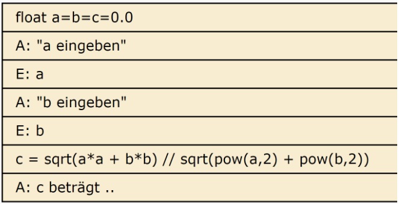
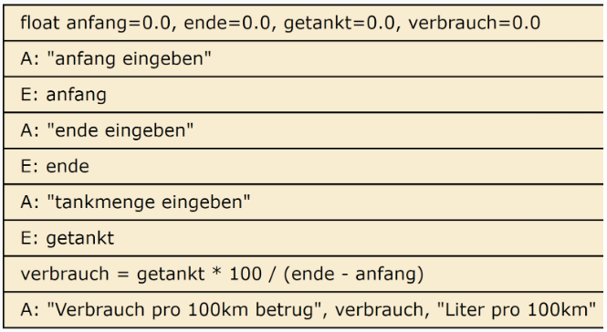
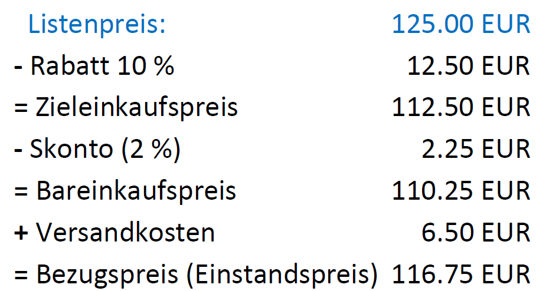
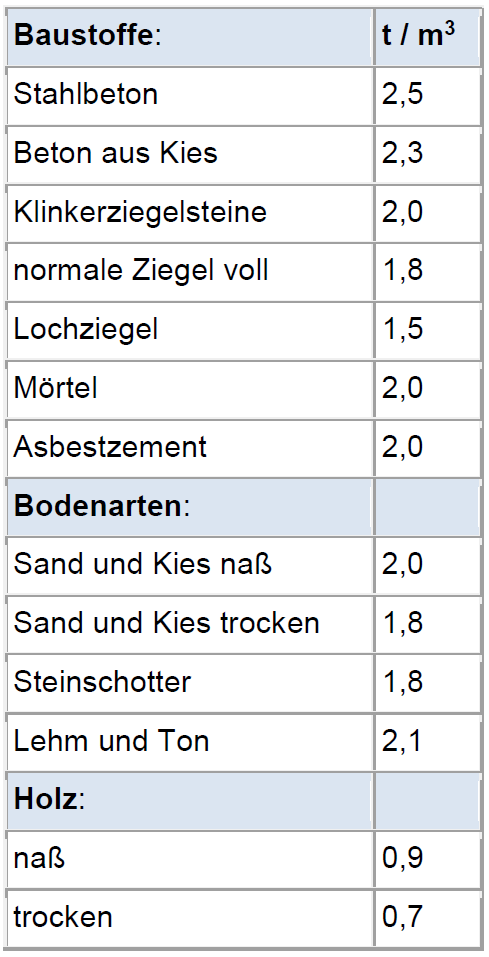
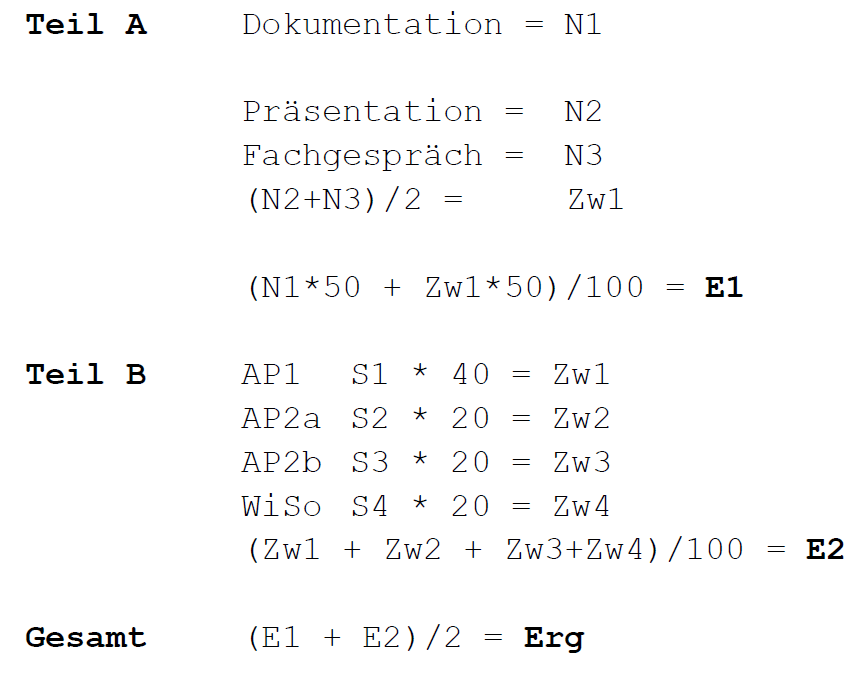
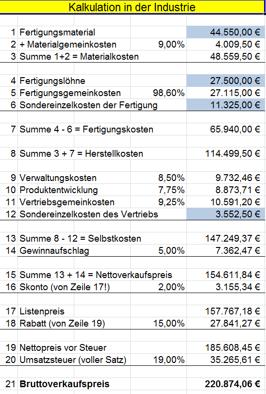

<CardChapter>

  ## 1

  Das Volumen eines Quaders berechnet sich aus `a * b * c`.

Erstellen Sie ein Programm, dass nach Eingabe der 3 Werte das Volumen berechnet und ausgibt.

```cpp
#include <iostream>

using namespace std;

int main(int argc, char const *argv[])
{
  float a = 0;
  float b = 0;
  float c = 0;
  float volumen = 0;

  cout << "Bitte Seite A eingeben" << endl;
  cin >> a;

  cout << "Bitte Seite B eingeben" << endl;
  cin >> b;

  cout << "Bitte Seite C eingeben" << endl;
  cin >> c;

  volumen = a * b * c;

  cout << "das Volumen betraegt : " << volumen << endl;

  return 0;
}
```

</CardChapter>
<br/>

<CardChapter>

  ## 2

  Der Satz des Pythagoras lautet `a² + b² = c²`.
Erstellen Sie ein Programm zur Berechnung der Seite C nach Eingabe der Werte für a und b.

Für die Wurzelberechnung können Sie die Funktion `sqrt()` benutzen.



```cpp
#include <iostream>
#include <cmath>

using namespace std;

int main(int argc, char const *argv[])
{
  float a = 0;
  float b = 0;
  float c = 0;

  cout << "Bitte Seite A eingeben" << endl;
  cin >> a;

  cout << "Bitte Seite B eingeben" << endl;
  cin >> b;

  c = sqrt(a * a + b * b);

  cout << "Seite C betraegt : " << c << endl;

  return 0;
}
```

</CardChapter>
<br/>

<CardChapter>

  ## 3

  Die Fläche eines Kreises lässt sich über die Formel `pi * r²` ausrechnen , der Umfang über die Formel `2pi * r`; wobei `pi` einer Konstanten von 3,1416 entspricht und `r` der Radius des Kreises ist. 
  
  Erstellen Sie ein Programm, welches nach Eingabe des Radius die Fläche und den Umfang des entsprechenden Kreises berechnet und auf dem Bildschirm ausgibt.

```cpp
#include <iostream>
#include <cmath>
#define M_PI 3.14159265358979323846

using namespace std;

int main(int argc, char const *argv[])
{
  float radius = 0;
  float flaeche = 0;
  float umfang = 0;

  cout << "Bitte Radius angeben: " << endl;
  cin >> radius;

  flaeche = M_PI * pow(radius, 2);
  umfang = 2 * M_PI * radius;

  cout << "Die Flaeche betraegt: " << flaeche << endl;
  cout << "Der Umfang betraegt: " << umfang << endl;

  return 0;
}
```

</CardChapter>
<br/>

<CardChapter>

  ## 4

  Erstellen sie ein einfaches Kassenprogramm. Es soll eine Kaufsumme eingegeben werden, dazu die Zahlung des Kunden. 
  
  Das Programm soll den Rückgabebetrag (Wechselgeld), sowie die im Kaufpreis enthaltene Mehrwertsteuer (voller Satz) berechnen und anzeigen.

```cpp
#include <iostream>

using namespace std;

int main(int argc, char const *argv[])
{
  float kaufSumme = 0;
  float zahlung = 0;
  float wechselGeld = 0;
  float mwSt = 0;

  cout << "Kaufsumme bitte: " << endl;
  cin >> kaufSumme;
  cout << "Ihr Zahlung bitte: " << endl;
  cin >> zahlung;

  wechselGeld = zahlung - kaufSumme;
  mwSt = kaufSumme * 0.19;

  cout << "Ihre Kaufsumme: " << kaufSumme << endl;
  cout << "MwStAnteil: " << mwSt << endl;
  cout << "Ihre Zahlung:" << zahlung << endl;
  cout << "Ihr Wechselgeld: " << wechselGeld << endl;

  return 0;
}
```

</CardChapter>
<br/>

<CardChapter>

  ## 5

  Ein Programm soll den Benzinverbrauch eines Kfz auf 100 km berechnen. Dies lässt sich nach folgender Formel durchführen: `Treibstoffmenge * 100 / gefahrene Strecke = Verbrauch pro 100km`

Die gefahrene Strecke ergibt sich aus der Differenz vom KM-Stand beim letzten Tanken und neuen KM-Stand beim Auftanken. 

Erstellen Sie das dazugehörige Programm, das nach Eingabe von Anfangskilometerstand, Endkilometerstand und getankten Litern den Verbrauch berechnet und ausgibt.



```cpp
#include <iostream>

using namespace std;

int main(int argc, char const *argv[])
{
  float anfangsStand = 0;
  float endStand = 0;
  float getankt = 0;
  float benzinVerbrauch = 0;

  cout << "Bitte Anfangskilometerstand eingeben" << endl;
  cin >> anfangsStand;

  cout << "Bitte Endkilometer eingeben: " << endl;
  cin >> endStand;

  cout << "Bitte Tankmenge in Liter eingeben: " << endl;
  cin >> getankt;

  benzinVerbrauch = getankt * 100 / (endStand - anfangsStand);

  cout << "Sie fuhren: " << endStand - anfangsStand << " km." << endl;
  cout << "Ihr Benzinverbrauch pro 100km betrug: " << benzinVerbrauch << "l" << endl;

  return 0;
}
```

</CardChapter>
<br/>

<CardChapter>

  ## 6

  Zwei Variablen `a` und `b` sollen die Inhalte tauschen;

Formulieren Sie dazu ein allgemeingültiges Verfahren! Es muss für Daten jedes Typs funktionieren, auch für Char-Variablen, sprich Texte, Strings.

```cpp
#include <iostream>

using namespace std;

template <typename T>
void swapValues(T &a, T &b)
{
  T temp = a;
  a = b;
  b = temp;
}

int main(int argc, char const *argv[])
{
  int intA = 5, intB = 10;
  double doubleA = 3.14, doubleB = 2.71;
  char charA = 'A', charB = 'B';

  // Tausche zwei Integer
  swapValues(intA, intB);
  std::cout << "Nach dem Tausch - Integer: a = " << intA << ", b = " << intB << std::endl;

  // Tausche zwei Doubles
  swapValues(doubleA, doubleB);
  std::cout << "Nach dem Tausch - Double: a = " << doubleA << ", b = " << doubleB << std::endl;

  // Tausche zwei Char
  swapValues(charA, charB);
  std::cout << "Nach dem Tausch - Char: a = " << charA << ", b = " << charB << std::endl;

  return 0;
}
```
</CardChapter>
<br/>

<CardChapter>

  ## 7

  Die Programmiersprache `C` stellt eine Funktion zum kaufmännischen Runden zur Verfügung, die jedoch nur auf ganze Zahlen rundet;

aus 3.4 wird also 3, aus 6.5 eine 7 usw.

Wie erreichen Sie eine Rundung auf zum Beispiel 2 Nachkommastellen? 

-> aus 3.1415 soll dann 3.14 werden, aus 2.728 dann 2.73 usw.

```cpp
#include <iostream>
#include <cmath>

using namespace std;

int main(int argc, char const *argv[])
{
  float pi = 3.1415;

  pi = pi * 100;
  pi = round(pi);
  pi = pi / 100;

  cout << "pi gerundet : " << pi << endl;
  printf("pi gerundet : %.2f", pi);

  return 0;
}
```

</CardChapter>
<br/>

<CardChapter>

  ## 8

  Ein Zeitgenosse des Pythagoras war Heron von Alexandria. Basierend auf dem Satz des Pythagoras entwickelte er folgende Formel für die Berechnung der Fläche jedes Dreiecks:

$F = \sqrt[2]{(𝑠−𝑎)∗(𝑠−𝑏)∗(𝑠−𝑐)∗𝑠}$


wobei gilt: $\frac{𝑎+𝑏+𝑐}{2}$


```cpp
#include <iostream>
#include <cmath>

using namespace std;

int main(int argc, char const *argv[])
{
  float a = 0;
  float b = 0;
  float c = 0;
  float s = 0;
  float f = 0;

  cout << "Bitte Seite a eingeben: " << endl;
  cin >> a;

  do
  {
    cout << "Bitte positive Werte fuer Seite a eingeben: " << endl;
    cin >> a;
  } while (a < 0);

  cout << "Bitte Seite b eingeben: " << endl;
  cin >> b;

  do
  {
    cout << "Bitte positive Werte fuer Seite b eingeben: " << endl;
    cin >> b;
  } while (b < 0);

  c = sqrt(a * a + b * b);
  s = (a + b + c) / 2;
  f = sqrt((s - a) * (s - b) * (s - c) * s);

  cout << "Fuer a = " << a << " und b = " << b << endl;
  cout << "Betraegt c = " << c << endl;
  cout << "S betraegt: " << s << endl;
  cout << "Flaeche betraegt: " << f << endl;

  return 0;
}
```

</CardChapter>
<br/>

<CardChapter>

  ## 9

  Ein Programm "SeeM" soll aus einer einzugebenden Kilometerzahl die entsprechenden Seemeilen
( 1 SM = 1,852 Km) berechnen.

Erweiterung:
Berechnen Sie, wieviel Meter Seemannsgarn der Kapitän während einer zehnstündigen Fahrt
bei einer mittleren Geschwindigkeit von 4 Grog pro Stunde spinnt.

```cpp
#include <iostream>

using namespace std;

int main(int argc, char const *argv[])
{
  float kilometerAnzahl = 0;
  float seeMeilen = 0;

  cout << "Bitte Kilometer eingeben: " << endl;
  cin >> kilometerAnzahl;

  seeMeilen = kilometerAnzahl / 1.852;

  cout << kilometerAnzahl << "km = " << seeMeilen << "sm" << endl;

  return 0;
}
```

</CardChapter>
<br/>

<CardChapter>

  ## 10

  Berechnen Sie nach Eingabe von Anfangskapital, Stehzeit (in Jahren) und eines Zinssatzes den Kapitalwert am Ende der Zeit mit Hilfe der (nebenstehenden) Zinseszinsformel.

$K_n = K_0(1+\frac{p}{100})^n$

```cpp
#include <iostream>
#include <cmath>

using namespace std;

int main(int argc, char const *argv[])
{
  float anfangsKapital = 0;
  float stehZeit = 0;
  float zinsSatz = 0;
  float endKapital = 0;

  cout << "Bitte Anfangskapital eingeben :" << endl;
  cin >> anfangsKapital;
  cout << "Bitte Stehzeit in Jahren eingeben :" << endl;
  cin >> stehZeit;
  cout << "Bitte Zinssatz eingeben :" << endl;
  cin >> zinsSatz;

  endKapital = anfangsKapital * pow((1 + (zinsSatz / 100)), stehZeit);

  cout << "Endkapital betraegt :" << endKapital << endl;

  return 0;
}
```

</CardChapter>
<br/>

<CardChapter>

  ## 11

  Schreiben Sie ein Programm zur Kalkulation des Bezugspreises einer Ware. Die Kalkulation erfolgt nach dem folgenden Beispiel.

Eingegeben wird der Listenpreis, Ausgaben bitte wie unten gezeigt.



```cpp
#include <iostream>
#include <iomanip>

using namespace std;

int main(int argc, char const *argv[])
{
  float listenPreis = 125;
  float rabatt = 0;
  float zielEinkaufsPreis = 0;
  float skonto = 0;
  float barEinkaufsPreis = 0;
  float versandKosten = 6.5;
  float bezugsPreis = 0;

  cout << fixed << setprecision(2);
  cout << "Bitte Listenpreis eingeben: " << endl;
  cin >> listenPreis;

  rabatt = listenPreis * 0.1;
  zielEinkaufsPreis = listenPreis - rabatt;
  skonto = zielEinkaufsPreis * 0.02;
  barEinkaufsPreis = zielEinkaufsPreis - skonto;
  bezugsPreis = barEinkaufsPreis + versandKosten;

  cout << " Listenpreis:  \t \t" << setw(11) << right << listenPreis << " EUR" << endl;
  cout << "- Rabatt 10%:  \t \t" << setw(11) << right << rabatt << " EUR" << endl;
  cout << "= Zieleinkaufspreis:  \t" << setw(11) << right << zielEinkaufsPreis << " EUR" << endl;
  cout << "- Skonto 10%:  \t \t" << setw(11) << right << skonto << " EUR" << endl;
  cout << "= Bareinkaufspreis:  \t" << setw(11) << right << barEinkaufsPreis << " EUR" << endl;
  cout << "+ Versandkosten:  \t" << setw(11) << right << versandKosten << " EUR" << endl;
  cout << "= Bezugspreis:  \t" << setw(11) << right << bezugsPreis << " EUR" << endl;

  return 0;
}
```

</CardChapter>
<br/>

<CardChapter>

  ## 12 2Do

  Für Baustoffe gelten die, in der nebenstehenden Tabelle genannten, Einheitsgewichte. Eingegeben werden die Maße einer Baugrube in Metern (Länge, Breite und Tiefe), und das Programm soll zuerst das abzutransportierende Volumen in Kubikmetern berechnen und ausgeben.

Anschließend soll das Gewicht in Tonnen pro Kubikmeter eingegeben werden, um auch das Gewicht des abzutransportierenden Bauschutts zu ermitteln und auszugeben.


</CardChapter>
<br/>

<CardChapter>

  ## 13 2Do

  Bei der Handelskammerprüfung fallen insgesamt 7 Noten an; jede Bewertung geht immer von 0 bis maximal 100 Punkte. Davon werden die Noten ähnlich folgendem Berechnungsschema zu einer zusammengerechnet, diese beiden Werte werden dann am Ende wiederum addiert und daraus der Durchschnitt ergibt die Gesamtnote der Kammerprüfung.



Erstellen Sie ein Programm, dass nach Eingabe der 6 Werte (N1 bis N3, S1 bis S4) die Ergebnisse für Teil A (E1) und B (E2) sowie das Gesamtergebnis (Erg) ausgibt.

Erweiterung 1:
Die Prüfung ist bestanden, wenn beide Teile A und B mit jeweils mindestens 50% absolviert wurden.

Erweiterung 2:
Wenn auch nur ein Teilergebnis (N1, N2, N3, Zw1, Zw2 oder Zw3) unter 30% liegt,
gilt die gesamte Prüfung als nicht bestanden!
</CardChapter>
<br/>

<CardChapter>

  ## 14

  Erstellen Sie das Programm zur Kalkulation in einem Industriebetrieb: Die farbig (blau) hinterlegten Werte werden eingegeben, der Rest erscheint danach berechnet auf dem Bildschirm.



```cpp title='14.cpp'
#include <iostream>
#include <iomanip>

using namespace std;

int main(int argc, char const *argv[])
{
  double fertigungsMaterial = 44550.0;
  double fertigungsLoehne = 27500.0;
  double sonderEinzelKostenFertigung = 11325.0;
  double sonderEinzelKostenVertrieb = 3552.50;

  double materialgemeinKosten = 9.00;
  double materialKosten = 0.0;

  double fertigungsGemeinKosten = 98.60;

  double fertigungsKosten = 98.60;
  double herstellKosten = 0.0;
  double verwaltungsKosten = 8.5;
  double produktEntwicklung = 7.75;
  double vertriebsGemeinKosten = 9.25;

  double selbstKosten = 0.0;
  double gewinnAufschlag = 5.00;

  double nettoVerkaufsPreis = 0.0;
  double skonto = 2.00; // vom Listenpreis

  double listenPreis = 0.0;
  double rabatt = 15.00; // von nettoPreisVorSteuer

  double nettoPreisVorSteuer = 0.0;
  double umsatzSteuer = 19.00;

  double bruttoVerkaufsPreis = 0.0;

  cout << fixed << setprecision(2);

  materialKosten = fertigungsMaterial + (fertigungsMaterial * materialgemeinKosten / 100);
  fertigungsKosten = fertigungsLoehne + (fertigungsLoehne * fertigungsGemeinKosten / 100) + sonderEinzelKostenFertigung;
  herstellKosten = materialKosten + fertigungsKosten;

  selbstKosten = herstellKosten + (verwaltungsKosten * herstellKosten / 100) + (produktEntwicklung * herstellKosten / 100) + (vertriebsGemeinKosten * herstellKosten / 100) + (sonderEinzelKostenVertrieb);

  nettoVerkaufsPreis = selbstKosten + (selbstKosten * gewinnAufschlag / 100);
  listenPreis = nettoVerkaufsPreis + (nettoVerkaufsPreis * skonto / (100 - skonto));
  nettoPreisVorSteuer = listenPreis + (listenPreis * rabatt / (100 - rabatt));
  bruttoVerkaufsPreis = nettoPreisVorSteuer + (nettoPreisVorSteuer * umsatzSteuer / 100);

  cout
      << "  Fertigungsmaterial: \t \t \t \t" << setw(12) << right << fertigungsMaterial << " EUR" << endl;
  cout << "+ Materialgemeinkosten " << materialgemeinKosten << "%: \t \t \t"
       << setw(12) << right << fertigungsMaterial * materialgemeinKosten / 100 << " EUR" << endl;
  cout << "= Materialkosten: \t \t \t \t" << setw(12) << right << materialKosten << " EUR \n"
       << endl;

  cout << "  Fertigungloehne: \t \t \t \t" << setw(12) << right << fertigungsLoehne << " EUR" << endl;
  cout << "+ Fertigungsgemeinkosten " << fertigungsGemeinKosten << "%: \t \t"
       << setw(12) << right << fertigungsLoehne * fertigungsGemeinKosten / 100 << " EUR" << endl;
  cout << "+ Sondereinzelkosten der Fertigung: \t \t" << setw(12) << right << sonderEinzelKostenFertigung << " EUR \n"
       << endl;

  cout << "= Fertigungskosten: \t \t \t \t" << setw(12) << right << fertigungsKosten << " EUR \n"
       << endl;

  cout << "= Herstellkosten: \t \t \t \t" << setw(12) << right << herstellKosten << " EUR\n"
       << endl;

  cout << "+ Verwaltungskosten " << verwaltungsKosten << "%: \t \t \t" << setw(12) << right << verwaltungsKosten * herstellKosten / 100 << " EUR "
       << endl;
  cout << "+ Produktentwicklung " << produktEntwicklung << "%: \t \t \t" << setw(12) << right << produktEntwicklung * herstellKosten / 100 << " EUR"
       << endl;
  cout << "+ Vertriebsgemeinkosten " << vertriebsGemeinKosten << "%: \t \t \t" << setw(12) << right << vertriebsGemeinKosten * herstellKosten / 100 << " EUR"
       << endl;
  cout << "+ Sondereinzelkosten des Vertriebs: \t \t" << setw(12) << right << sonderEinzelKostenVertrieb << " EUR \n"
       << endl;

  cout << "= Selbstkosten: \t \t \t \t" << setw(12) << right << selbstKosten << " EUR"
       << endl;
  cout << "+ Gewinnaufschlag " << gewinnAufschlag << "%: \t \t \t" << setw(12) << right << selbstKosten * gewinnAufschlag / 100 << " EUR \n"
       << endl;

  cout << "= Nettoverkaufspreis: \t \t \t \t" << setw(12) << right << nettoVerkaufsPreis << " EUR"
       << endl;
  cout << "+ Skonto " << skonto << "%: \t \t \t \t" << setw(12) << right << nettoVerkaufsPreis * skonto / (100 - skonto) << " EUR \n"
       << endl;

  cout << "= Listenpreis: \t \t \t \t \t" << setw(12) << right << listenPreis << " EUR"
       << endl;
  cout << "+ Rabatt " << rabatt << "%: \t \t \t \t" << setw(12) << right << listenPreis * rabatt / (100 - rabatt) << " EUR \n"
       << endl;

  cout << "= Nettopreis vor Steuer: \t \t \t" << setw(12) << right << nettoPreisVorSteuer << " EUR"
       << endl;

  cout << "+ Umsatzsteuer " << umsatzSteuer << "%: \t \t \t \t" << setw(12) << right << (nettoPreisVorSteuer * umsatzSteuer / 100) << " EUR \n"
       << endl;

  cout << "= Bruttoverkaufspreis: \t \t \t \t" << setw(12) << right << bruttoVerkaufsPreis << " EUR"
       << endl;

  return 0;
}
```

alternativ: Ausgabe mit `printf()`

```cpp title='14_2.cpp'
#include <iostream>
#include <iomanip>

using namespace std;

int main(int argc, char const *argv[])
{
  double fertigungsMaterial = 44550.0;
  double fertigungsLoehne = 27500.0;
  double sonderEinzelKostenFertigung = 11325.0;
  double sonderEinzelKostenVertrieb = 3552.50;

  double materialgemeinKosten = 9.00;
  double materialKosten = 0.0;

  double fertigungsGemeinKosten = 98.60;

  double fertigungsKosten = 98.60;
  double herstellKosten = 0.0;
  double verwaltungsKosten = 8.5;
  double produktEntwicklung = 7.75;
  double vertriebsGemeinKosten = 9.25;

  double selbstKosten = 0.0;
  double gewinnAufschlag = 5.00;

  double nettoVerkaufsPreis = 0.0;
  double skonto = 2.00; // vom Listenpreis

  double listenPreis = 0.0;
  double rabatt = 15.00; // von nettoPreisVorSteuer

  double nettoPreisVorSteuer = 0.0;
  double umsatzSteuer = 19.00;

  double bruttoVerkaufsPreis = 0.0;

  cout << fixed << setprecision(2);

  // Eingabe
  // cout << "Bitte Kosten Fertigungsmaterial angeben:" << endl;
  // cin >> fertigungsMaterial;

  // cout
  //     << "Bitte Kosten der Fertigungsloehne eingeben:" << endl;
  // cin >> fertigungsLoehne;

  // cout << "Bitte Sondereinzelkosten der Fertigung eingeben:" << endl;
  // cin >> sonderEinzelKostenFertigung;

  // cout << "Bitte Sondereinzelkosten des Vertriebs eingeben:" << endl;
  // cin >> sonderEinzelKostenVertrieb;

  materialKosten = fertigungsMaterial + (fertigungsMaterial * materialgemeinKosten / 100);
  fertigungsKosten = fertigungsLoehne + (fertigungsLoehne * fertigungsGemeinKosten / 100) + sonderEinzelKostenFertigung;
  herstellKosten = materialKosten + fertigungsKosten;

  selbstKosten = herstellKosten + (verwaltungsKosten * herstellKosten / 100) + (produktEntwicklung * herstellKosten / 100) + (vertriebsGemeinKosten * herstellKosten / 100) + (sonderEinzelKostenVertrieb);

  nettoVerkaufsPreis = selbstKosten + (selbstKosten * gewinnAufschlag / 100);
  listenPreis = nettoVerkaufsPreis + (nettoVerkaufsPreis * skonto / (100 - skonto));
  nettoPreisVorSteuer = listenPreis + (listenPreis * rabatt / (100 - rabatt));
  bruttoVerkaufsPreis = nettoPreisVorSteuer + (nettoPreisVorSteuer * umsatzSteuer / 100);

  printf("  Fertigungsmaterial: %38.2lf EUR", fertigungsMaterial);
  printf("\n+ Materialgemeinkosten %2.2lf%%: %30.2lf EUR", materialgemeinKosten, (fertigungsMaterial * materialgemeinKosten / 100));
  printf("\n= Materialkosten: %42.2lf EUR", materialKosten);

  printf("\n\n  Fertigungloehne: %41.2lf EUR", fertigungsLoehne);
  printf("\n+ Fertigungsgemeinkosten %2.2lf%%: %27.2lf EUR", fertigungsGemeinKosten, (fertigungsLoehne * fertigungsGemeinKosten / 100));
  printf("\n+ Sondereinzelkosten der Fertigung: %24.2lf EUR", sonderEinzelKostenFertigung);

  printf("\n\n= Fertigungskosten: %40.2lf EUR", fertigungsKosten);

  printf("\n\n= Herstellkosten %43.2lf EUR", herstellKosten);

  printf("\n\n+ Verwaltungskosten %2.2lf%%: %33.2lf EUR", verwaltungsKosten, (verwaltungsKosten * herstellKosten / 100));
  printf("\n+ Produktentwicklung %2.2lf%%: %32.2lf EUR", produktEntwicklung, (produktEntwicklung * herstellKosten / 100));
  printf("\n+ Vertriebsgemeinkosten %2.2lf%%: %29.2lf EUR", vertriebsGemeinKosten, (vertriebsGemeinKosten * herstellKosten / 100));
  printf("\n+ Sondereinzelkosten des Vertriebs: %24.2lf EUR", sonderEinzelKostenVertrieb);

  printf("\n\n= Selbstkosten: %44.2lf EUR", selbstKosten);
  printf("\n+ Gewinnaufschlag %2.2lf%%: %35.2lf EUR", gewinnAufschlag, (selbstKosten * gewinnAufschlag / 100));

  printf("\n\n= Nettoverkaufspreis: %38.2lf EUR", nettoVerkaufsPreis);
  printf("\n+ Skonto %2.2lf%%: %44.2lf EUR", skonto, (nettoVerkaufsPreis * skonto / (100 - skonto)));

  printf("\n\n= Listenpreis: %45.2lf EUR", listenPreis);
  printf("\n+ Rabatt %2.2lf%%: %43.2lf EUR", rabatt, (listenPreis * rabatt / (100 - rabatt)));

  printf("\n\n= Nettopreis vor Steuer: %35.2lf EUR", nettoPreisVorSteuer);
  printf("\n+ Umsatzsteuer %2.2lf%%: %37.2lf EUR", umsatzSteuer, (nettoPreisVorSteuer * umsatzSteuer / 100));

  printf("\n\n= Bruttoverkaufspreis: %37.2lf EUR", bruttoVerkaufsPreis);

  return 0;
}
```

</CardChapter>
<br/>


