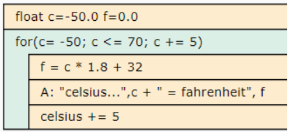
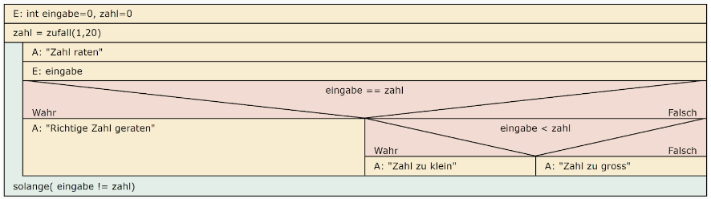
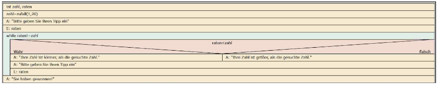
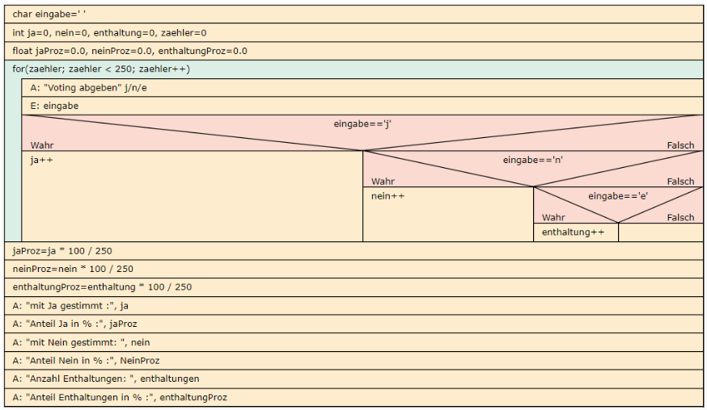
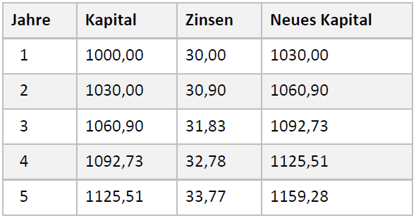
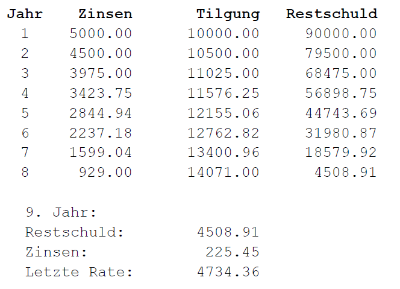

<CardChapter>

  ## 1

  Ausgabe der Zahlen 1 bis 100. Es sollen jedoch nur jeweils 25 Zahlen angezeigt werden. Danach soll zu einem Tastendruck aufgefordert werden, um die nächsten 25 Zahlen anzuzeigen.

```cpp
#include <iostream>

using namespace std;

int main(int argc, char const *argv[])
{

  for (int i = 1; i <= 100; i++)
  {
    if (i == 26 || i == 51 || i == 76)
    {
      cout << endl;
      system("pause");
    }

    cout << i << " ";
  }

  return 0;
}
```

</CardChapter>
<br/>

<CardChapter>

  ## 2

  Geben Sie eine Liste der Umrechnungswerte für Temperaturen von Celsius in Fahrenheit `F = C° \* 1,8 + 32` aus. Benutzen Sie dabei den Bereich von -50° bis +70° Celsius in 5°-Schritten.



```cpp
#include <iostream>

using namespace std;

int main()
{
  float celsius = 0;
  float fahrenheit = 0;

  for (celsius; celsius <= 70; celsius += 5)
  {
    fahrenheit = celsius * 1.8 + 32;
    cout << celsius << " Celsius entsprechen: " << fahrenheit << " Fahrenheit\n";
  }

  return 0;
}
```

</CardChapter>
<br/>

<CardChapter>

  ## 3

  Es werden beliebig viele positive, ganze Zahlen eingegeben, Ende bei Eingabe einer negativen Zahl. Das Programm gibt dann aus, wie viele gerade Zahlen eingegeben wurden.

```cpp
#include <iostream>

using namespace std;

int main(int argc, char const *argv[])
{
  int eingabe = 0;
  int zaehler = 0;

  do
  {
    cout << "Bitte Zahl eingeben" << endl;
    cin >> eingabe;
    if (eingabe % 2 == 0)
    {
      zaehler++;
    }

  } while (eingabe >= 0);

  cout << "Es wurden " << zaehler << " gerade Zahlen eingegeben" << endl;

  return 0;
}
```

</CardChapter>
<br/>

<CardChapter>

  ## 4

  Schreiben Sie ein Programm, das zwei ganze Zahlen a und b eingegeben bekommt und dann die Summe aller ganzen Zahlen in diesem Bereich (Intervall) berechnet.

Beispiel:

- = Eingaben 3 und 7
  - ergibt 25 = 3 + 4 + 5 + 6 + 7
- = Eingaben 20 und 24
  - ergibt 110 = 20 + 21 + 22 + 23 + 24

```cpp
#include <iostream>

using namespace std;

int main()
{
  int zahlA = 0;
  int zahlB = 0;
  int summe = 0;

  cout << "Bitte Zahl A eingeben: " << endl;
  cin >> zahlA;

  cout << "Bitte Zahl B eingeben: " << endl;
  cin >> zahlB;

  for (zahlA; zahlA <= zahlB; zahlA++)
  {
    summe += zahlA;
  }

  cout << summe;

  return 0;
}
```

</CardChapter>
<br/>

<CardChapter>

  ## 5

  Das Programm "Zahlenraten" denkt sich eine Zahl zwischen 1 und 20 (oder 100 oder 1000 oder oder oder) aus und Sie müssen diese Zahl erraten. Nehmen Sie zahl = zufall(1,20) als Anweisung für die Zufallszahl.

Das Programm gibt nach jeder Eingabe den Hinweis, ob die eingegebene Zahl größer oder kleiner war als die gesuchte Zahl – oder es ein Treffer ist.

Erweiterung: Der User hat maximal n Versuche.



alternativ:


```cpp title='5.cpp'
#include <iostream>
#include <stdlib.h>
#include <ctime>
#define OG 20
#define UG 1

using namespace std;

int main(int argc, char const *argv[])
{
  int eingabe = 0, zufall = 0;
  srand(time(NULL)); // Start Random

  // zufall = rand() % (Obergrenze - Untergrenze + 1) + Untergrenze
  zufall = rand() % (OG - UG + 1) + UG;

  do
  {

    cout << "Bitte Zahl raten: " << endl;
    cin >> eingabe;
    if (eingabe == zufall)
    {
      cout << "zahl richtig geraten!";
    }
    else if (eingabe < zufall)
    {
      cout << "zahl zu klein!" << endl;
    }
    else
    {
      cout << "zahl zu gross!" << endl;
    }

  } while (eingabe != zufall);

  return 0;
}
```

alternativ:

```cpp title='5_2.cpp'
#include <iostream>
#include <stdlib.h>
#include <time.h>
#define OG 20
#define UG 1

using namespace std;

int main()
{
  int zahl, raten;
  srand(time(NULL));

  zahl = rand() % (OG - UG + 1) + UG;

  cout << "Tipp: ";
  cin >> raten;

  while (raten != zahl)
  {
    if (raten < zahl)
    {
      cout << "Ihre Zahl ist kleiner als die gesuchte Zahl";
    }
    else
    {
      cout << "Ihre Zahl ist groesser als die gesuchte Zahl";
    }
    cout << "\nTipp: ";
    cin >> raten;
  }
  cout << "GEWONNEN!";

  return 0;
}
```

</CardChapter>
<br/>

<CardChapter>

  ## 6

  Berechnen Sie die Fakultät einer Zahl.

| Eingabe     | Verarbeitung          | Ausgabe |
| :------:    | :------:              | :------:|
| `3`         | `1 * 2 * 3`           | `6`     |
| `4`         | `1 * 2 * 3 * 4`       | `24`    |
| `5`         | `1 * 2 * 3 * 4 * 5`   | `120`   |


```cpp
#include <iostream>

using namespace std;

int main()
{
  int zahl = 0;
  int erg = 1;

  cout << "Eingabe a bitte: ";
  cin >> zahl;
  cout << zahl;

  while (zahl > 0)
  {
    erg = erg * zahl;
    zahl--;
  }

  cout << "! = " << erg;

  return 0;
}
```

</CardChapter>
<br/>

<CardChapter>

  ## 7

  Ein Voting: 250 User können `j` für Ja, `n` für Nein und `e` für Enthaltung eingeben. Geben Sie bitte aus, wie viele User jeweils für Ja und Nein gestimmt haben und wie viele Enthaltungen es gab.

Freiwillige Erweiterung: Geben Sie die prozentualen Anteile an.



```cpp title='7.cpp'
#include <iostream>
#define ANZ 250

using namespace std;

int main()
{
  int ja = 0, nein = 0, enthaltung = 0, ungueltig = 0, i = 0;
  double stimmen = 0.0;
  char eingabe = ' ';

  for (i = 0; i < ANZ; i++)
  {
    cout << "Bitte abstimmen (J)a / (N)ein (E)nthaltung" << endl;
    cin >> eingabe;
    stimmen++;

    if (eingabe == 'j' || eingabe == 'J')
    {
      ja++;
    }
    else if (eingabe == 'n' || eingabe == 'N')
    {
      nein++;
    }
    else if (eingabe == 'e' || eingabe == 'E')
    {
      enthaltung++;
    }
    else
    {
      ungueltig++;
    }
  }

  printf("Mit 'ja' abgestimmt: %4i %6.2lf%%", ja, (ja * 100 / stimmen));
  printf("\nMit 'nein' abgestimmt: %2i %6.2lf%%", nein, (nein * 100 / stimmen));
  printf("\nEnthaltungen: %11i %6.2lf%%", enthaltung, (enthaltung * 100 / stimmen));
  printf("\nUngueltige Stimmen: %5i %6.2lf%%", ungueltig, (ungueltig * 100 / stimmen));

  return 0;
}
```


</CardChapter>
<br/>

<CardChapter>

  ## 8 2Do

  Lösen Sie bitte das "Reiskornproblem": Auf einem Schachbrett kommt auf das erste Feld 1 Reiskorn, auf das nächste „doppelt so viele“ (also 2) und auf jedes weitere entsprechend immer die doppelte Anzahl des vorherigen Feldes.
(siehe auch http://de.wikipedia.org/wiki/Sissa_ibn_Dahir)

- Wie viele Reiskörner liegen am Ende insgesamt auf dem Spielfeld?
- Wenn ein Reiskorn 0,025 Gramm wiegt, was würde dann der gesamte Reis wiegen?

</CardChapter>
<br/>

<CardChapter>

  ## 9

  In einem Unternehmen wird das Gehalt in einer Gehaltsgruppe in Abhängigkeit vom Alter der Beschäftigten berechnet. Dazu soll eine entsprechende Tabelle ausgegeben werden. Im Alter bis 35 wird das monatliche Bruttogehalt alle 2 Jahre um 100€ erhöht, danach alle 4 Jahre um jeweils 150€. Gehen Sie von einem Endalter von mindestens 67 Jahren aus.

Ausgangspunkt (und Eingabe): Das Gehalt eines 21-jährigen Mitarbeiters

```cpp title='9.cpp'
#include <iostream>

using namespace std;

int main(int argc, char const *argv[])
{
  double gehalt = 0;
  int alter = 21, jahr = 1;

  cout << "Bitte Gehalt eingeben: " << endl;
  cin >> gehalt;

  printf("Jahr    Gehalt   Alter:");

  do
  {
    printf("\n%4i   %5.2lf   %5i", jahr, gehalt, alter);
    alter++;
    jahr++;
    if (jahr % 2 == 0)
    {
      gehalt = gehalt + 100;
    }
  } while (alter <= 35);

  do
  {
    printf("\n%4i   %5.2lf   %5i", jahr, gehalt, alter);
    alter++;
    jahr++;
    if (jahr % 4 == 3 && alter >= 39)
    {
      gehalt = gehalt + 150;
    }
  } while (alter > 35 && alter <= 67);

  return 0;
}
```

</CardChapter>
<br/>

<CardChapter>

  ## 10

  Es sollen vom Benutzer ein Anlagebetrag, ein Zinssatz (in %) und eine Stehzeit eingegeben werden. Das Programm gibt dann in einer Tabelle die Entwicklung des Kapitalzuwachses anschaulich in einer Tabelle aus. (Auf die Zahlenformatierung brauchen Sie noch nicht Rücksicht zu nehmen.) Beispiel: Kapital 1000 Euro, Zinssatz 3 % auf 5 Jahre angelegt



```cpp title='10.cpp'
#include <iostream>

using namespace std;

int main(int argc, char const *argv[])
{
  double startKapital = 1000.0;
  int zinsSatz = 3;
  double zinsen = 0.0;
  int jahre = 5;
  double endKapital = 0.0;

  // cout << "Bitte Startkapital eingeben: " << endl;
  // cin >> startKapital;

  // cout << "Bitte Zinssatz eingeben: " << endl;
  // cin >> zinsSatz;

  // cout << "Bitte Stehzeit eingeben: " << endl;
  // cin >> jahre;

  cout << "Jahre "
       << "StartKapital "
       << "Zinsen "
       << "Endkapital:" << endl;

  for (int i = 1; i <= jahre; i++)
  {
    endKapital = startKapital + (startKapital * zinsSatz / 100);
    zinsen = endKapital - startKapital;

    printf("\n%5i %12.2lf %6.2lf %10.2lf ", i, startKapital, zinsen, endKapital);
    startKapital = endKapital;
  }

  return 0;
}
```


</CardChapter>
<br/>

<CardChapter>

  ## 11 2Do

  Eine Variation der Zinsaufgabe(10): Nach Eingabe eines Kapitals und eines Zinssatzes soll das Programm "sagen", nach wie viel Jahren sich das angelegte Kapital verdoppelt hat.

</CardChapter>
<br/>

<CardChapter>

  ## 12 2Do

  Ebenfalls eine Erweiterung zu oben (Aufgabe 10): Erstellen Sie ein Programm, welches errechnet, nach wie viel Jahren man Millionär geworden ist, wenn man einen beliebigen Betrag zu einem bestimmten Zinssatz verzinst. Programmieren Sie dazu eine Schleife, die beendet wird, wenn die Bedingung erfüllt wird.

</CardChapter>
<br/>

<CardChapter>

  ## 13 2Do

  Prüfen Sie die Eingaben im "Sparprogramm" (die vorherige Zinseszinsaufgabe 10) auf Korrektheit! Bei falscher Eingabe muss der User die entsprechenden Werte erneut eingeben, bis er eine gültige Eingabe macht.

Prüfungen:

- Der Anlagebetrag muss mindestens 500 € betragen, maximal 500.000 €;
- der Zinssatz muss zwischen 0,5 und max. 10% liegen;
- die Stehzeit: mindestens 1 Jahr, maximal 50 Jahre.

</CardChapter>
<br/>

<CardChapter>

  ## 14 2Download

  Die Fibonacci-Reihe: `0, 1, 1, 2, 3, 5, 8, 13, 21, 34, … `
  
  Berechnen Sie die ersten 100 Fibonacci-Zahlen und geben Sie diese aus!

</CardChapter>
<br/>

<CardChapter>

  ## 15 2Do

  Lösen Sie, bzw. der Rechner, Kettenaufgaben, z.B. 2 + 5 \* 3 – 12 / 3 = 3

- dabei werden die Berechnungen von links nach rechts durchgeführt, ohne Beachtung der Hierarchie der Rechenarten

=> kein "Punktrechnung vor Strichrechnung"!!

- 2 + 5 = 7
- 7 \* 3 = 21
- 21 – 12 = 9
- 9 / 3 = 3

</CardChapter>
<br/>

<CardChapter>

  ## 16 2Do

  Für einen Kredit soll in Tilgungsplan erstellt werden. Nach Eingabe von Kreditbetrag, Zinssatz und (jährlicher) Tilgungsrate wird der kreditverlauf in anschaulicher Form ausgegeben.



Erläuterungen:<br/>
Die zweite Spalte enthält die Kreditzinsen für das abgelaufene Jahr. Die dritte Spalte enthält jeweils den Tilgungsbetrag (=Tilgungsrate – aktuelle Zinsen) des abgelaufenen Jahres und die vierte Spalte die Restschuld als Differenz zum Betrag am Jahresanfang und dem Tilgungsbetrag.

Die Ausgabeschleife läuft, bis die Restschuld + Zinsen für das nächste Jahr kleiner als die Tilgungsraten sind. Aus diesen Werten wird dann die aktuelle, letzte Tilgung berechnet und ausgegeben.

Tipp: <br/>
Rechnen Sie die Tabellenwerte mit dem Taschenrechner (oder Excel) nach.

Zusatzaufgabe/Erweiterung: <br/>
Die Tilgungsrate muss größer sein als die Rate im Zinsen im ersten Jahr, sonst gibt es eine "ewige Tilgung"; fangen Sie daher diesen Eingabefehler ab. Ebenso geben wir nur Kredit für Beträge zwischen 1.000 € und 500.000 € und der Zinssatz liegt zwischen 0,5% und 10%.

</CardChapter>
<br/>


