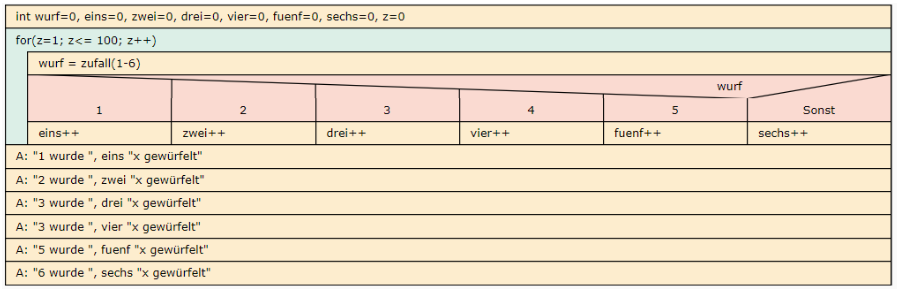
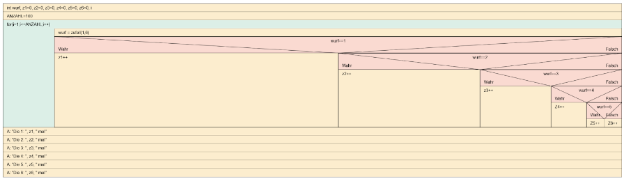
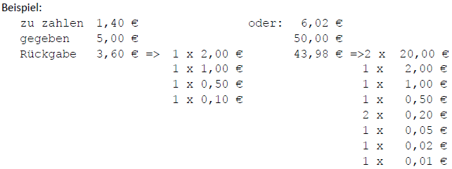
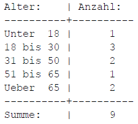

<CardChapter>

  ## 1 2Do

  Das Programm gibt das kleine Einmaleins aus, d.h. 1 x 1 = 1 bis 10 x 10 = 100. 
  
  Erstellen Sie 4 Lösungen: 
  - mit 2 Kopfschleifen + Laufbedingungen, 
  - mit 2 Fußschleifen + Abbruchbedingungen 
  - mit 2 For-Schleifen 
  - und mit nur einer Schleife und einer Verzweigung darin.

</CardChapter>
<br/>

<CardChapter>

  ## 2 2Do 

  


alternativ:



</CardChapter>
<br/>

<CardChapter>

  ## 3 2Do

  Erstellen Sie ein Programm, das nach Eingabe beliebig vieler Werte zwischen 1 und 100 das Minimum, das Maximum und den Durchschnitt der eingegebenen Werte ausgibt. Ende bei Eingabe einer 999, danach erfolgt die Ausgabe der geforderten Werte.

</CardChapter>
<br/>

<CardChapter>

  ## 4 2Do

  Erstellen Sie das Programm für einen Geldrückgabeautomaten, zum Beispiel im Parkhaus, bei einem Fahrkartenautomaten, ähnlich auch wie in einem Geldautomaten.



</CardChapter>
<br/>

<CardChapter>

  ## 5

Für einen Betrieb soll eine Altersstatistik der Mitarbeiter erzeugt werden,
die die Anzahl der Beschäftigten nach Altersgruppen aufsteigend aufgeschlüsselt ausgibt.
Dazu wird das jeweilige Alter der Personen eingegeben, Ende bei Eingabe einer 0.



best practice:

```cpp title='5_2.cpp'
#include <iostream>
#include <cstdlib>
#include <ctime>
using namespace std;

int main()
{
  int alter, u18 = 0, u30 = 0, u50 = 0, u65 = 0, ue65 = 0;

  while (alter != 0)
  {
    cout << "Alter bitte (Ende bei 0):";
    cin >> alter;

    if (alter > 65)
    {
      ue65++;
    }
    else if (alter >= 51)
    {
      u65++;
    }
    else if (alter >= 31)
    {
      u50++;
    }
    else if (alter >= 18)
    {
      u30++;
    }
    else if (alter != 0)
    {
      u18++;
    }
  }
  cout << "unter 18:  " << u18 << endl;
  cout << "18 bis 30: " << u30 << endl;
  cout << "31 bis 50: " << u50 << endl;
  cout << "51 bis 65: " << u65 << endl;
  cout << "\201ber 65 :  " << ue65 << endl;

  return 0;
}
```

alternativ:

```cpp title='5.cpp'
#include <iostream>
#include <cstdlib>
#include <ctime>
using namespace std;

int main()
{
  int alter, u18 = 0, u30 = 0, u50 = 0, u65 = 0, ue65 = 0;

  while (alter != 0)
  {
    cout << "Alter bitte (Ende bei 0):";
    cin >> alter;

    if (alter < 18 && alter != 0)
    {
      u18++;
    }
    else if (alter <= 30 && alter != 0)
    {
      u30++;
    }
    else if (alter <= 50 && alter != 0)
    {
      u50++;
    }
    else if (alter <= 65 && alter != 0)
    {
      u65++;
    }
    else if (alter != 0)
    {
      ue65++;
    }
  }
  cout << "unter 18:  " << u18 << endl;
  cout << "18 bis 30: " << u30 << endl;
  cout << "31 bis 50: " << u50 << endl;
  cout << "51 bis 65: " << u65 << endl;
  cout << "\201ber 65 :  " << ue65 << endl;

  return 0;
}
```

alternativ:

```cpp title='5p.cpp'
#include <iostream>

using namespace std;

int main()
{
  int eingabe = 0, alterUnter18 = 0, alter18Bis30 = 0, alter31Bis50 = 0, alter51Bis65 = 0, alterAb65 = 0, summe = 0;

  do
  {
    printf("Bitte Alter eingeben: \n");
    printf("Fuer Abbruch 0 eingeben: \n");
    cin >> eingabe;
    if (eingabe > 0 && eingabe < 18)
    {
      alterUnter18++;
    }
    else if (eingabe >= 18 && eingabe <= 30)
    {
      alter18Bis30;
    }
    else if (eingabe >= 31 && eingabe <= 50)
    {
      alter31Bis50++;
    }
    else if (eingabe >= 51 && eingabe <= 65)
    {
      alter51Bis65++;
    }
    else if (eingabe > 65)
    {
      alterAb65++;
    }
  } while (eingabe != 0);

  summe = alterUnter18 + alter18Bis30 + alter31Bis50 + alter51Bis65 + alterAb65;

  printf("Unter 18:  %i\n", alterUnter18);
  printf("18 bis 30: %i\n", alter18Bis30);
  printf("31 bis 50: %i\n", alter31Bis50);
  printf("51 bis 65: %i\n", alter51Bis65);
  printf("Ueber 65:  %i\n", alterAb65);
  printf("Summe:     %i\n", summe);

  return 0;
}
```

</CardChapter>
<br/>


