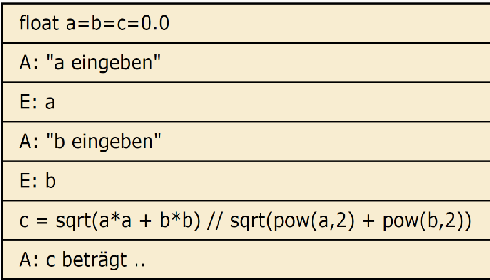
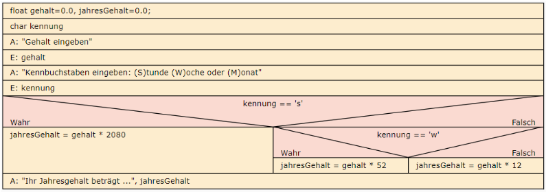
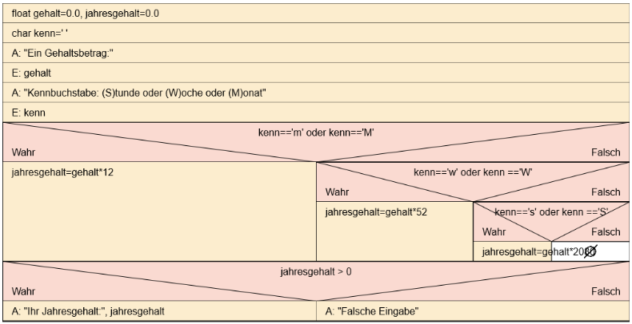
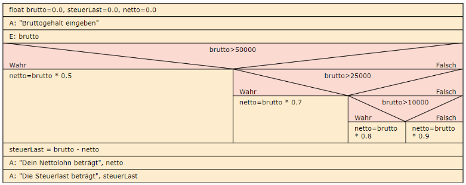

<CardChapter>

  ## 1

  Der Satz des Pythagoras lautet "a² + b² = c²". Erstellen Sie ein Programm zur Berechnung der Seite C nach Eingabe der Werte für a und b. Für die Wurzelberechnung können Sie die Funktion "sqrt()" benutzen.




```cpp
#include <iostream>
#include <cmath>

using namespace std;

int main(int argc, char const *argv[])
{
  float a = 0;
  float b = 0;
  float c = 0;

  cout << "Bitte Seite a eingeben: " << endl;
  cin >> a;

  do
  {
    cout << "Bitte positive Werte fuer Seite a eingeben: " << endl;
    cin >> a;
  } while (a < 0);

  cout << "Bitte Seite b eingeben: " << endl;
  cin >> b;

  do
  {
    cout << "Bitte positive Werte fuer Seite b eingeben: " << endl;
    cin >> b;
  } while (b < 0);

  c = sqrt(a * a + b * b);

  cout << "Fuer a = " << a << " und b = " << b << endl;
  cout << "Betraegt c = " << c << endl;

  return 0;
}

```

</CardChapter>
<br/>

<CardChapter>

  ## 2

  Früher wurde das Normalgewicht berechnet aus der Körpergröße in Zentimetern - 100, das dazugehörige Idealgewicht lag bei Männern 10% darunter, bei Frauen minus 15%.

Erstellen Sie ein Programm, das Größe und Geschlecht (m/w) abfragt und dann Normal- und Ideal-gewicht ausgibt.

Erweiterung: Lassen Sie das tatsächliche Gewicht eingeben und geben Sie die Abweichung vom Normal- und Idealgewicht aus, ggf. mit entsprechenden Bewertung "Sie haben Über-/Untergewicht."

```cpp
#include <iostream>

using namespace std;

int main(int argc, char const *argv[])
{
  float groesse = 0;
  char geschlecht = ' ';
  float idealGewicht = 0;
  float normalGewicht = 0;
  float gewicht = 0;

  cout << "Bitte Koerpergroesse in cm eingeben: " << endl;
  cin >> groesse;

  do
  {
    cout << "Bitte geben Sie Ihr Geschlecht an (w/m) : " << endl;
    cin >> geschlecht;
  } while (geschlecht != 'w' && geschlecht != 'm');

  cout << "Bitte geben Sie Ihr Gewicht ein: " << endl;
  cin >> gewicht;

  normalGewicht = groesse - 100;

  if (geschlecht == 'w')
  {
    idealGewicht = normalGewicht * 0.85;
  }
  else
  {
    idealGewicht = normalGewicht * 0.9;
  }

  cout << "Ihr Normalgewicht betraegt : " << normalGewicht << endl;
  cout << "Ihr Idealgewicht betraegt : " << idealGewicht << endl;
  if (gewicht < idealGewicht)
  {
    cout << "Sie haben Untergewicht!" << endl;
  }
  else
  {
    cout << "Sie haben Uebergewicht!" << endl;
  }

  return 0;
}
```

</CardChapter>
<br/>

<CardChapter>

  ## 3

  Eingabe: Stückzahl und Einzelpreis.

Bei mehr als 10 Stück gibt es 5 % Rabatt, bei mehr als 50 Stück gibt es 10 % Rabatt.

Ausgabe: Gesamtpreis.

```cpp
#include <iostream>


using namespace std;

int main(int argc, char const *argv[])
{
  int menge = 0;
  float einzelPreis = 0;
  float gesamtPreis = 0;
  int rabatt1 = 5;
  int rabatt2 = 10;

  cout << "Bitte geben Sie die Stueckzahl ein: " << endl;
  cin >> menge;

  cout << "Bitte geben Sie den Einzelpreis an: " << endl;
  cin >> einzelPreis;

  if (menge > 50)
  {
    gesamtPreis = menge * (einzelPreis + (einzelPreis * rabatt1 / 100));
  }
  else if (menge > 10)
  {
    gesamtPreis = menge * (einzelPreis + (einzelPreis * rabatt2 / 100));
  }
  else
  {
    gesamtPreis = menge * einzelPreis;
  }

  cout << "Der Gesamtpreis betraegt: " << gesamtPreis << endl;

  return 0;
}
```

</CardChapter>
<br/>

<CardChapter>

  ## 4 

  Schreiben Sie ein Programm, welches eine Note (1 bis 6) in Ziffern einliest und anschließend die Note in Worten (’sehr gut’, ’gut’ usw.) ausgibt. Wenn eine ungültige Ziffer (>6 oder <1) eingegeben wurde, erscheint eine Fehlermeldung.

```cpp
#include <iostream>

using namespace std;

int main(int argc, char const *argv[])
{
  int note = 0;

  cout << "Bitte Note eingeben: " << endl;
  cin >> note;

  while (note < 0 || note > 6)
  {
    cout << "Bitte geben Sie eine Note zwischen 1-6 an: " << endl;
    cin >> note;
  }

  switch (note)
  {
  case 1:
    cout << "Ihr Note ist sehr gut! " << endl;
    break;
  case 2:
    cout << "Ihr Note ist gut! " << endl;
    break;
  case 3:
    cout << "Ihr Note ist befriedigend! " << endl;
    break;
  case 4:
    cout << "Ihr Note ist ausreichend! " << endl;
    break;
  case 5:
    cout << "Ihr Note ist mangelhaft! " << endl;
    break;
  default:
    cout << "Ihr Note ist ungenuegend! " << endl;
    break;
  }

  return 0;
}
```

</CardChapter>
<br/>

<CardChapter>

  ## 5

  
Für einen einfachen Taschenrechner soll es 3 (drei!) einzelne Eingaben geben:

- Zahl1
- Operator `+`, `-`, `*`, `/`
- Zahl2

Das Programm soll dann anhand des Operators die richtige Berechnung durchführen und das Ergebnis auf dem Bildschirm ausgeben.

Achtung: Eine Division durch 0 ist nicht erlaubt und ist mit einer Fehlermeldung zu quittieren, es darf dann kein Ergebnis ausgegeben werden.

```cpp
#include <iostream>

using namespace std;

int main(int argc, char const *argv[])
{
  float zahl1 = 0.0;
  float zahl2 = 0.0;
  char operat = ' ';
  float ergebnis = 0.0;

  cout << "Bitte Zahl1 eingeben: " << endl;
  cin >> zahl1;

  do
  {
    cout << "Bitte Operator eingeben: " << endl;
    cin >> operat;
  } while (operat != '+' && operat != '-' && operat != '*' && operat != '/');

  do
  {
    cout << "Bitte Zahl2 eingeben: " << endl;
    cin >> zahl2;
    if (operat == '/' && zahl2 == 0)
    {
      cout << "Division durch 0 nicht moeglich!" << endl;
    }
  } while (operat == '/' && zahl2 == 0);

  switch (operat)
  {
  case '+':
    ergebnis = zahl1 + zahl2;
    cout << zahl1 << " + " << zahl2 << " = " << ergebnis << endl;
    break;
  case '-':
    ergebnis = zahl1 - zahl2;
    cout << zahl1 << " - " << zahl2 << " = " << ergebnis << endl;
    break;
  case '*':
    ergebnis = zahl1 * zahl2;
    cout << zahl1 << " * " << zahl2 << " = " << ergebnis << endl;
    break;
  default:
    ergebnis = zahl1 / zahl2;
    cout << zahl1 << " / " << zahl2 << " = " << ergebnis << endl;
    break;
  }

  return 0;
}
```

</CardChapter>
<br/>

<CardChapter>

  ## 6 

  
Es werden 3 Zahlen per Tastatur eingeben, der Computer gibt anschließend die größte Zahl wieder aus.

Erweiterung: Auch die kleinste eingegebene Zahl wird ausgegeben.

```cpp
#include <iostream>

using namespace std;

int main(int argc, char const *argv[])
{
  float eingabe = 0;
  float min = 0;
  float max = 0;

  for (int i = 1; i <= 3; i++)
  {
    cout << "Bitte Zahl" << i << " eingeben:" << endl;
    cin >> eingabe;

    if (i == 1)
    {
      max = min = eingabe;
    }
    else if (eingabe < min)
    {
      min = eingabe;
    }
    else if (eingabe > max)
    {
      max = eingabe;
    }
  }

  cout << "Die kleinste Zahl betrug: " << min << endl;
  cout << "Die groesste Zahl betrug: " << max << endl;

  return 0;
}
```

</CardChapter>
<br/>

<CardChapter>

  ## 7

  Ein Unternehmen beschließt für seine Mitarbeiter Belegschaftsaktien zu Vorzugskonditionen anzubieten.
Es werden folgende Konditionen festgesetzt.

Mitarbeiter mit einer Betriebszugehörigkeit von mehr als 10 Jahren können 20 Aktien beziehen,
bei einer Betriebszugehörigkeit von mehr als 2 Jahren können sie 10 Aktien erwerben.

Mitarbeiter, die sich in einem gekündigten Arbeitsverhältnis befinden, sollen jedoch keine Aktien erhalten.

Eingabe:
Dauer der Betriebszugehörigkeit, gekündigtes Arbeitsverhältnis (ja oder nein)

Ausgabe: Anzahl der Aktien, die bezogen werden können.

```cpp
#include <iostream>

using namespace std;

int main(int argc, char const *argv[])
{
  int betriebsZugehoerigkeit = 0;
  int aktien = 0;
  char gekuendigt = ' ';

  cout << "Bitte Dauer der Betriebszugehoerigkeit angeben: " << endl;
  cin >> betriebsZugehoerigkeit;

  do
  {
    cout << "Wurde Ihnen gekuendigt (j/n)?" << endl;
    cin >> gekuendigt;
    if (gekuendigt != 'j' && gekuendigt != 'n')
    {
      cout << "Falsche Eingabe! Bitte (j/n) angeben: " << endl;
    }

  } while (gekuendigt != 'j' && gekuendigt != 'n');

  if (gekuendigt == 'j')
  {
    cout << "Da Ihnen gekuendigt wurde erhalten Sie keine Vorzugsaktien" << endl;
  }
  else
  {
    if (betriebsZugehoerigkeit > 10)
    {
      aktien = 20;
      cout << "Sie koennen " << aktien << " Vorzugsaktien erwerben!" << endl;
    }
    else
    {
      aktien = 10;
      cout << "Sie koennen " << aktien << " Vorzugsaktien erwerben!" << endl;
    }
  }

  return 0;
}
```

</CardChapter>
<br/>

<CardChapter>

  ## 8

  Nach Eingabe eines Gehalts und eines Kennbuchstabens (`S`tunde, `W`oche, `M`onat) wird das entsprechende Jahresgehalt ausgerechnet.

Das Jahr hat 52 Wochen, 12 Monate und 2080 Arbeitsstunden/Jahr sind zu leisten.



alternativ:



```cpp
#include <iostream>

using namespace std;

int main(int argc, char const *argv[])
{
  float gehalt = 0;
  float jahresGehalt = 0;
  char kennBuchstabe = ' ';

  do
  {
    cout << "Bitte geben Sie Ihr Gehalt ein: " << endl;
    cin >> gehalt;
  } while (gehalt <= 0);

  do
  {
    cout << "Bitte geben Sie Berechnungzeitraum ein (S)tunden-, (W)ochen- oder (M)onatslohn : " << endl;
    cin >> kennBuchstabe;
  } while (kennBuchstabe != 's' && kennBuchstabe != 'S' && kennBuchstabe != 'w' && kennBuchstabe != 'W' && kennBuchstabe != 'm' && kennBuchstabe != 'M');

  if (kennBuchstabe == 's' || kennBuchstabe == 'S')
  {
    jahresGehalt = gehalt * 2080;
  }
  else if (kennBuchstabe == 'w' || kennBuchstabe == 'W')
  {
    jahresGehalt = gehalt * 52;
  }
  else
  {
    jahresGehalt = gehalt * 12;
  }

  cout << "Ihr Jahresgehalt betraegt: " << jahresGehalt << endl;

  return 0;
}
```

</CardChapter>
<br/>

<CardChapter>

  ## 9

  Erstellen Sie ein Programm für eine einfache Datumsprüfung. Es werden einzeln Tag, Monat, Jahr eingegeben und sind danach zu prüfen.

- Der Tag muss zwischen 1 und 31 liegen
- Der Monat dann zwischen 1 und 12 und
- Jahreszahl sollen nur zwischen 1800 und 2200 erlaubt sein.

Das Programm gibt am Ende aus: "Plausibles Datum!" oder "Falsches Datum!"

```cpp
#include <iostream>

using namespace std;

int main(int argc, char const *argv[])
{
  int tag = 0;
  int monat = 0;
  int jahr = 0;

  cout << "Bitte Tag eingeben" << endl;
  cin >> tag;
  cout << "Bitte Monat eingeben" << endl;
  cin >> monat;
  cout << "Bitte Jahr eingeben" << endl;
  cin >> jahr;

  if (tag < 1 || tag > 31 || monat < 1 || monat > 12 || jahr < 1800 || jahr > 2200)
  {
    cout << "Falsche Datumeingabe!" << endl;
  }
  else
  {
    cout << "Plausible Datumeingabe!" << endl;
  }

  return 0;
}
```

</CardChapter>
<br/>

<CardChapter>

  ## 10 - check

  Verfeinern Sie Ihre Lösung: Januar, März, Mai, Juli, August, Oktober, Dezember haben 31 Tage, die anderen Monate mit Ausnahme des Februars haben 30 Tage.

-> Sie müssen also Tag und Monat im Zusammenhang prüfen…

Das Monatsende des Februars muss natürlich im Zusammenhang mit dem Jahr geprüft werden, gibt es 28 oder 29 Tage?!?

- 2020 Schaltjahr
- 1900 kein Schaltjahr

```cpp
#include <iostream>

using namespace std;

int main(int argc, char const *argv[])
{
  int tag = 0;
  int monat = 0;
  int jahr = 0;

  cout << "Bitte Tag eingeben" << endl;
  cin >> tag;
  cout << "Bitte Monat eingeben" << endl;
  cin >> monat;
  cout << "Bitte Jahr eingeben" << endl;
  cin >> jahr;

  if (tag < 1 || tag > 31 || monat < 1 || monat > 12 || jahr < 1800 || jahr > 2200)
  {

    cout << "Falsche Datumeingabe!" << endl;
  }
  else
  {
    cout << "Plausible Datumeingabe!" << endl;
  }
  if (monat == 1 || monat == 3 || monat == 5 || monat == 7 || monat == 8 || monat == 10 || monat == 12)
  {
    cout << "Dieser Monat hat 31 Tage" << endl;
    // cout << "Den " << tag << "." << monat << "." << jahr << " gibt es nicht!" << endl;
  }
  else if (monat == 2)
  {
    if (jahr % 400 == 0 || jahr % 4 == 0 && jahr % 100 != 0)
    {
      cout << "Schaltjahr: Dieser Monat hat 29 Tage" << endl;
      /* code */
    }
    else
    {
      cout << "Dieser Monat hat 28 Tage" << endl;
    }
  }
  else
  {
    cout << "Dieser Monat hat 30 Tage!" << endl;
  }

  return 0;
}
```

</CardChapter>
<br/>

<CardChapter>

  ## 11

  Es gelte folgende vereinfachte Steuertabelle:

- 20% Steuern bei mehr als 10.000€ Einkommen;
- 30% Steuern bei mehr als 25.000€ Einkommen;
- 50% Steuern bei mehr als 50.000€ Einkommen;
- Geringverdiener zahlen nur 10% Steuern.

Eingegeben wird (nur) das Bruttogehalt.
Erstellen Sie ein Programm zur Ermittlung und Ausgabe der Steuerlast und des Nettogehalts.



```cpp
#include <iostream>

using namespace std;

int main(int argc, char const *argv[])
{
  float bruttoGehalt = 0.0;
  float steuerLast = 0.0;
  float nettoGehalt = 0.0;

  cout << "Bitte Bruttogehalt eingeben: " << endl;
  cin >> bruttoGehalt;

  if (bruttoGehalt > 50000)
  {
    nettoGehalt = bruttoGehalt * 0.5;
  }
  else if (bruttoGehalt > 25000)
  {
    nettoGehalt = bruttoGehalt * 0.7;
  }
  else if (bruttoGehalt > 10000)
  {
    nettoGehalt = bruttoGehalt * 0.8;
  }
  else
  {
    nettoGehalt = bruttoGehalt * 0.9;
  }

  steuerLast = bruttoGehalt - nettoGehalt;

  cout << "Ihr Nettogehalt betraegt: " << nettoGehalt << endl;
  cout << "Ihre Steuerlast betraegt: " << steuerLast << endl;

  return 0;
}
```

</CardChapter>
<br/>

<CardChapter>

  ## 12

  Verknüpfen Sie die beiden vorherigen Aufgaben (8) zum „Jahres/Stunde/Monatsgehalt“ und
die Aufgabe (11) zur Steuerberechnung, so dass nach Ermittlung des Jahresgehalts (Brutto)
die Steuer und der Nettolohn ermittelt werden.

```cpp
#include <iostream>

using namespace std;

int main(int argc, char const *argv[])
{
  float bruttoGehalt = 0;
  float jahresGehaltBrutto = 0;
  float jahresGehaltNetto = 0;
  float steuerLast = 0;
  char kennBuchstabe = ' ';

  do
  {
    cout << "Bitte geben Sie Ihr Gehalt (brutto) ein: " << endl;
    cin >> bruttoGehalt;
  } while (bruttoGehalt <= 0);

  do
  {
    cout << "Bitte geben Sie Berechnungzeitraum ein (S)tunden-, (W)ochen- oder (M)onatslohn : " << endl;
    cin >> kennBuchstabe;
  } while (kennBuchstabe != 's' && kennBuchstabe != 'S' && kennBuchstabe != 'w' && kennBuchstabe != 'W' && kennBuchstabe != 'm' && kennBuchstabe != 'M');

  if (kennBuchstabe == 's' || kennBuchstabe == 'S')
  {
    jahresGehaltBrutto = bruttoGehalt * 2080;
  }
  else if (kennBuchstabe == 'w' || kennBuchstabe == 'W')
  {
    jahresGehaltBrutto = bruttoGehalt * 52;
  }
  else
  {
    jahresGehaltBrutto = bruttoGehalt * 12;
  }

  if (jahresGehaltBrutto > 50000)
  {
    jahresGehaltNetto = jahresGehaltBrutto * 0.5;
  }
  else if (jahresGehaltBrutto > 25000)
  {
    jahresGehaltNetto = jahresGehaltBrutto * 0.7;
  }
  else if (jahresGehaltBrutto > 10000)
  {
    jahresGehaltNetto = jahresGehaltBrutto * 0.8;
  }
  else
  {
    jahresGehaltNetto = jahresGehaltBrutto * 0.9;
  }

  steuerLast = jahresGehaltBrutto - jahresGehaltNetto;

  cout << "Ihr Jahresgehalt (brutto) betraegt: " << jahresGehaltBrutto << endl;
  cout << "Ihr Jahresgehalt (netto) betraegt: " << jahresGehaltNetto << endl;
  cout << "Ihre jaehrliche Steuerlast betraegt: " << steuerLast << endl;

  return 0;
}
```

</CardChapter>
<br/>

<CardChapter>

  ## 13

  In Abhängigkeit vom Goldgehalt im Roherz soll die anschließende Verarbeitung festgelegt werden.

Eingegeben wird der Goldgehalt, das Programm gibt eine Meldung aus, wie mit dem Material zu verfahren ist. Folgende Gehalte und deren Verarbeitung sind zu berücksichtigen.

- 1 g/t gelten als Erz und werden der Aufbereitung zugeführt;
- Reicherze mit Gehalten von über 10g/t werden zum Verschneiden mit Armerzen zwischengelagert;
- Erze mit Gehalten zwischen 10 und 2 g/t werden direkt in die Aufbereitung transportiert;
- Armerze (1-2g/t) werden zum Verschneiden mit Reicherzen eingewogen;
- Gestein mit Gehalten bis 1g/t werden auf die Halde geschüttet.

```cpp
#include <iostream>

using namespace std;

int main(int argc, char const *argv[])
{
  float goldGehalt = 0.0;

  cout << "Bitte Goldgehalt eingeben (gramm/tonne): " << endl;
  cin >> goldGehalt;

  if (goldGehalt < 1)
  {
    cout << "Gestein mit Gehalten bis 1g/t werden auf die Halde geschuettet." << endl;
  }
  else if (goldGehalt >= 1 && goldGehalt <= 2)
  {
    cout << "Armerze (1-2g/t) werden zum Verschneiden mit Reicherzen eingewogen" << endl;
  }
  else if (goldGehalt >= 2 && goldGehalt <= 10)
  {
    cout << "Erze mit Gehalten zwischen 2 und 10 g/t werden direkt in die Aufbereitung transportiert" << endl;
  }
  else
  {
    cout << "Reicherze mit Gehalten von ueber 10g/t werden zum Verschneiden mit Armerzen zwischengelagert" << endl;
  }

  return 0;
}
```

</CardChapter>
<br/>

<CardChapter>

  ## 14

  Sie haben in Ihrem Außendienst mehrere Vertreter beschäftigt und wollen für diese Mitarbeiter Provisionen und jeweils das Gesamtgehalt eines Mitarbeiters berechnen.

Das Grundgehalt der Vertreter beträgt 3.000 €, und es gilt folgende Provisionsregelung im Unternehmen:

- Unter 10.000 € Umsatz bekommt ein Vertreter 3% Provision.
- bei einem Umsatz zwischen 10.000 € und 20.000 € gibt es 5% Provision.
- liegt der Umsatz über 20.000 €, so bekommt ein Vertreter 7.5% Provision.

Für jeden Vertreter soll nach Eingabe des Umsatzes das Gehalt berechnet und ausgegeben werden.

```cpp
#include <iostream>
#define GRUNDGEHALT 3000

using namespace std;

int main(int argc, char const *argv[])
{
  float umsatz = 0.0;
  float gehalt = 0.0;

  cout << "Bitte Umsatz eingeben:" << endl;
  cin >> umsatz;

  if (umsatz < 10000)
  {
    gehalt = GRUNDGEHALT * 1.03;
  }
  else if (umsatz >= 10000 && umsatz <= 20000)
  {
    gehalt = GRUNDGEHALT * 1.05;
  }
  else if (umsatz > 20000)
  {
    gehalt = GRUNDGEHALT * 1.075;
  }
  cout << "Sie erhalten insgesamt: " << gehalt << endl;
  return 0;
}
```

</CardChapter>
<br/>

<CardChapter>

  ## 15

  Erweitern Sie die obige Aufgabe (14): Wenn Vertreter in (`H`)amburg, (`B`)erlin oder (`M`)ünchen wohnen, erhalten sie einen Ortszuschlag von 250 € für die erhöhten Lebenshaltungskosten in diesen Großstädten.

```cpp
#include <iostream>
#define GRUNDGEHALT 3000

using namespace std;

int main(int argc, char const *argv[])
{
  float umsatz = 0.0;
  float gehalt = 0.0;
  char ort = ' ';

  cout << "Bitte Umsatz eingeben:" << endl;
  cin >> umsatz;

  cout << "Bitte Wohnort angeben (H)amburg, (B)erlin oder (M)uenchen:" << endl;
  cin >> ort;

  if (umsatz < 10000)
  {
    gehalt = GRUNDGEHALT * 1.03;
  }
  else if (umsatz >= 10000 && umsatz <= 20000)
  {
    gehalt = GRUNDGEHALT * 1.05;
  }
  else if (umsatz > 20000)
  {
    gehalt = GRUNDGEHALT * 1.075;
  }

  cout << "Sie erhalten Gehalt + Provision: " << gehalt << endl;

  if (ort == 'H' || ort == 'h' || ort == 'b' || ort == 'B' || ort == 'M' || ort == 'M')
  {
    gehalt = gehalt + 250;
    cout << "Sie erhalten Ortszuschlag: 250" << endl;
  }

  cout << "Sie erhalten insgesamt: " << gehalt << endl;

  return 0;
}
```

</CardChapter>
<br/>

<CardChapter>

  ## 16

  Ein Exporteur bietet seinen ausländischen Kunden bei Kauf des Artikels:

- Endlosschleifen, rosa, wahlweise links- oder rechtsgedreht
- Preis pro Stück: 3,98 €

folgende Rabatte an:

- bei Abnahme von mindestens 100 Stück: 5 % Rabatt
- mindestens 1.000 Stück: 10 % Rabatt
- mindestens 5.000 Stück: 15 % Rabatt
- mindestens 10.000 Stück: 20 % Rabatt

Ein Programm soll nach Eingabe der gekauften Menge folgende Daten berechnen und ausgeben:

- Nettopreis gesamt
- Rabattbetrag
- Nettobetrag abzgl. Rabatt
- MwSt (voller Satz)
- Bruttoendpreis.

```cpp
#include <iostream>

using namespace std;

int main(int argc, char const *argv[])
{
  int menge = 0;
  float einzelPreis = 3.98;
  float gesamtNetto = 0;
  int rabatt = 0;
  float rabattBetrag = 0;
  float nettoNachRabatt = 0;
  float mwSt = 0;
  float bruttoEndPreis = 0;

  cout << "Bitte Menge angeben: " << endl;
  cin >> menge;

  if (menge >= 10000)
  {
    rabatt = 20;
  }
  else if (menge >= 5000)
  {
    rabatt = 15;
  }
  else if (menge >= 1000)
  {
    rabatt = 10;
  }
  else if (menge >= 100)
  {
    rabatt = 5;
  }

  gesamtNetto = menge * einzelPreis - gesamtNetto;
  rabattBetrag = menge * (einzelPreis * rabatt / 100);
  nettoNachRabatt = gesamtNetto - rabattBetrag;
  mwSt = nettoNachRabatt * 0.19;
  bruttoEndPreis = nettoNachRabatt + mwSt;

  cout
      << "Gesamtnetto: " << gesamtNetto << endl;
  cout << "Rabattbetrag: " << rabattBetrag << endl;
  cout << "Nettobetrag abzgl. Rabatt: " << nettoNachRabatt << endl;
  cout << "zzgl. Umsatzsteuer: " << mwSt << endl;
  cout << "Endpreis brutto : " << bruttoEndPreis << endl;

  return 0;
}
```

</CardChapter>
<br/>

<CardChapter>

  ## 17 - 2Do

  Als Großhändler bieten wir unseren Kunden verschiedene Rabatte:

- Stammkunden erhalten 5 % Treuerabatt, Neukunden natürlich noch keinen
- Großhändler/Wiederverkäufer bekommen einen Preisnachlass von 15 %
- Bei einem Betrag von mehr als 2.500€ erhalten alle 5 % Rabatt extra,
- bei mehr als 5.000€ sogar 8 %.
- Barzahler erhalten 2% Skonto.

Stammkunden, die auch Großhändler sind, erhalten also generell

- mindestens 20 % Rabatt,
- zusätzlich einem evtl. Mengenrabatt.
- Endverbraucher als Neukunden bekommen zum Beispiel 10% (8+2) Rabatt, wenn sie für mehr 5.000€ einkaufen und bar zahlen.

Es handelt sich hier also um "addierende Rabatte"; ein eventueller Skontobetrag bei Barzahlung wird aber erst NACH Berechnung der Endsumme abgezogen.

Erstellen Sie ein Programm, das alle entsprechenden Informationen (Stammkunde? Großhändler? Kaufsumme? Barzahler?) abfragt und danach die Summe der erhaltenen Rabatte (in % und €), den Skontobetrag und natürlich den Endpreis anzeigt.

</CardChapter>
<br/>


