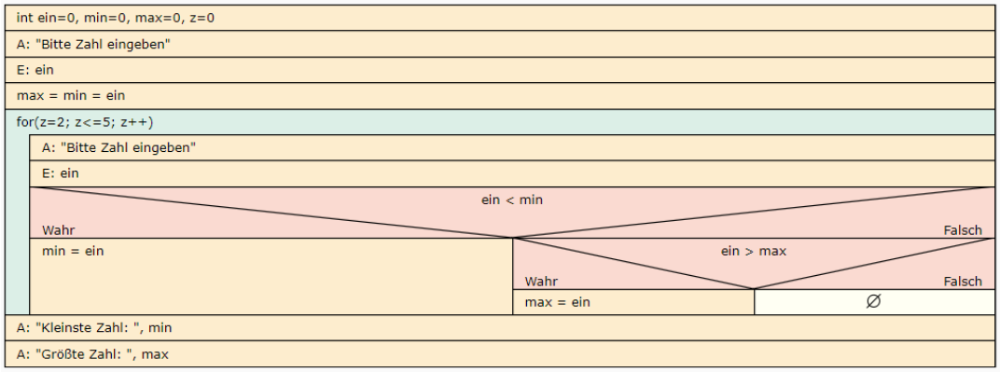
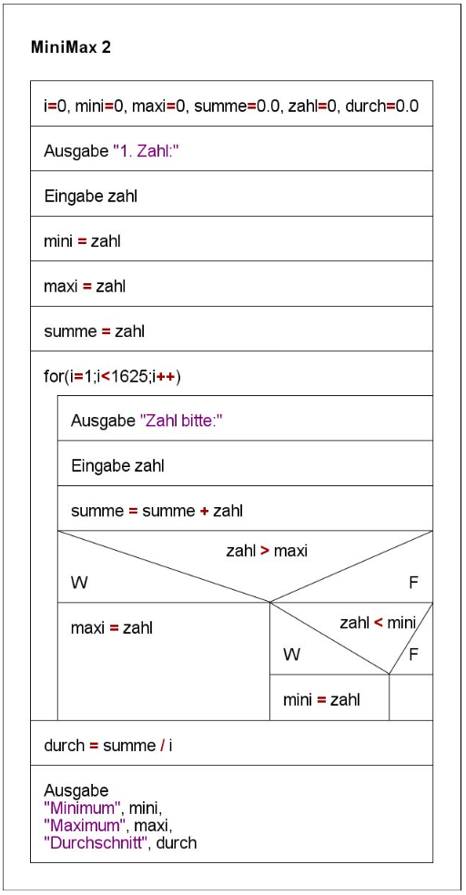
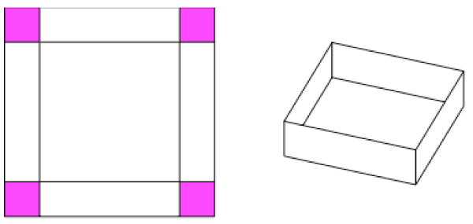
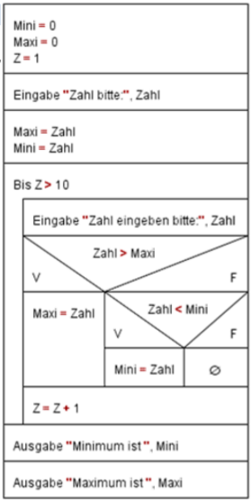
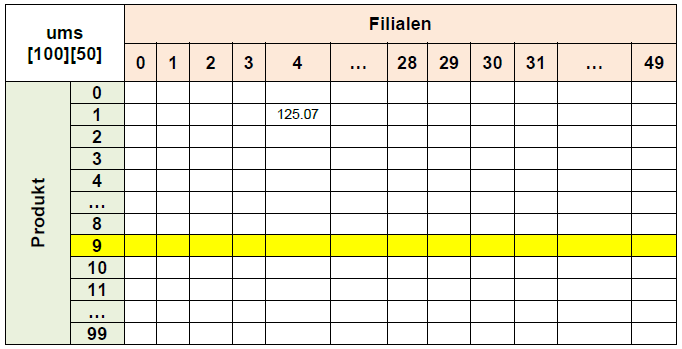
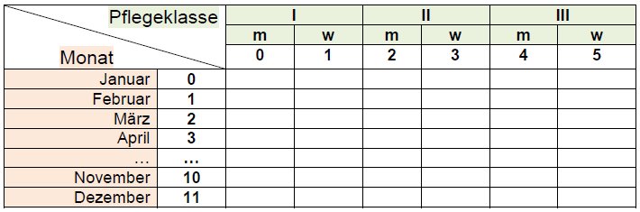
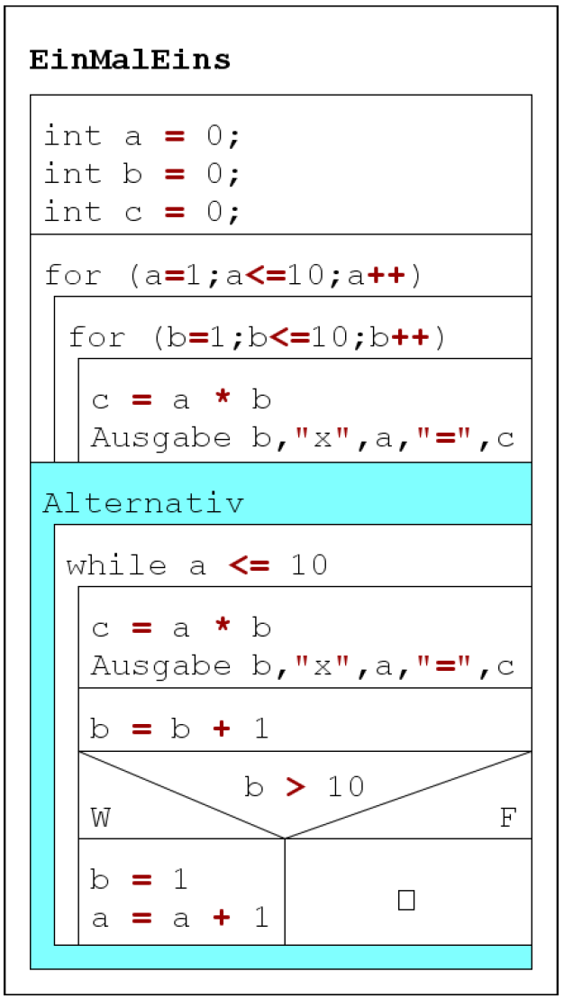
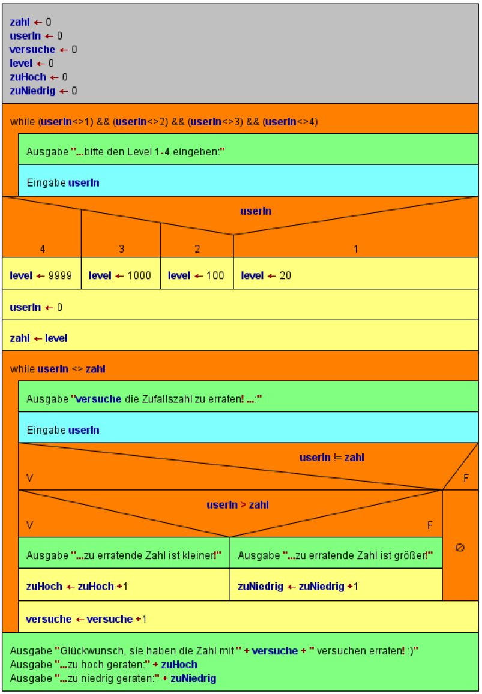
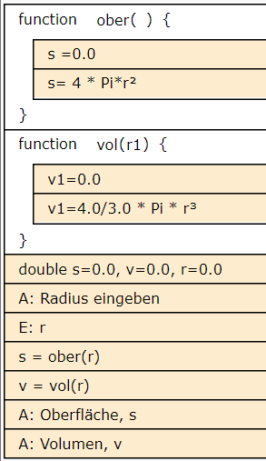
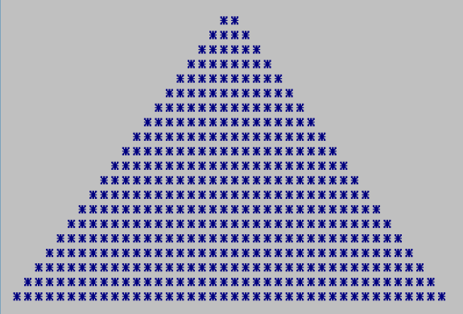

<CardHeading>

  ## 13.10
</CardHeading>


<CardChapter>

  ### while.cpp

  Geben Sie die Zahlen von 1-10 in der Konsole aus.

```cpp title='while.cpp'
#include <iostream>

using namespace std;

int main()
{
  int z = 0;

  while (z <= 10)
  {
    cout << z << "\n";
    z++;
  }

  return 0;
}
```
alternativ:

### for.cpp

```cpp title='for.cpp'
#include <iostream>

using namespace std;

int main()
{

  for (int z = 0; z <= 10; z++)
  {
    cout << z << "\n";
  }

  return 0;
}
```

</CardChapter>
<br/>


<CardHeading>

  ## 16.10
</CardHeading>


<CardChapter>

  ### EVA-Prinzip

  
```cpp title='eva.cpp'
#include <iostream>

using namespace std;

int main()
{
  int a = 0;
  int b = 0;

  // Eingabe
  //
  cout << "Eingabe von a: \n";
  cin >> a;
  cout << "Eingabe von b: \n";
  cin >> b;

  // Verarbeitung

  // modulo funktioniert nur bei integer
  a %= b;

  // int werden abgeschnitten
  // a /= b;

  // Ausgabe
  cout << a;

  /*
  Eingabe 3 und 8     -   299 und 100
  Ergebnis 0 Rest 3   -   2 Test 99
  */

  return 0;
}
```

</CardChapter>
<br/>

<CardChapter>

  ### teilenMitModulo.cpp

  ```cpp title='teilenMitModulo.cpp'
#include <iostream>

using namespace std;

int main()
{
  // Deklarationen und Initialisierungen
  int a = 0, b = 0, c = 0;

  // Eingabe(n)
  cout << "Eingabe a bitte: ";
  cin >> a; // "Console Input"
  cout << "Eingabe b bitte: ";
  cin >> b; // "Console Input"

  // Verarbeitung
  c = a / b;
  a %= b; // a = a / b

  // Ausgabe(n)
  //  Eingaben: 3 und 8  -  299 und 100
  //  Ausgabe:  0 Rest 3 -   2 Rest 99

  cout << c << " Rest " << a; // "Console Output"
  return 0;
}
```

</CardChapter>
<br/>

<CardChapter>

  ### teilenOhneModulo.cpp

  
```cpp title='teilenOhneModulo.cpp'
#include <iostream>

/*
Teilen ohne modulo...
  b != 0
  a > b
    z.B.  Eingaben: 3 und 8  -  299 und 100
    ->    Ausgabe:  0 Rest 3 -   2 Rest 99
*/

using namespace std;

int main()
{
  int a = 0, b = 0, c = 0;

  cout << "Eingabe a bitte: ";
  cin >> a;
  cout << "Eingabe b bitte: ";
  cin >> b;

  while (a >= b)
  {
    a -= b;
    c++;
  }

  cout << c << " Rest " << a;
  return 0;
}

```

</CardChapter>
<br/>

<CardHeading>

  ## 17.10
</CardHeading>

<CardChapter>

  ### zufallZahlen

  Geben Sie 50 zufällig ermittelte Zahlen in der Konsole aus.

```cpp title='zufallZahlen.cpp'
#include <iostream>
#include <stdlib.h>
#include <time.h>
#define OG 6
#define UG 1

using namespace std;

int main()
{
  int i, zufall;
  srand(time(NULL)); // Start Random

  for (i = 1; i <= 50; i++)
  {
    // zufall = rand() % (Obergrenze - Untergrenze +1 ) + Untergrenze
    zufall = rand() % (OG - UG + 1) + UG;
    cout << zufall << " ";
    if (i % 10 == 0)
    {
      cout << endl;
    }
  }

  return 0;
}
```

</CardChapter>
<br/>

<CardChapter>

  ### MinMax.cpp

  Bestimmen Sie Minimum und Maximum, sowie Durchschnitt von Zahlen und geben Sie diese in der Konsole aus.



```cpp title='MinMax.cpp'
#include <iostream>

using namespace std;

int main(int argc, char const *argv[])
{

  int i = 0, mini = 0, maxi = 0, zahl = 0;
  float summe = 0.0, durch = 0.0;

  cout << "Bitte erste Zahl eingeben:" << endl;
  cin >> zahl;

  mini = zahl;
  maxi = zahl;
  summe = zahl;

  for (i = 1; i < 5; i++)
  {
    cout << "Bitte naechste Zahl eingeben:" << endl;
    cin >> zahl;
    summe += zahl;
    if (zahl > maxi)
    {
      maxi = zahl;
    }
    else if (zahl < mini)
    {
      mini = zahl;
    }
  }
  durch = summe / i;

  cout << "Minimum:" << mini << endl;
  cout << "Maximum:" << maxi << endl;
  cout << "Durchschnitt" << durch << endl;

  return 0;
}
```

</CardChapter>
<br/>

<CardHeading>

  ## 18.10
</CardHeading>

<CardChapter>

  ### minMax2.cpp

  Bestimmen Sie Minimum und Maximum, sowie Durchschnitt von Zahlen und geben Sie diese in der Konsole aus.



```cpp title='minMax2.cpp'
#include <iostream>

using namespace std;

int main()
{

  int i, mini = 0, maxi = 0, zahl = 0;
  float summe = 0.0, durch = 0.0;

  for (i = 1; i <= 5; i++)
  {
    cout << "Zahl bitte: ";
    cin >> zahl;
    summe = summe + zahl;
    if (i == 1)
    {
      maxi = zahl;
      mini = zahl;
    }
    else if (zahl > maxi)
    {
      maxi = zahl;
    }
    else if (zahl < mini)
    {
      mini = zahl;
    }
  }

  durch = summe / i;

  cout << "\nMinimum: " << mini;
  cout << "\nMaximum: " << maxi;
  cout << "\nDurchschnitt: " << durch;

  return 0;
}
```

</CardChapter>
<br/>

<CardChapter>

  ### minMaxZufallZahlen.cpp

best practice: 

Zuweisung des ersten Wertes vor der Schleife ist effizienter, 
da der Ausdruck nicht bei jedem Schleifendrchlauf überprüft wird

```cpp title='minMaxZufallZahlen.cpp'
#include <iostream>
#include <stdlib.h>
#include <time.h>
#define OG 200
#define UG 100

using namespace std;

int main()
{

  int i = 0, mini = 0, maxi = 0, zahl = 0;
  float summe = 0.0, durch = 0.0;

  srand(time(NULL)); // Start Random
  zahl = rand() % (OG - UG + 1) + UG;

// highlight-start
  mini = zahl;
  maxi = zahl;
  summe = zahl;
// highlight-end

  for (i = 1; i < 10; i++)
  {

    zahl = rand() % (OG - UG + 1) + UG;

    summe += zahl;
    if (zahl > maxi)
    {
      maxi = zahl;
    }
    else if (zahl < mini)
    {
      mini = zahl;
    }
  }
  durch = summe / i;

  cout << "Minimum:" << mini << endl;
  cout << "Maximum:" << maxi << endl;
  cout << "Durchschnitt" << durch << endl;

  return 0;
}
```

</CardChapter>
<br/>

<CardHeading>

  ## 19.10
</CardHeading>

<CardChapter>

  ### minMaxZufallZahlen2.cpp

Prüfung, ob erster Durchlauf ist (zwecks Zuweisung des ersten Wertes), erfolgt bei jedem Schleifendurchlauf.

```cpp title='minMaxZufallZahlen2.cpp'
#include <iostream>
#include <stdlib.h>
#include <time.h>
#define OG 500
#define UG 1
#define ANZAHL 100

using namespace std;

int main()
{

  int i, mini = 0, maxi = 0, zahl = 0;
  float summe = 0.0, durch = 0.0;
  srand(time(NULL));

  for (i = 1; i <= ANZAHL; i++)
  {
    zahl = rand() % (OG - UG + 1) + UG;
    printf("%3i ", zahl);

    if (i % 10 == 0)
    {
      printf("\n");
    }
    summe = summe + zahl;
      // highlight-start
    if (i == 1)
    {
      maxi = zahl;
      mini = zahl;
    }
      // highlight-end
    else if (zahl > maxi)
    {
      maxi = zahl;
    }
    else if (zahl < mini)
    {
      mini = zahl;
    }
  }

  durch = summe / ANZAHL;

  cout << "\nMinimum: " << mini;
  cout << "\nMaximum: " << maxi;
  cout << "\nDurchschnitt: " << durch;

  return 0;
}
```
</CardChapter>
<br/>

<CardHeading>

  ## 20.10
</CardHeading>

<CardChapter>

  ### array01.cpp

Eingabe von 5 Werten über Konsole und speichern dieser im Array.
Random Ausgabe eines Array-Elements.

  ```cpp title='array01.cpp'
#include <iostream>
#include <stdlib.h>
#include <time.h>
#include <cmath>
#define ANZ 5

using namespace std;

int main()
{
  int z[ANZ], i;
  srand(time(NULL));

  for (i = 0; i < ANZ; i++)
  {
    cout << "z[" << i << "] bitte: ";
    cin >> z[i];
  }
  cout << "\n---------------------\n";
  /*
      for(i=ANZ-1; i>=0; i--){
          cout << "z["<< i <<"]: " << z[i] << endl;
      }

      cout << "Welches Element wollen Sie sehen? ";
      cin >> i;
  */
  i = rand() % ANZ;
  cout << "\nz[" << i << "]: " << z[i];

  return 0;
}
```

</CardChapter>
<br/>

<CardChapter>

  ### array02.cpp

Array mit Zufallszahlen.
Eingabe einer Zahl und Anzeige dieses Array-Index.

  ```cpp title='array02.cpp'
#include <iostream>
#include <stdlib.h>
#include <time.h>
#include <cmath>
#define ANZ 50

using namespace std;

int main()
{
  int z[ANZ], i;
  srand(time(NULL));

  for (i = 0; i < ANZ; i++)
  {
    z[i] = rand() % 100 + 1;
  }

  for (i = 0; i < ANZ; i++)
  {
    cout << z[i] << " ";
    if ((i + 1) % 10 == 0)
      cout << endl;
  }
  cout << "\n---------------------\n";
  cout << "Welches Element wollen Sie sehen? ";
  cin >> i;

  //   i=rand()%ANZ;
  cout << "\nz[" << i << "]: " << z[i];

  return 0;
}
```

</CardChapter>
<br/>

<CardChapter>

  ### array02GeradeUngeradeAnzahl.cpp

Ermitteln Sie die Anzahl der geraden und ungeraden Zahlen...

```cpp title='array02GeradeUngeradeAnzahl.cpp'
#include <iostream>
#include <stdlib.h>
#include <time.h>
#include <cmath>
#define ANZ 50

using namespace std;

int main()
{
  int z[ANZ], i;
  int gerade = 0, ungerade = 0;
  srand(time(NULL));

  for (i = 0; i < ANZ; i++)
  {
    z[i] = rand() % 100 + 1;
  }

  for (i = 0; i < ANZ; i++)
  {
    cout << z[i] << " ";
    if ((i + 1) % 10 == 0)
      cout << endl;
    if (z[i] % 2 == 0)
    {
      ungerade++;
    }
    else
    {
      gerade++;
    }
  }
  cout << "\n---------------------\n";

  cout << "Ungerade:  " << ungerade << endl;
  cout << "Gerade:  " << gerade << endl;

  return 0;
}
```

</CardChapter>
<br/>

<CardChapter>

  ### array02MinMax.cpp

  Ermitteln Sie Minumum und Maximum aus einem Array.

```cpp title='array02MinMax.cpp'
#include <iostream>
#include <stdlib.h>
#include <time.h>
#include <cmath>
#define ANZ 50

using namespace std;

int main()
{
  int min = 0;
  int max = 0;
  int z[ANZ], i;
  srand(time(NULL));

  for (i = 0; i < ANZ; i++)
  {
    z[i] = rand() % 100 + 1;
  }

  for (i = 0; i < ANZ; i++)
  {
    cout << z[i] << " ";
    if ((i + 1) % 10 == 0)
      cout << endl;
    if (i == 0)
    {
      min = max = z[i];
    }
    else if (z[i] < min)
    {
      min = z[i];
    }
    else if (z[i] > max)
    {
      max = z[i];
    }
  }
  cout << "\n---------------------\n";

  cout << "min: " << min << endl;
  cout << "max: " << max << endl;

  return 0;
}
```

</CardChapter>
<br/>

<CardHeading>

  ## 06.11
</CardHeading>

<CardChapter>

  ### quadratzahlen.cpp

  Ausgabe der Quadratzahlen:

1 x 1 = 1

2 x 2 = 4

3 x 3 = 9

...

20 x 20 = 400

```cpp title='quadratzahlen.cpp'
#include <iostream>

using namespace std;

int main()
{
  int a = 1, b = 0;

  for (a = 1; a <= 20; a++)
  {
    b = a * a;
    // cout << a << " x " << a << " = " << b << endl;
    printf("%3i x %2i = %3x\n", a, a, b);
  }
  return 0;
}
```

</CardChapter>
<br/>

<CardChapter>

  ### zerlegen.cpp

  Zerlegen Sie eine bis zu vierstellige Zahl (Eingabe)
und geben Sie die Teile einzeln aus, 

z.B.: 
- 1234 = 1 Tausender + 2 Hunderter + 3 Zehner + 4 Einer
- 689 = 6 Hunderter + 8 Zehner + 9 Einer
- 7 = 7 Einer

```cpp title='zerlegen.cpp'
#include <iostream>
#include <cstdlib>
#include <ctime>
#include <cmath>

using namespace std;

int main()
{
  int zahl = 0, t = 0, h = 0, z = 0;

  cout << "Zahl bitte: (max. 9999)";
  cin >> zahl;

  t = zahl / 1000;
  zahl = zahl % 1000;

  h = zahl / 100;
  zahl = zahl % 100;

  z = zahl / 10;
  zahl = zahl % 10;

  if (t > 0)
    cout << t << " Tausender + ";

  cout << h << " Hunderter + ";
  cout << z << " Zehner + ";
  cout << zahl << " Einer";
  cout << endl
       << "Rest : " << zahl;

  return 0;
}
```

</CardChapter>
<br/>


<CardChapter>

  ### zerlegenP.cpp

  Zerlegen Sie eine bis zu vierstellige Zahl (Eingabe)
und geben Sie die Teile einzeln aus, 

z.B.: 
- 1234 = 1 Tausender + 2 Hunderter + 3 Zehner + 4 Einer
- 689 = 6 Hunderter + 8 Zehner + 9 Einer
- 7 = 7 Einer

```cpp title='zerlegenP.cpp'
#include <iostream>

using namespace std;

int main()
{

  int eingabe = 5432;

  printf("%i x tausender \n", eingabe / 1000);
  printf("%i x hunderter \n", eingabe % 1000 / 100);
  printf("%i x zehner \n", eingabe % 100 / 10);
  printf("%i x einer \n", eingabe % 10);

  return 0;
}
```

</CardChapter>
<br/>

<CardChapter>

  ### zerlegenZufall.cpp

  Zerlegen Sie 10 zufällige bis zu vierstellige Zahlen
und geben Sie die Teile einzeln aus, 

z.B.: 
- 1234 = 1 Tausender + 2 Hunderter + 3 Zehner + 4 Einer
- 689 = 6 Hunderter + 8 Zehner + 9 Einer
- 7 = 7 Einer

```cpp title='zerlegenZufall.cpp'
#include <iostream>
#include <cstdlib>
#include <ctime>
#include <cmath>

using namespace std;

int main()
{
  int zahl, t = 0, h = 0, z = 0, i;
  srand(time(NULL));

  for (i = 1; i <= 10; i++)
  {

    zahl = rand() % 9999 + 1;
    printf("Zahl: %4i => ", zahl);

    t = zahl / 1000;
    zahl = zahl % 1000;

    h = zahl / 100;
    zahl = zahl % 100;

    z = zahl / 10;
    zahl = zahl % 10;

    if (t > 0)
      cout << t << " Tausender + ";

    cout << h << " Hunderter + ";
    cout << z << " Zehner + ";
    cout << zahl << " Einer\n";
  }

  return 0;
}

```
</CardChapter>
<br/>

<CardChapter>

  ### rechenTrainer1.cpp

  Rechentrainer mit Zufallszahlen

Erweiterung1:
Operatoren: `+`


```cpp title='rechenTrainer1.cpp'
#include <iostream>
#include <cstdlib>
#include <ctime>

using namespace std;

int main()
{
  int a, b, c, d;

  srand(time(NULL));

  a = rand() % 9 + 1;
  b = rand() % 9 + 1;
  c = a + b;

  cout << a << " + " << b << " = ";
  cin >> d;

  if (d == c)
    cout << "richtig geraten";
  else
    cout << "leider falsch";

  return 0;
}
```

</CardChapter>
<br/>

<CardChapter>

  ### rechenTrainer2.cpp

  Rechentrainer mit Zufallszahlen

Erweiterung1:
Operatoren: `+`, `-`, `*`, `%`

```cpp title='rechenTrainer2.cpp'
#include <iostream>
#include <cstdlib>
#include <ctime>

using namespace std;

int main()
{
  int a, b, c, eingabe, zuf;
  char op;

  srand(time(NULL));

  a = rand() % 9 + 1;
  b = rand() % 9 + 1;
  zuf = rand() % 4;

  switch (zuf)
  {
  case 0:
    op = '+';
    c = a + b;
    break;
  case 1:
    op = '-';
    c = a - b;
    break;
  case 2:
  {
    op = '*';
    c = a * b;
    break;
  }
  case 3:
  {
    op = '%';
    c = a % b;
    break;
  }
  }

  cout << a << " " << op << " " << b << " = ";
  cin >> eingabe;

  if (eingabe == c)
    cout << "richtig geraten";
  else
    cout << "leider falsch";

  return 0;
}
```

</CardChapter>
<br/>

<CardChapter>

  ### rechenTrainer3.cpp

  Rechentrainer mit Zufallszahlen

Erweiterung1:
Operatoren: `+`, `-`, `*`, `%`

Erweiterung2:
10x Eingabe und Ausgabe und Summe der richtigen Berechnungen

```cpp title='rechenTrainer3.cpp'
#include <iostream>
#include <cstdlib>
#include <ctime>

using namespace std;

int main()
{
  int a, b, c, eingabe, zuf, i, zaehler = 0;
  char op;

  srand(time(NULL));

  for (i = 1; i <= 5; i++)
  {
    a = rand() % 9 + 1;
    b = rand() % 9 + 1;
    zuf = rand() % 4;

    switch (zuf)
    {
    case 0:
      op = '+';
      c = a + b;
      break;
    case 1:
      op = '-';
      c = a - b;
      break;
    case 2:
    {
      op = '*';
      c = a * b;
      break;
    }
    case 3:
    {
      op = '%';
      c = a % b;
      break;
    }
    }

    cout << a << " " << op << " " << b << " = ";
    cin >> eingabe;

    if (eingabe == c)
      zaehler++;
  }
  cout << "Sie haben " << zaehler << " Aufgaben richtig beantwortet.";

  return 0;
}
```

</CardChapter>
<br/>

<CardChapter>

  ### rechenTrainerP.cpp

  Rechentrainer mit Zufallszahlen

Erweiterung1:
Operatoren: `+`, `-`, `*`, `%`

Erweiterung2:
10x Eingabe und Ausgabe

```cpp title='rechenTrainer3.cpp'
#include <iostream>
#define OG 20
#define UG 10

using namespace std;

int main()
{
  int a = 0, b = 0, c = 0, d = 0, operat = 0;
  char op = ' ';

  for (int i = 1; i <= 10; i++)
  {
    srand(time(NULL)); // Start Random
    a = rand() % (OG - UG + 1) + UG;
    b = rand() % (OG - UG + 1) + UG;
    operat = rand() % 4;

    if (operat == 0)
    {
      op = '+';
      c = a + b;
    }
    else if (operat == 1)
    {
      op = '-';
      c = a - b;
    }
    else if (operat == 2)
    {
      op = '*';
      c = a * b;
    }
    else if (operat == 3)
    {
      op = '%';
      c = a % b;
    }

    printf("Was ist das Ergebnis von %i %c %i?\n", a, op, b);
    cin >> d;

    while (d != c)
    {
      printf("Eingabe falsch! \n");
      printf("Was ist das Ergebnis von %i %c %i?\n", a, op, b);
      cin >> d;
    }

    printf("Gut gerechnet!\n");
  }

  return 0;
}
```

</CardChapter>
<br/>

<CardHeading>

  ## 07.11
</CardHeading>

<CardChapter>

  ### arr01.cpp

Ermittlung und Ausgabe von Minimum und Maximum eines Arrays (Ganzzahlen).

```cpp title='arr01.cpp'
#include <iostream>
#include <cstdlib>
#include <ctime>
#define ANZAHL 50

using namespace std;

int main()
{
  int a[ANZAHL] = {0}, i, mini, maxi;
  srand(time(NULL));

  for (i = 0; i < ANZAHL; i++)
  {
    a[i] = rand() % 100 + 1;
    cout << a[i] << " ";
  }

  mini = maxi = a[0];
  for (i = 1; i < ANZAHL; i++)
  {
    if (a[i] > maxi)
    {
      maxi = a[i];
    }
    else if (a[i] < mini)
    {
      mini = a[i];
    }
  }
  printf("\nMinimum ist: %i", mini);
  printf("\nMaximum ist: %i", maxi);

  return 0;
}

```

</CardChapter>
<br/>

<CardChapter>

  ### arr02strings.cpp

  Eingabe, Speicherung und Ausgabe von 5 Strings in einem Array.

```cpp title='arr02strings.cpp'
#include <iostream>
#include <cstdlib>
#include <ctime>
#include <cmath>

using namespace std;

int main()
{
  string namen[5];
  int i;

  for (i = 0; i < 5; i++)
  {
    cout << "Name:";
    cin >> namen[i];
  }

  cout << "\n----------------------\n";
  for (i = 0; i < 5; i++)
  {
    cout << namen[i] << " ";
  }
  return 0;
}
```

</CardChapter>
<br/>

<CardChapter>

  ### minMax.cpp

  Es sollen vom User 100 Werte eingegeben werden, das Programm gibt Minimum
und Maximum der eingegebenen Werte aus. Erstellen Sie den Code für die geforderte Auswertung.

Hinweis: Es ist kein Array zu benutzen.
Folgendes Gerüst ist vorgegeben (und zu benutzen):

```cpp title='vorgabe.cpp'
#include <iostream>
using namespace std;

int main()
{
  int x = 0, y = 0;
  int mini = 0, maxi = 0;

  while (y < 100)
  {
    cout << "\nZahl bitte: ";
    cin >> x;

    y++;
  }
  cout << "\nMinimum ist: " << mini;
  cout << "\nMaximum ist: " << maxi;

  return 0;
}
```

```cpp title='minMax.cpp'
#include <iostream>

using namespace std;

int main()
{
  int x = 0, y = 0;
  int mini = 0, maxi = 0;

// highlight-start
  cout << "\nZahl bitte: ";
  cin >> mini >> maxi;
  y++;
// highlight-end

  while (y < 100)
  {
    cout << "\nZahl bitte: ";
    cin >> x;

// highlight-start
    if (x < mini)
    {
      mini = x;
    }
    else if (x > maxi)
    {
      maxi = x;
    }
// highlight-end
    y++;
  }

  cout << "\nMinimum ist: " << mini;
  cout << "\nMaximum ist: " << maxi;

  return 0;
}
```

</CardChapter>
<br/>

<CardHeading>

  ## 08.11
</CardHeading>

<CardChapter>

  ### arrWuerfeln.cpp

  Ein Programm soll 100/1000/10.000/... mal "würfeln".

Ermitteln Sie, wie oft jede Zahl (1-6) jeweils geworfen wurde.

```cpp title='arrWuerfeln.cpp'
#include <iostream>
#include <stdlib.h>
#include <time.h>
#define OG 6
#define UG 1
#define ANZAHL 60

using namespace std;

int main()
{
  int i, zufall, z[7] = {0};

  srand(time(NULL)); // Start Random

  for (i = 1; i <= ANZAHL; i++)
  {
    zufall = rand() % (OG - UG + 1) + UG;
    cout << zufall << " ";
    if (i % 20 == 0)
    {
      cout << "\n";
    }
    switch (zufall)
    {
    case 1:
      z[1]++;
      break;
    case 2:
      z[2]++;
      break;
    case 3:
      z[3]++;
      break;
    case 4:
      z[4]++;
      break;
    case 5:
      z[5]++;
      break;
    case 6:
      z[6]++;
      break;
    }
  }

  for (i = 1; i < 7; i++)
  {
    cout << "\n " << i << ": " << z[i] << " mal";
  }

  return 0;
}
```

alternativ als array:

```cpp title='arrWuerfeln2.cpp'
#include <iostream>
#include <stdlib.h>
#include <time.h>
#define OG 6
#define UG 1
#define ANZAHL 60

using namespace std;

int main()
{
  int i, zufall, z[7] = {0};

  srand(time(NULL)); // Start Random

  for (i = 1; i <= ANZAHL; i++)
  {
    zufall = rand() % (OG - UG + 1) + UG;
    cout << zufall << " ";
    if (i % 20 == 0)
    {
      cout << "\n";
    }
    z[zufall]++;
  }

  for (i = 1; i < 7; i++)
  {
    cout << "\n " << i << ": " << z[i] << " mal";
  }

  return 0;
}
```

</CardChapter>
<br/>

<CardChapter>

  ### volumen.cpp

Berechnen. Sie das maximale Volumen eines quadratischen Behältnisses.



Die dunklen Flächen werden in 1 mm Schritten vom Seitenrand ausgeschnitten. Im 1. Schritt werden
die Seitenflächen jeweils um 1 mm verkürzt. Die so entstandene neue Grundfläche wird mit Imm
Höhe berechnet, so erhält man ein Volumen. Wiederholen Sie die Schritte, bis Sie das maximale
Volumen haben und geben dann die so entstandenen neuen Seitenlängen und das Volumen aus.


```cpp title='volumen.cpp'
#include <iostream>

using namespace std;

int main()
{
  double volumen = 0.0, a = 10.0, h = 0.0, aMax = 0.0, hMax = 0.0, volMax = 0.0;

  while (h <= a / 2)
  {
    volumen = (a - 2 * h) * (a - 2 * h) * h;

    if (volumen > volMax)
    {
      volMax = volumen;
      aMax = a - 2 * h;
      hMax = h;
    }
    h *= 10;
    h += 1;
    h /= 10;
  }

  cout << "Groesste Volumen ist " << volMax << endl;
  cout << "Seitenlaenge :" << aMax << endl;
  cout << "Hoehe :" << hMax << endl;

  return 0;
}
```

</CardChapter>
<br/>

<CardChapter>

  ### arrayGeradeUebertragen

Füllen Sie ein Array mit 10 Zufallszahlen (zwischen 10 und 50)
übertragen Sie alle geraden Zahlen in das zweite Array.

```cpp title='arrGeradeUebertragen.cpp'
#include <iostream>
#include <cstdlib>
#include <ctime>
#include <cmath>

using namespace std;

int main()
{
  int arr[10], arrGerade[10] = {0}, i, k = 0;
  srand(time(NULL));

  for (i = 0; i < 10; i++)
  {
    arr[i] = rand() % (50 - 10 + 1) + 10;
    cout << arr[i] << " ";
  }
  cout << endl;
  for (i = 0; i < 10; i++)
  {
    if (arr[i] % 2 == 0)
    {
      arrGerade[k] = arr[i];
      // cout << arrGerade[k] << " ";
      k++;
    }
  }

  for (i = 0; i < k; i++)
  {
    cout << arrGerade[i] << " ";
  }
  return 0;
}
```

</CardChapter>
<br/>

<CardChapter>

  ### arrMultiplizierenUebertragen.cpp
  
Füllen Sie ein Array mit 10 Zufallszahlen (zwischen 10 und 50)
multiplizieren Sie jede Zahl mit 2 und legen Sie das Ergebnis danach in einem
zweiten Array ab

```cpp title='arrMultiplizierenUebertragen.cpp'
#include <iostream>
#include <ctime>
#define OG 50
#define UG 10
#define ANZAHL 10

using namespace std;

int main(int argc, char const *argv[])
{
  int erstes[ANZAHL] = {0}, zweites[ANZAHL] = {0}, i = 0;

  srand(time(NULL));

  for (i = 0; i < ANZAHL; i++)
  {
    erstes[i] = rand() % (OG - UG + 1) + UG;
    zweites[i] = erstes[i] * 2;

    cout << "Erstes[" << i << "]: " << erstes[i] << "   "
         << "Zweites[" << i << "]: " << zweites[i] << endl;
  }

  return 0;
}
```

</CardChapter>
<br/>


<CardHeading>

  ## 09.11
</CardHeading>

<CardChapter>

  ### minimumSort

Aufsteigende Sortierung eines Arrays nach Minimumsort / Methode des kleinsten Elementes.

```cpp title='minimumSort.cpp'
#include <iostream>

using namespace std;

int main(int argc, char const *argv[])
{
  int arr[5] = {7, 12, 2, 15, 9}, i, hilf, k;

  cout << "Vorher: ";
  for (i = 0; i < 5; i++)
  {
    printf("%4i ", arr[i]);
  }

  for (i = 0; i < 4; i++)
  {
    for (k = 0; k < 5; k++)
    {
      hilf = arr[i];
      arr[i] = arr[k];
      arr[k] = hilf;
    }
  }

  cout << "\nNachher:";
  for (i = 0; i < 5; i++)
  {
    printf("%4i ", arr[i]);
  }

  return 0;
}
```

alternativ mit Konstante für Arraygröße:

```cpp title='minimumSort2.cpp'
#include <iostream>
// highlight-next-line
#define ANZ 5

using namespace std;

int main(int argc, char const *argv[])
{
  int arr[ANZ] = {7, 12, 2, 15, 9}, i, hilf, k;

  cout << "Vorher: ";
  for (i = 0; i < ANZ; i++)
  {
    printf("%4i ", arr[i]);
  }

  for (i = 0; i < ANZ - 1; i++)
  {
    for (k = 0; k < 5; k++)
    {
      hilf = arr[i];
      arr[i] = arr[k];
      arr[k] = hilf;
    }
  }

  cout << "\nNachher:";
  for (i = 0; i < ANZ; i++)
  {
    printf("%4i ", arr[i]);
  }

  return 0;
}
```

</CardChapter>
<br/>

<CardChapter>

  ### minimumSortZufall.cpp

Aufsteigende Sortierung eines Arrays nach Minimumsort / Methode des kleinsten Elementes.

Mit Zufallszahlen.

```cpp title='minimumSortZufall.cpp'
#include <iostream>
#include <ctime>
#define ANZ 5
#define OG 100
#define UG 1

using namespace std;

int main(int argc, char const *argv[])
{
  int arr[ANZ], i, hilf, k;

  srand(time(NULL));

  for (i = 0; i < ANZ; i++)
  {
    arr[i] = rand() % (OG - UG - 1) + UG;
  }

  cout << "Vorher: ";
  for (i = 0; i < ANZ; i++)
  {
    printf("%4i ", arr[i]);
  }

  for (i = 0; i < ANZ - 1; i++)
  {
    for (k = 0; k < 5; k++)
    {
      hilf = arr[i];
      arr[i] = arr[k];
      arr[k] = hilf;
    }
  }

  cout << "\nNachher:";
  for (i = 0; i < ANZ; i++)
  {
    printf("%4i ", arr[i]);
  }

  return 0;
}
```

alternativ mit Angabe Schleifendurchläufe und Tauschanzahl:

```cpp title='minimumSortZufall2.cpp'
#include <iostream>
#include <cstdlib>
#include <ctime>
#define ANZ 20

using namespace std;

int main()
{
  int arr[ANZ], hilf, tausch = 0, schleifen = 0;
  int i, k;

  srand(time(NULL));
  cout << "Vorher:\n";
  for (i = 0; i < ANZ; i++)
  {
    arr[i] = i; // rand()%100+1;
    cout << arr[i] << " ";
  }

  for (i = 0; i < ANZ - 1; i++)
  {
    for (k = i + 1; k < ANZ; k++)
    {
      schleifen++;
      if (arr[k] < arr[i])
      {
        tausch++;
        hilf = arr[i];
        arr[i] = arr[k];
        arr[k] = hilf;
      }
    }
  }

  cout << "\nNachher:\n";
  for (i = 0; i < ANZ; i++)
  {
    cout << arr[i] << " ";
  }

  cout << "\nEs wurde " << tausch << " mal getauscht.";
  cout << "\nSchleifendurchl\204ufe: " << schleifen;

  return 0;
}
```

</CardChapter>
<br/>

<CardChapter>

  ### bubbleSort.cpp

  Aufsteigende Sortierung eines Arrays nach Methode Bubblesort.

```cpp title='bubbleSort.cpp'
#include <iostream>

using namespace std;

int main(int argc, char const *argv[])
{
  int arr[5] = {25, 9, 14, 25, 7}, anz = 5, i = 0, hilf = 0;
  bool tausch = true;

  printf("Vorher: ");
  for (i = 0; i < 5; i++)
  {
    printf("%3i ", arr[i]);
  }

  do
  {
    tausch = false;
    anz = anz - 1;
    for (i = 0; i < anz; i++)
    {
      if (arr[i] > arr[i + 1])
      {
        hilf = arr[i];
        arr[i] = arr[i + 1];
        arr[i + 1] = hilf;
        tausch = true;
      }
    }

  } while (tausch == true);

  printf("\nNachher:");
  for (i = 0; i < 5; i++)
  {
    printf("%3i ", arr[i]);
  }

  return 0;
}
```

alternativ mit Angabe Schleifendurchläufe und Tauschanzahl:

```cpp title='bubbleSort2.cpp'
#include <iostream>
#include <cstdlib>
#include <ctime>
#define ANZ 10

using namespace std;

int main()
{
  int arr[ANZ], hilf, tausch = 0, schleifen = 0;
  int i, anz = ANZ;
  bool getauscht;

  srand(time(NULL));
  cout << "Vorher:\n";
  for (i = 0; i < ANZ; i++)
  {
    arr[i] = rand() % 10 + 1;
    cout << arr[i] << " ";
  }

  do
  {
    getauscht = false;
    anz--;
    for (i = 0; i < anz; i++)
    {
      schleifen++;
      if (arr[i + 1] < arr[i])
      {
        tausch++;
        hilf = arr[i];
        arr[i] = arr[i + 1];
        arr[i + 1] = hilf;
        getauscht = true;
      }
    }
  } while (getauscht == true);

  cout << "\nNachher:\n";
  for (i = 0; i < ANZ; i++)
  {
    cout << arr[i] << " ";
  }

  cout << "\nEs wurde " << tausch << " mal getauscht.";
  cout << "\nSchleifendurchl\204ufe: " << schleifen;

  return 0;
}
```

Sortierung eines Text-Array:

```cpp title='bubbleSortString.cpp'
#include <iostream>
#include <cstdlib>
#include <ctime>

#define ANZ 5

using namespace std;

int main()
{
  string arr[ANZ] = {"Hans", "Anton", "Stefanie", "Stefan", "Stef"}, hilf;
  int i, anz = ANZ, tausch = 0, schleifen = 0;
  bool getauscht;

  srand(time(NULL));
  cout << "Vorher:\n";
  for (i = 0; i < ANZ; i++)
  {
    cout << arr[i] << " ";
  }

  do
  {
    getauscht = false;
    anz--;
    for (i = 0; i < anz; i++)
    {
      schleifen++;
      if (arr[i + 1] < arr[i])
      {
        tausch++;
        hilf = arr[i];
        arr[i] = arr[i + 1];
        arr[i + 1] = hilf;
        getauscht = true;
      }
    }
  } while (getauscht == true);

  cout << "\nNachher:\n";
  for (i = 0; i < ANZ; i++)
  {
    cout << arr[i] << " ";
  }

  cout << "\nEs wurde " << tausch << " mal getauscht.";
  cout << "\nSchleifendurchl\204ufe: " << schleifen;

  return 0;
}
```

</CardChapter>
<br/>

<CardChapter>

  ### arraySearch.cpp

  Array nach Benutzereingabe durchsuchen.

  ```cpp title='arraySearch.cpp'
#include <iostream>

using namespace std;

int main(int argc, char const *argv[])
{
  string arr[5] = {"Hans", "Stefan", "Stefanie", "Peter", "Paul"}, ein = " ";
  int i = 0;

  printf("Bitte zu durchsuchenden Namen eingeben:");
  cin >> ein;

  for (i = 0; i < 5; i++)
  {
    if (ein == arr[i])
    {
      printf("%s gefunden: arr[%i]", ein.c_str(), i);
    }
  }
  return 0;
}
```

</CardChapter>
<br/>

<CardChapter>

  ### arrayGewinner.cpp

  Zufällig einen Gewinner aus dem Array ermitteln.

```cpp title='arrayGewinner.cpp'
#include <iostream>
#include <ctime>

using namespace std;

int main(int argc, char const *argv[])
{
  string arr[5] = {"Hans", "Stefan", "Stefanie", "Peter", "Paul"};

  srand(time(NULL));

  printf("%s hat gewonnen", arr[rand() % 5].c_str());

  return 0;
}
```

</CardChapter>
<br/>

<CardHeading>

  ## 10.11
</CardHeading>

<CardChapter>

  ### Übungsklausur 3


Gegeben ist das untenstehende Array; erstellen Sie den C-Code
(nur Variablendeklaration und Anweisungsteil) für den Bubble-Sort zu diesem Array.

`int a[5] = { 2, 8, 5, 4, 21};`


```cpp title='uebKlausur3.cpp'
#include <iostream>
using namespace std;

int main()
{
  // highlight-start
  int a[5] = {2, 8, 5, 4, 21}, hilf = 0, i = 0, anz = 5;
  bool tausch = true;
  // highlight-end

  cout << "vorher: ";
  for (i = 0; i < 5; i++)
  {
    printf("%2i ", a[i]);
  }

// highlight-start
  do
  {
    tausch = false;
    anz--;
    for (i = 0; i < anz; i++)
    {
      if (a[i] > a[i + 1])
      {
        hilf = a[i];
        a[i] = a[i + 1];
        a[i + 1] = hilf;
        tausch = true;
      }
    }
  } while (tausch);
// highlight-end

  cout << "\nnachher:";
  for (i = 0; i < 5; i++)
  {
    printf("%2i ", a[i]);
  }

  return 0;
}
```

</CardChapter>
<br/>

<CardChapter>

  ### Übungsklausur 4

  Erstellen Sie bitte ein komplettes C++-Programm "kw.cpp", das eine PS-Leistung
eingegeben bekommt und dann die entsprechenden Kilowattwert berechnet und aus
gibt.

Hilfe: 1 PS = 0,735499 kW

```cpp title='uebKlausur4.cpp'
#include <iostream>
using namespace std;

int main()
{
  float ps = 0, kw = 0;

  cout << "Bitte PS eingeben:" << endl;
  cin >> ps;

  kw = ps * 0.735499;

  cout << ps << " PS entsprechen " << kw << " kW" << endl;

  return 0;
}

```

</CardChapter>
<br/>


<CardChapter>

  ### Übungsklausur 5

  Schreiben zu der, im folgenden Struktogramm dargestellten,
Programmlogik ein C++-Programm.
NUR ab main() { ... }



```cpp title='uebKlausur5.cpp'
#include <iostream>
using namespace std;

int main()
{
  int mini = 0, maxi = 0, z = 1, zahl = 0;

  cout << "Zahl bitte eingeben:" << endl;
  cin >> zahl >> maxi >> mini;

// highlight-next-line
  while (z <= 10)
  {
    cout << "Zahl bitte eingeben:" << endl;
    cin >> zahl;

    if (zahl > maxi)
    {
      maxi = zahl;
    }
    else if (zahl < mini)
    {
      mini = zahl;
    }
    z++;
  }
  cout << "Minimum ist :" << mini << endl;
  cout << "Maximum ist :" << maxi << endl;

  return 0;
}
```

</CardChapter>
<br/>

<CardChapter>

  ### Übungsklausur 6

Gegeben ist folgendes JavaScript. "Übersetzen" Sie das Script in ein entsprechendes
vollständiges C++-Programm.

```html title='vorgabe.html'
<html>
  <head>
    <title></title>
    <meta name="author" content="kuhn" />
  </head>
  <body text="#000000" bgcolor="#FFFFFF" link="#FF0000">
    <script language="JavaScript">
      <!--
      var a = 10;
      var s = 0;
      var V = 0;
      var Vmax = 0;
      var Smax = 0;
      var l = 0.1; // Schnittlänge
      while (V >= Vmax) {
        V = (a - 2 * s) * (a - 2 * s) * s;
        // Zeile für Zwischenausgabe der Werte
        document.write("Schnittlänge ", s, " akt. Vol. ", V, ".<br>");
        if (Vmax < V) {
          Vmax = V;
          Smax = s;
        }
        s = s + l;
      }
      document.write("Maximales Volumen von ", Vmax, " bei ", Smax);
      //-->
    </script>
  </body>
</html>
```

```cpp title='uebKlausur6.cpp'
#include <iostream>
using namespace std;

int main()
{
  double a = 10, s = 0, v = 0, vmax = 0, smax = 0, l = 0.01;
  while (v >= vmax)
  {
    v = (a - 2 * s) * (a - 2 * s) * s;
    cout << "Schnittl\204nge " << s << " akt. Volumen " << v << endl;
    if (vmax < v)
    {
      vmax = v;
      smax = s;
    }
    s += l;
  }
  cout << "Maximales Volumen von " << vmax << " bei " << smax;

  return 0;
}
```

</CardChapter>
<br/>

<CardChapter>

  ### Übungsklausur 7

Gegeben ist ein Array bsp[100] von Ganzzahlen.
(Die unten gezeigten Inhalte stellen nur ein Beispiel zur besseren Visualisierung dar!)

Erstellen Sie den C++-Code (nur Variablendeklaration und Anweisungsteil) für die folgenden beiden Aufgabenstellungen:

1. den Bubble-Sort zu dem Array bsp[100];

2. alle ungeraden Zahlen aus bsp[100] sind in das Array ung[50]
zu übertragen. Ist das zweite Array voll (also alle Plätze belegt),
darf nicht mehr weiter übertragen werden!

`int bsp [100] = {25, 3, 32, 8, 56, 4, 21, 12, 48, ... };`

`int ung [50] = {0};`

```cpp title='uebKlausur7.cpp'
#include <iostream>
#include <cstdlib>
#include <ctime>
using namespace std;

int main()
{
  int bsp[10] = {25, 3, 31, 8, 55, 43, 21, 17, 49, 85};
  int ung[5] = {0};
  int i = 0, k = 0, hilf, anz = 10;
  bool tausch = true;

  printf("\nVorher:  ");
  for (i = 0; i < 10; i++)
  {
    printf("%3i ", bsp[i]);
  }

  do
  {
    tausch = false;
    anz = anz - 1;
    for (i = 0; i < anz; i++)
    {
      if (bsp[i] > bsp[i + 1])
      {
        hilf = bsp[i];
        bsp[i] = bsp[i + 1];
        bsp[i + 1] = hilf;
        tausch = true;
      }
    }

  } while (tausch == true);

  printf("\nNachher: ");
  for (i = 0; i < 10; i++)
  {
    printf("%3i ", bsp[i]);
  }

  // while(k<5 && i<10){
  for (i = 0; i < 10 && k < 5; i++)
  {
    if (bsp[i] % 2 == 1)
    {
      ung[k] = bsp[i];
      k++;
    }
    //	i++;
  }

  printf("\nUngerade:");
  for (i = 0; i < 5; i++)
  {
    printf("%3i", ung[i]);
  }
  return 0;
}
```
</CardChapter>
<br/>

<CardHeading>

  ## 13.11
</CardHeading>

<CardChapter>

  ### array2DZufallZahlen.cpp

  Mehrdimensionales Array mit Zufallszahlen zwischen 50 und 500.

```cpp title='array2DZufallZahlen.cpp'
#include <iostream>
#include <ctime>
#define ZEILEN 10
#define SPALTEN 5

int main()
{
  int a[ZEILEN][SPALTEN] = {0};
  srand(time(NULL));

  for (int i = 0; i < ZEILEN; i++)
  {
    for (int k = 0; k < SPALTEN; k++)
    {
      a[i][k] = rand() % 451 + 50;
      printf("%4i", a[i][k]);
    }
    printf("\n");
  }
}
  ```
  
</CardChapter>
<br/>

<CardChapter>

  ### arrayMinMax

Minimum und Maximum aus einem zweidimensionalen Array ausgeben.

```cpp title='array2DMinMax.cpp'
#include <iostream>
#include <cstdlib>
#include <ctime>
#define ZEILEN 10
#define SPALTEN 5

using namespace std;

int main()
{
  int a[ZEILEN][SPALTEN] = {0}, i, k, mini = 0, maxi = 0;
  srand(time(NULL));

// highlight-start
  a[i][k] = rand() % 451 + 50;
  mini = maxi = a[i][k];
  i++;
  k++;
// highlight-end

  for (i = 0; i < ZEILEN; i++)
  {
    for (k = 0; k < SPALTEN; k++)
    {
      a[i][k] = rand() % 451 + 50;
      printf("%4i", a[i][k]);

// highlight-start
      if (a[i][k] > maxi)
      {
        maxi = a[i][k];
      }
      else if (a[i][k] < mini)
      {
        mini = a[i][k];
      }
// highlight-end
    }
    cout << endl;
  }

  printf("\nMinimum: %3i", mini);
  printf("\nMaximum: %3i", maxi);

  return 0;
}
```

alternativ:

```cpp title='array2DMinMax2.cpp'
#include <iostream>
#include <cstdlib>
#include <ctime>
#define ZEILEN 10
#define SPALTEN 5

using namespace std;

int main()
{
  int a[ZEILEN][SPALTEN] = {0}, i, k, mini = 0, maxi = 0;
  srand(time(NULL));

  for (i = 0; i < ZEILEN; i++)
  {
    for (k = 0; k < SPALTEN; k++)
    {
      a[i][k] = rand() % 451 + 50;
      printf("%4i", a[i][k]);
    }
    cout << endl;
  }

// highlight-start
  mini = maxi = a[0][0];

  for (i = 0; i < ZEILEN; i++)
  {
    for (k = 0; k < SPALTEN; k++)
    {
      if (a[i][k] > maxi)
      {
        maxi = a[i][k];
      }
      else if (a[i][k] < mini)
      {
        mini = a[i][k];
      }
    }
  }
// highlight-end

  printf("\nMinimum: %3i", mini);
  printf("\nMaximum: %3i", maxi);

  return 0;
}
```

</CardChapter>
<br/>

<CardChapter>

  ### Array Systemhaus

In einem bundesweit agierenden Systemhaus mit angeschlossenem Shop für Hard- und Software mit insgesamt 50 Filialen wird ein einheitliches Sortiment von 100 Produkten verkauft.

Für die monatlichen Umsatzauswertungen sollen die Daten in einem Programm ausgewertet werden, dazu wird ein zweidimensionales Array mit 100 Zeilen und 50 Spalten benutzt.

In jeder Zeile finden sich also die Umsätze eines Produkts in allen 50 Filialen; in jeder Spalte die Umsätze einer Filiale mit jeweils allen 100 Produkten.

Beispiel/Hinweis: Der Beispielwert 125,07 € ist der Umsatz des 2. Produktes in der 5. Filiale. Wegen der Indexierung aber mit 0 beginnend, also 0, 1, 2, …, ist aber die Ansprache des dazugehörigen Array-Elements dann "ums[1][4]".



Erstellen Sie die Programme (sprich: Struktogramme) für die Ermittlung folgender Kennzahlen:

a. Gesamtumsatz dieses Monats

b. Welcher Umsatz in allen Filialen wurde mit dem neuen Betriebssystem "Winux 0.8.15" gemacht? (Produkt 10 = Zeile 9!)

```cpp title='arrUmsatz_a+b.cpp'
#include <iostream>
#include <cstdlib>
#include <ctime>

using namespace std;

int main()
{
  int ums[100][50], p, f, summe = 0;

  for (p = 0; p < 100; p++)
  {
    for (f = 0; f < 50; f++)
    {
      ums[p][f] = 1; // rand()%151;
      //  		cout << ums[p][f] << " ";
    }
    cout << endl;
  }
  // Gesamtumsatz
  for (p = 0; p < 100; p++)
  {
    for (f = 0; f < 50; f++)
    {
      summe += ums[p][f];
    }
  }
  cout << "\nMonatsumsatz: " << summe;

  // Umsatz Produkt 10
  summe = 0;
  p = 9;
  for (f = 0; f < 50; f++)
  {
    summe += ums[p][f];
  }
  cout << "\nUmsatz Winux 08.15: " << summe;

  // Umsatz Filiale 1 (Spalte 0)
  summe = 0;
  f = 0;
  for (p = 0; p < 100; p++)
  {
    summe += ums[p][f];
  }
  cout << "\nUmsatz Filiale 1: " << summe;

  return 0;
}
```

c. Geben Sie den Umsatz je Produkt und den Umsatz je Filiale aus.

```cpp title='arrUmsatz_c.cpp'
#include <iostream>
#include <cstdlib>
#include <ctime>

using namespace std;

int main()
{
  int ums[100][50], p, f, summe = 0;

  for (p = 0; p < 100; p++)
  {
    for (f = 0; f < 50; f++)
    {
      ums[p][f] = 1; // rand()%151;
    }
    cout << endl;
  }

  // Umsatz je Produkt
  for (p = 0; p < 100; p++)
  {

    for (f = 0; f < 50; f++)
    {
      summe += ums[p][f];
    }
    cout << "\nProdukt: " << (p + 1) << " Umsatz: " << summe;
    summe = 0;
  }

  // Umsatz Filiale 1 (Spalte 0)
  for (f = 0; f < 50; f++)
  {
    summe = 0;
    for (p = 0; p < 100; p++)
    {
      summe += ums[p][f];
    }
    cout << "\nUmsatz Filiale: " << (f + 1) << " Umsatz: " << summe;
  }

  return 0;
}
```

d. MiniMax
- (1) Das umsatzstärkste Produkt war welches? (Ausgabe Produktnummer und der dazugehörige Umsatz)
- (2) Welches Produkt war der "Ladenhüter", d.h. hatte den geringsten Umsatz? (insgesamt in allen Filialen, Ausgabe Produktnummer und der dazugehörige Umsatz)

```cpp title='arrUmsatz_d.cpp'
#include <iostream>
#include <cstdlib>
#include <ctime>

using namespace std;

int main()
{
  int ums[100][50], p, f, summe = 0, maxi, mini, maxP, minP;
  srand(time(NULL));
  for (p = 0; p < 100; p++)
  {
    for (f = 0; f < 50; f++)
    {
      ums[p][f] = rand() % 11;
    }
  }

  // Umsatz je Produkt (Zeilensumme = Spaltenindex in der inneren Schleife)
  for (p = 0; p < 100; p++)
  {
    summe = 0;
    for (f = 0; f < 50; f++)
    {
      summe += ums[p][f];
    }
    cout << "\nProdukt: " << (p + 1) << " Umsatz: " << summe;
    if (p == 0)
    {
      maxi = mini = summe;
      maxP = minP = p;
    }
    else if (summe > maxi)
    {
      maxi = summe;
      maxP = p;
    }
    else if (summe < mini)
    {
      mini = summe;
      minP = p;
    }
  }
  cout << "\nBestes Produkt: " << (maxP + 1)
       << " Umsatz: " << maxi;
  cout << "\nSchlechtestes Produkt: " << (minP + 1)
       << " Umsatz: " << mini;

  return 0;
}
```

e. Geben Sie die Filialen mit mehr als 10.000 € Umsatz aus und geben Sie am Ende die Anzahl dieser "Umsatzbringer" aus.

```cpp title='arrUmsatz_e.cpp'
#include <iostream>
#include <cstdlib>
#include <ctime>

using namespace std;

int main()
{
  int ums[100][50], p, f, summe = 0, anz = 0;
  srand(time(NULL));
  for (p = 0; p < 100; p++)
  {
    for (f = 0; f < 50; f++)
    {
      ums[p][f] = rand() % 191;
    }
  }

  // Umsatz je Filiale
  for (f = 0; f < 50; f++)
  {
    summe = 0;
    for (p = 0; p < 100; p++)
    {
      summe += ums[p][f];
    }
    // Umsatz > 10.000 ermitteln
    if (summe > 10000)
    {
      cout << "\nFiliale: " << (f + 1) << " Umsatz: " << summe;
      anz++;
    }
  }
  cout << "\nEs sind " << anz << " Filialen.";

  return 0;
}
```

</CardChapter>
<br/>

<CardChapter>

  ### Array Krankenhaus

Das "Krankenhaus am Rande der Stadt" verfügt über unterschiedlich ausgestattete Zimmer:

- Pflegeklasse 1 Einzelzimmer mit eigener Nasszelle, TV und Internetanschluss inklusive
- Pflegeklasse 2 Zweibettzimmer mit eigener Nasszelle und TV; ein Internetanschluss ist auf Wunsch gegen Bezahlung möglich.
- Pflegeklasse 3 Mehrbettzimmer mit Etagendusche/-WC, TV und Internetanschluss auf Wunsch gegen gesonderte Berechnung.

In jeder Klasse werden monatlich die Patientenzahlen nach Geschlechtern getrennt erfasst, die Daten sind in einem zweidimensionalen Array gespeichert. Zur Veranschaulichung dient folgende schematische Darstellung der Daten



Ermitteln Sie jetzt folgende Werte:

a. Gesamtzahl aller männlichen Patienten im Jahr (Januar – Dezember), die Gesamtzahl aller weiblichen Patientinnen im Jahr und die Gesamtzahl aller Patienten für das Jahr;

```cpp title='arrkrhs_a.cpp'
#include <iostream>
#include <cstdlib>
#include <ctime>

using namespace std;

int main()
{
  int krhs[12][6], z, s, sm = 0, sw = 0;
  srand(time(NULL));

  printf("    I    II    III\n");
  printf("  m  w  m  w  m  w\n");
  for (z = 0; z < 12; z++)
  {
    for (s = 0; s < 6; s++)
    {
      krhs[z][s] = rand() % 3 + 1;
      printf("%3i", krhs[z][s]);
    }
    printf("\n");
  }

  for (z = 0; z < 12; z++)
  {
    for (s = 0; s < 6; s += 2)
    {
      sm += krhs[z][s];
      sw += krhs[z][s + 1];
    }
  }

  // for (z = 0; z < 12; z++)
  // {
  //   for (s = 0; s < 6; s++)
  //   {
  //     if (s % 2 == 0)
  //       sm += krhs[z][s];
  //     else
  //       sw += krhs[z][s];
  //   }
  // }

  // for (z = 0; z < 12; z++)
  // {
  //   for (s = 0; s < 6; s += 2)
  //   {
  //     sm += krhs[z][s];
  //   }
  //   for (s = 1; s < 6; s += 2)
  //   {
  //     sw += krhs[z][s];
  //   }
  // }

  printf("\nEs lagen %i M\204nner im Krankenhaus.", sm);
  printf("\nEs lagen %i Frauen im Krankenhaus.", sw);
  printf("\nInsgesamt %i Menschen.", sm + sw);

  return 0;
}
```

b. Geben Sie die Belegung je Monat aus; (also 12 Ausgaben)

```cpp title='arrkrhs_b.cpp'
#include <iostream>
#include <cstdlib>
#include <ctime>

using namespace std;

int main()
{
  int krhs[12][6], z, s, su = 0;
  srand(time(NULL));

  printf("    I    II    III\n");
  printf("  m  w  m  w  m  w\n");
  for (z = 0; z < 12; z++)
  {
    for (s = 0; s < 6; s++)
    {
      krhs[z][s] = rand() % 3 + 1;
      printf("%3i", krhs[z][s]);
    }
    printf("\n");
  }

  for (z = 0; z < 12; z++)
  {
    su = 0;
    for (s = 0; s < 6; s++)
    {
      su += krhs[z][s];
    }
    printf("\nMonat %2i, Belegung: %i", z + 1, su);
  }

  return 0;
}
```

<CardHeading>

  ## 14.10
</CardHeading>

c. Es wird eine Monatsnummer (1-12) eingegeben, das Programm gibt dann die Belegung (insgesamt) in diesem Monat aus; Für Fortgeschrittene: Es dürfen nur gültige Werte (1-12) eingegeben werden, auch wiederholte Falscheingaben sind abzufangen!

```cpp title='arrkrhs_c.cpp'
#include <iostream>
#include <cstdlib>
#include <ctime>

using namespace std;

int main()
{
  int krhs[12][6], z = 0, s, su = 0;
  char antwort;

  srand(time(NULL));

  printf("    I    II    III\n");
  printf("  m  w  m  w  m  w\n");
  for (z = 0; z < 12; z++)
  {
    for (s = 0; s < 6; s++)
    {
      krhs[z][s] = rand() % 3 + 1;
      printf("%3i", krhs[z][s]);
    }
    printf("\n");
  }

  do
  {
    do
    {
      cout << "Gesuchter Monat? (1-12)";
      cin >> z;
    } while (z < 1 || z > 12);
    su = 0;
    for (s = 0; s < 6; s++)
    {
      su += krhs[z - 1][s];
    }
    printf("\nMonat %2i, Belegung: %i", z, su);
    printf("\nNochmal? (j/n)");
    cin >> antwort;
  } while (antwort == 'j' || antwort == 'J');

  return 0;
}
```

d. Belegung in Pflegeklasse II im ersten Halbjahr;

```cpp title='arrkrhs_d.cpp'
#include <iostream>
#include <cstdlib>
#include <ctime>

using namespace std;

int main()
{
  int krhs[12][6], z, s, su = 0;
  srand(time(NULL));

  printf("    I    II    III\n");
  printf("  m  w  m  w  m  w\n");
  for (z = 0; z < 12; z++)
  {
    for (s = 0; s < 6; s++)
    {
      krhs[z][s] = rand() % 3 + 1;
      printf("%3i", krhs[z][s]);
    }
    printf("\n");
  }

  for (z = 0; z < 6; z++)
  {
    for (s = 2; s < 4; s++)
    {
      su += krhs[z][s];
    }
  }
  //    s=2;
  //    for(z=0;z<6;z++){
  //    	su=su+krhs[z][s]+krhs[z][s+1];
  //		}

  //    for(z=0;z<6;z++){
  //    	su=su+krhs[z][2]+krhs[z][3];
  //		}

  printf("\nInsgesamt %i Menschen in Pflegeklasse II.", su);

  return 0;
}
```


e. Anzahl männlicher Patienten im 2. Quartal;

f. Anzahl weiblichen Patientinnen in Pflegeklasse I und II;

g. Anzahl männlicher Patienten im November;

h. In welcher Pflegeklasse lagen die meisten Männer?

i. In welchem Monat lagen die meisten Männer im Krankenhaus? In welchem Monat lagen die wenigsten Frauen im Krankenhaus?

j. Geben Sie die Anzahl der Patientinnen und Patienten (zusammen) pro Monat aus, nach Anzahl absteigend sortiert, damit abgelesen werden kann, in welchen Monaten statistisch gesehen mit verstärktem Patientenaufkommen zu rechnen ist.

</CardChapter>
<br/>

<CardChapter>

  ### Funktionen

Funktionen quadrat() und kubik():

- Import der Funktionen vor main und Deklaration nach main()

```cpp title='quadratUndKubik.cpp'
#include <iostream>

// highlight-start
int kubik(int);
int quadrat(int);
// highlight-end


using namespace std;

int main()
{

  int a = 5, b;
  b = quadrat(a);
  cout << "Quadrat :" << b << endl;
  b = kubik(a);
  cout << "Kubik :" << b;

  return 0;
}

// highlight-start
int quadrat(int x)
{
  int erg;
  erg = x * x;
  return erg;
}

int kubik(int z)
{
  return quadrat(z) * z;
}
// highlight-end
```

alternativ:

- Deklaration vor main()

```cpp title='quadratUndKubik2.cpp'
#include <iostream>

// highlight-start
int kubik(int z)
{
  return quadrat(z) * z;
}

int quadrat(int x)
{
  int erg;
  erg = x * x;
  return erg;
}
// highlight-end

using namespace std;

int main()
{

  int a = 5, b;
  b = quadrat(a);
  cout << "Quadrat :" << b << endl;
  b = kubik(a);
  cout << "Kubik :" << b;

  return 0;
}
```

alternativ:

<CardDanger>

Caution: Deklaration 

Error: kubik() ruft quadrat() auf, quadrat wurde jedoch nach kubik deklariert!

```cpp title='quadratUndKubikError.cpp'
#include <iostream>

// highlight-next-line-error
int kubik(int z)
// highlight-next-line-error
{
// highlight-next-line-error
  return quadrat(z) * z;
// highlight-next-line-error
}

// highlight-next-line-error
int quadrat(int x)
// highlight-next-line-error
{
// highlight-next-line-error
  int erg;
// highlight-next-line-error
  erg = x * x;
// highlight-next-line-error
  return erg;
// highlight-next-line-error
}

using namespace std;

int main()
{

  int a = 5, b;
  b = quadrat(a);
  cout << "Quadrat :" << b << endl;
  b = kubik(a);
  cout << "Kubik :" << b;

  return 0;
}

```

</CardDanger>

</CardChapter>
<br/>

<CardHeading>

  ## 15.11
</CardHeading>


<CardChapter>

  ### fktDefaults.cpp

Funktion mit Aufruf eines zweiten optional Parameters (wird auf Defaultwert b=0 gesetzt)

```cpp title='fktDefaults.cpp'
#include <iostream>

float multiplizieren(float a, float b = 0)
{
  if (b == 0)
    return a * a;
  else
    return a * b;
}

using namespace std;

int main()
{
  float erg;
  erg = multiplizieren(1, 0);

  //  erg=multiplizieren(6);

  cout << "Ergebnis: " << erg;
  return 0;
}
```

</CardChapter>
<br/>

<CardChapter>

  ### fktUeberladung.cpp

Überladene Funktion

```cpp title='fktUeberladung.cpp'
#include <iostream>

float ui(float);        // Angabe mehrerer Prototypen
float ui(float, float); // ="Funktionsüberladung"

using namespace std;

int main()
{
  float f;

  f = ui(2.5, 3.2);

  cout << "Ergebnis: " << f;
  return 0;
}

float ui(float a)
{
  return a * a;
}

float ui(float a, float b)
{
  return a / b;
}
```

</CardChapter>
<br/>

<CardChapter>

  ### fktZinseszins.cpp


Es sollen vom Benutzer ein Anlagebetrag, ein Zinssatz (in %) und eine Stehzeit eingegeben werden.
Das Programm gibt dann in einer Tabelle die Entwicklung des Kapitalzuwachses anschaulich in einer Tabelle aus.
(Auf die Zahlenformatierung brauchen Sie noch nicht Rücksicht zu nehmen.)
Beispiel: Kapital 1000 Euro, Zinssatz 3 % auf 5 Jahre angelegt

`Umsetzung der Konsoleneingaben und Ausgaben über eine Funktion`


```cpp title='fktZinseszins.cpp'
#include <iostream>

using namespace std;

float eingabe(string text)
{
  float zahl;
  cout << text << " eingeben: ";
  cin >> zahl;
  return zahl;
}
tropft
int main()
{
  float kapital = 0.0, nkapital = 0.0, zinssatz = 0, zinsen = 0.0;
  int jahre = 0, i;

  kapital = eingabe("Kapital");
  zinssatz = eingabe("Zinssatz");
  jahre = eingabe("Stehzeit");

  for (i = 1; i <= jahre; i++)
  {
    zinsen = kapital * zinssatz / 100;
    nkapital = kapital + zinsen;

    printf("%3i %8.2f %6.2f %8.2f\n", i, kapital, zinsen, nkapital);
    kapital = nkapital;
  }

  return 0;
}
```

Erweiterung der Funktion mit Schleifen, falls Werte nicht innerhalb vorgegebener Grenzen:

```cpp title='fktZinseszins2.cpp'
#include <iostream>

using namespace std;

double eingabe(string text, float unten, float oben)
{
  double zahl;

  // highlight-start
  do
  {
    cout << text << " eingeben(" << unten << "-" << oben << "): ";
    cin >> zahl;
  } while (zahl < unten || zahl > oben);
  // highlight-end

  return zahl;
}

int main()
{
  float kapital = 0.0, nkapital = 0.0, zinssatz = 0, zinsen = 0.0;
  int jahre = 0, i;

  kapital = eingabe("Kapital", 500, 500000);
  zinssatz = eingabe("Zinssatz", 0.5, 10);
  jahre = eingabe("Stehzeit", 1, 50);

  for (i = 1; i <= jahre; i++)
  {
    zinsen = kapital * zinssatz / 100;
    nkapital = kapital + zinsen;

    printf("%3i %8.2f %6.2f %8.2f\n", i, kapital, zinsen, nkapital);
    kapital = nkapital;
  }

  return 0;
}
```

</CardChapter>
<br/>


<CardChapter>

  ### rundenfktRunden.cpp

Funktion `runden(Zahl, Stellen)`, `Stellen` gibt die Anzahl der Stellen an auf die gerundet 
werden soll.

```cpp title='runden.cpp'
#include <iostream>
#include <math.h>

using namespace std;

double runden(double zahl, int stellen)
{
  zahl = zahl * pow(10, stellen);
  zahl = round(zahl);
  zahl = zahl / pow(10, stellen);
  return zahl;
}

int main()
{
  float z = 5.88754;
  cout << z << endl;
  cout << runden(z, 4) << endl;

  return 0;
}
```

</CardChapter>
<br/>

<CardHeading>

  ## 16.11
</CardHeading>


<CardChapter>

  ### fktArrSort.cpp

Bubblesort als Funktion

```cpp title='fktArrSort.cpp'
#include <iostream>
#include <cstdlib>
#include <ctime>

void arrSort(int[], int);

int main()
{
  int z[10], i, y;

  srand(time(NULL));

  printf("\nVorher :");
  for (i = 0; i < 10; i++)
  {
    z[i] = rand() % 49;
    printf("%i ", z[i]);
  }

  arrSort(z, 10); // Uebergabe der Anfangsadresse des (gesamten!) Arrays

  printf("\n\nNachher:");
  for (i = 0; i < 10; i++)
  {
    printf("%i ", z[i]);
  }
  return 0;
}

void arrSort(int arr[], int i)
{
  int hilf, x;
  char tausch = 'f';

  do
  {
    tausch = 'f';
    i--;
    for (x = 0; x < i; x++)
    {
      if (arr[x] > arr[x + 1])
      {
        hilf = arr[x];
        arr[x] = arr[x + 1];
        arr[x + 1] = hilf;
        tausch = 'w';
      }
    }
  } while (tausch == 'w');
}
```

</CardChapter>
<br/>

<CardChapter>

  ### fktArrMinMax.cpp

Minimum und Maximum aus einem Array über zwei Funktionen arrMin() und arrMax() bestimmen:

```cpp title='fktArrMinMax.cpp'
#include <iostream>
#include <cstdlib>
#include <ctime>

using namespace std;

int arrMin(int[], int);
int arrMax(int[], int);

int main()
{
  int z[10], i, mini, maxi;

  srand(time(NULL));

  for (i = 0; i < 10; i++)
  {
    z[i] = rand() % 49;
    printf("%i ", z[i]);
  }

  mini = arrMin(z, 10);
  maxi = arrMax(z, 10);

  cout << "\nMinimum ist: " << mini << endl;
  cout << "Maximum ist: " << maxi << endl;

  return 0;
}

int arrMin(int arr[], int x)
{
  int min;
  min = arr[0];
  for (int i = 1; i < x; i++)
  {
    if (arr[i] < min)
    {
      min = arr[i];
    }
  }

  return min;
}

int arrMax(int arr[], int x)
{
  int max;
  max = arr[0];
  for (int i = 1; i < x; i++)
  {
    if (arr[i] > max)
    {
      max = arr[i];
    }
  }

  return max;
}
```

</CardChapter>
<br/>

<CardChapter>

  ### fktPtrQuadrat.cpp

Umfang und Fläche eines Quadrates bestimmen mit `Call by Reference`.

```cpp title='fktPtrQuadrat.cpp'
#include <iostream>

using namespace std;
void quadrat(float, float *, float *);

int main()
{
  float a, umf, fla;
  cout << "Seite a: ";
  cin >> a;

  quadrat(a, &umf, &fla);

  cout << "Umfang ist: " << umf << endl;
  cout << "Fl\204che ist: " << fla << endl;
  return 0;
}

void quadrat(float a, float *u, float *f)
{
  *u = 4 * a;
  *f = a * a;
}
```

</CardChapter>
<br/>

<CardChapter>

  ### fktPtrArrMinMax.cpp

Minimum und Maximum aus einem Array über eine Funktion und `Call by Reference` bestimmen

```cpp title='fktPtrArrMinMax.cpp'
#include <iostream>
#include <cstdlib>
#include <ctime>

void arrMinMax(int[], int, int *, int *);

int main()
{
  int z[10], i, mini, maxi;

  srand(time(NULL));

  printf("\nVorher :");
  for (i = 0; i < 10; i++)
  {
    z[i] = rand() % 100 + 1;
    printf("%i ", z[i]);
  }

  arrMinMax(z, 10, &mini, &maxi);

  printf("\nMinimum: %i ", mini);
  printf("\nMaximum: %i ", maxi);
  return 0;
}

void arrMinMax(int arr[], int anz, int *min, int *max)
{
  int i;
  *min = *max = arr[0];
  for (i = 0; i < anz; i++)
  {
    if (arr[i] < *min)
    {
      *min = arr[i];
    }
    else if (arr[i] > *max)
    {
      *max = arr[i];
    }
  }
}
```

</CardChapter>
<br/>


<CardChapter>

  ### fktPtrTausch.cpp

2 Zahlen mit einer Funktion und `Call by Reference` tauschen.

```cpp title='fktPtrTausch.cpp'
#include <iostream>
using namespace std;

void tausch(int *, int *);

int main()
{
  int a = 7, b = 25;
  cout << "Vorher: " << a << " und " << b << endl;

  tausch(&a, &b);
  cout << "Nachher: " << a << " und " << b << endl;

  return 0;
}

void tausch(int *a, int *b)
{
  int hilf = *a;
  *a = *b;
  *b = hilf;
}
```

</CardChapter>
<br/>

<CardChapter>

  ### multi() 

Übergeben Sie 2 Variablen mit beliebigem Inhalt "Call by Reference" an eine Funktion `multi()`
und berechnen Sie die Summe, die Differenz, das Produkt und den Quotienten dieser beiden Zahlen

```cpp title='fktPtrMulti.cpp'
#include <iostream>
#include <cstdlib>
#include <ctime>

using namespace std;

void multi(double a, double b,
           double *sum, double *dif, double *pro, double *quo)
{
  *sum = a + b;
  *dif = a - b;
  *pro = a * b;
  *quo = a / b;
}

int main()
{
  double z1, z2, s, d, p, q;
  cout << "Zahl 1: ";
  cin >> z1;
  cout << "Zahl 2: ";
  cin >> z2;

  multi(z1, z2, &s, &d, &p, &q);

  cout << "\nSumme   ist " << s;
  cout << "\nDifferenz ist " << d;
  cout << "\nProdukt ist " << p;
  cout << "\nQuotient ist " << q;
  return 0;
}
```


alternativ:

```cpp title='fktPtrMultiP.cpp'
#include <iostream>
using namespace std;

void multi(double, double, double *, double *, double *, double *);

int main()
{
  double a = 4, b = 3, summe = 0, differenz = 0, produkt = 0, quotient = 0;
  cout << "Vorher: " << a << " und " << b << endl;
  cout << "Summe " << summe << " Differenz " << differenz << " Produkt " << produkt << " Quotient " << quotient << endl;

  multi(a, b, &summe, &differenz, &produkt, &quotient);

  cout << "Nachher: " << a << " und " << b << endl;
  cout << "Summe " << summe << " Differenz " << differenz << " Produkt " << produkt << " Quotient " << quotient << endl;

  return 0;
}

void multi(double a, double b, double *s, double *d, double *p, double *q)
{
  *s = a + b;
  *d = a - b;
  *p = a * b;
  *q = a / b;
}
```

</CardChapter>
<br/>

<CardChapter>

  ### Die Phrasendreschmaschine

Füllen Sie drei Arrays mit jeweils den Satzteilen Subjekt, Prädikat, Objekt.

Ein Programm kombiniert daraus über zufällige Zugriffe auf die Arrays ganze Sätze.

|   arr01   |  arr02 |    arr03    |   arr04  |   arr05  |
|:---------:|:------:|:-----------:|:--------:|:--------:|
|  Der Hund |  bellt |    laut.    | `optional` | `optional` |
| Mia       | tanzt  | zauberhaft. |   Zeit   |    Ort   |
| Der Regen | tropft | langsam.    |          |          |

Ausgaben:
- Hans tanzt langsam.
- Der Regen singt zauberhaft.
- Der Hund tropft laut.

```cpp title='phrasenDreschMaschine.cpp'
#include <iostream>
#include <ctime>

using namespace std;

int main(int argc, char const *argv[])
{
  string arr01[4] = {"Hans", "Der Hund", "Mia", "Der Regen"},
         arr02[4] = {"singt", "bellt", "tanzt", "tropft"},
         arr03[4] = {"falsch.", "laut.", "zauberhaft.", "langsam."};
  int i, j, k;

  srand(time(NULL));

  for (int x = 0; x < 10; x++)
  {
    i = rand() % 4;
    j = rand() % 4;
    k = rand() % 4;

    cout << arr01[i] << " " << arr02[j] << " " << arr03[k] << endl;
  }

  return 0;
}
```

</CardChapter>
<br/>

<CardHeading>

  ## 17.11
</CardHeading>


<CardChapter>

  ### 1

Erstellen Sie aus den folgenden Struktogrammen den passenden C++-Code.



```cpp title='1.cpp'
#include <iostream>

using namespace std;

int main(int argc, char const *argv[])
{
  int a = 0, b = 0, c = 0;

  for (a = 1; a <= 10; a++)
  {
    for (b = 1; b <= 10; b++)
    {
      c = a * b;
      printf("%2i * %2i = %3i\n", b, a, c);
    }
  }

  cout << "----------------" << endl;

  a = 1, b = 1, c = 0;

  // alternativ
  while (a <= 10)
  {
    c = a * b;
    printf("%2i * %2i = %3i\n", b, a, c);
    b++;

    if (b > 10)
    {
      b = 1;
      a++;
    }
  }

  return 0;
}
```

---
Erstellen Sie aus den folgenden Struktogrammen den passenden C++-Code.



```cpp title='zahlenRaten.cpp.cpp'
#include <iostream>

using namespace std;

int main(int argc, char const *argv[])
{
  int zahl = 0, userIn = 0, versuche = 0, level = 0, zuHoch = 0, zuNiedrig = 0;

  while (userIn < 1 || userIn > 5)
  {
    cout << "Bitte den Level eingeben: " << endl;
    cin >> userIn;
  }

  switch (userIn)
  {
  case 1:
    level = 1;
    break;
  case 2:
    level = 100;
    break;
  case 3:
    level = 1000;
    break;
  case 4:
    level = 9999;
    break;
  }

  userIn = 0;
  zahl = level;

  while (userIn < zahl || userIn > zahl)
  {
    cout << " versuche die Zufallszahl zu erraten!";
    cin >> userIn;

    if (userIn != zahl)
    {
      if (userIn > zahl)
      {
        cout << "Zu erratende Zahl ist kleiner!";
        zuHoch++;
      }
      else
      {
        cout << "Zu erratende Zahl ist groesser!";
        zuNiedrig++;
      }
    }
    versuche++;
  }

  cout << "Glueckwunsch, Sie haben die Zahl mit " << versuche << " Versuchen erraten!" << endl;
  cout << zuHoch << " zu hoch geraten" << endl;
  cout << zuNiedrig << " zu niedrig geraten" << endl;

  return 0;
}
```

---

Erstellen Sie aus folgendem C-Code die passenden Struktogramme.

```cpp title='1_structogramm.cpp'
#include <stdio.h>
#define PI 3.14159   /* Def. von PI als Konstante */
double ober(double); /* Prototyp der Function ober */
double vol(double);  /* Prototyp der Function vol */

void main()
{ /* "Hauptprogramm" */
  double s, v, r;
  printf("\nRadius eingeben: ");
  scanf("%lf", &r); // in C++: cin >> r
  s = ober(r);
  v = vol(r);
  printf("\n Oberflaeche = %10.2lf", s);
  printf("\n Volumen = %10.2lf\n\n", v);
}
double ober(double r) /* Definition der Funktion */
{
  double s;
  s = 4 * PI * r * r;
  return s;
}
double vol(double r1) /* Definition der Funktion */
{
  double v1;
  v1 = 4.0 / 3.0 * PI * r1 * r1 * r1;
  /* Achtung: 4/3 ergibt das ganzzahlige Resultat 1 */
  return v1;
}
```



```json title='struktog_2023-11-17.json'
{
  "id": "ebed0479-38c5-4132-4cb7-aeeb5b0c",
  "type": "InsertNode",
  "followElement": {
    "id": "d400b259-a401-0c8c-7f23-f6ff26a1",
    "type": "FunctionNode",
    "text": "ober",
    "parameters": [],
    "followElement": {
      "id": "b0ac5dc5-9083-406b-4029-cc498e5b",
      "type": "InsertNode",
      "followElement": {
        "id": "fbce4c1a-afa2-b523-5c9c-8d471e7e",
        "type": "FunctionNode",
        "text": "vol",
        "parameters": [{ "pos": "6", "parName": "r1" }],
        "followElement": {
          "id": "883783f6-dd3f-fe69-fc79-777ee5fa",
          "type": "InsertNode",
          "followElement": {
            "id": "0ab48886-dbdb-714c-71c7-08c5f2eb",
            "type": "TaskNode",
            "text": "double s=0.0, v=0.0, r=0.0",
            "followElement": {
              "id": "41714dc3-f2d2-2bb8-206e-0043f14f",
              "type": "InsertNode",
              "followElement": {
                "id": "d5716910-81aa-edb2-c2e8-df750a4f",
                "type": "OutputNode",
                "text": "Radius eingeben",
                "followElement": {
                  "id": "db6bf4cc-e125-332c-fa4a-1fcc58ae",
                  "type": "InsertNode",
                  "followElement": {
                    "id": "15c65cac-630b-3dc8-b938-3d97f775",
                    "type": "InputNode",
                    "text": "r",
                    "followElement": {
                      "id": "a6f5f0cd-c8c5-2136-418b-e20a1f3f",
                      "type": "InsertNode",
                      "followElement": {
                        "id": "a054f178-e978-6e54-9d0b-114a99eb",
                        "type": "TaskNode",
                        "text": "s = ober(r)",
                        "followElement": {
                          "id": "001649cc-ec77-d8e9-3810-1d0a4bd9",
                          "type": "InsertNode",
                          "followElement": {
                            "id": "5976eb8b-5a86-06a7-fe1f-5a63084d",
                            "type": "TaskNode",
                            "text": "v = vol(r)",
                            "followElement": {
                              "id": "791bbc34-94e9-5436-c1c2-8a1a8c21",
                              "type": "InsertNode",
                              "followElement": {
                                "id": "3fdfab37-2f6a-fe5d-36d7-759462b9",
                                "type": "OutputNode",
                                "text": "Oberfläche, s",
                                "followElement": {
                                  "id": "31902ba2-fdfa-4be5-b92c-aa80c180",
                                  "type": "InsertNode",
                                  "followElement": {
                                    "id": "20930810-c609-9e57-cec1-bb279901",
                                    "type": "OutputNode",
                                    "text": "Volumen, v",
                                    "followElement": {
                                      "id": "7ca6e26e-5264-cbc9-a280-fe4a3443",
                                      "type": "InsertNode",
                                      "followElement": null
                                    }
                                  }
                                }
                              }
                            }
                          }
                        }
                      }
                    }
                  }
                }
              }
            }
          }
        },
        "child": {
          "id": "2fbc8fc2-bf93-981b-000d-c0d95ac5",
          "type": "InsertNode",
          "followElement": {
            "id": "4a74007c-cb1f-f340-ec94-3fbadcdc",
            "type": "TaskNode",
            "text": "v1=0.0",
            "followElement": {
              "id": "51acf144-dba7-756e-12dd-0c6e0613",
              "type": "InsertNode",
              "followElement": {
                "id": "5aecb52e-d968-db67-ee48-681f2ab1",
                "type": "TaskNode",
                "text": "v1=4.0/3.0 * Pi * r³",
                "followElement": {
                  "id": "3d53d71e-6aaf-fd82-17b3-0db51ccf",
                  "type": "InsertNode",
                  "followElement": null
                }
              }
            }
          }
        }
      }
    },
    "child": {
      "id": "764f966a-3ff2-9de6-2e57-8b55e273",
      "type": "InsertNode",
      "followElement": {
        "id": "867389c5-225d-17b5-75b6-f41997cc",
        "type": "TaskNode",
        "text": "s =0.0",
        "followElement": {
          "id": "37ac0eb3-7b57-f9f4-23ce-e6a690fc",
          "type": "InsertNode",
          "followElement": {
            "id": "6705c765-743d-130f-31b1-919726e8",
            "type": "TaskNode",
            "text": "s= 4 * Pi*r²",
            "followElement": { "id": "e488955f-a734-efd8-1995-0ed1efda", "type": "InsertNode", "followElement": null }
          }
        }
      }
    }
  }
}
```

Fassen Sie in C++ die beiden Funktionen "ober()" und "vol()" zu einer Funktion zusammen, die Oberfläche und Volumen der Kugel gleichzeitig berechnet und schreiben Sie das Programm entsprechend um

```cpp title='1_kugel.cpp'
#include <iostream>
#include <cmath>

using namespace std;

void kugel(double, double *, double *);

using namespace std;

int main(int argc, char const *argv[])
{
  double s = 0.0, v = 0.0, r = 0.0;

  cout << "Bitte radius eingeben: " << endl;
  cin >> r;

  kugel(r, &s, &v);

  cout << "Oberflaeche = " << s << endl;
  cout << "Volumen     = " << v << endl;

  return 0;
}

void kugel(double r, double *s, double *v)
{

  *s = 4 * M_PI * pow(r, 2);
  *v = 4 / 3.0 * M_PI * pow(r, 3);
}
```

</CardChapter>
<br/>

<CardChapter>

  ### 2

Lassen Sie vom Benutzer Größe und Gewicht eingeben und berechnen Sie dazu den Bodymaßindex (BMI).

Bewerten Sie den BMI der Benutzer, indem Sie ausgeben:
- "Untergewicht",
  - bmi < 25
- "Normalgewicht",
  - bmi >= 25
- "Übergewicht 1 (Untergroß)",
  - bmi >= 30
- "Übergewicht 2, Arzt konsultieren".
  - bmi > 40

```cpp title='2.cpp'
#include <iostream>

using namespace std;

int main(int argc, char const *argv[])
{
  double groesse = 1.75, gewicht = 220, bmi = 0;

  cout << "Bitte Groesse eingeben: " << endl;
  cin >> groesse;

  cout << "Bitte Gewicht eingeben: " << endl;
  cin >> gewicht;

  bmi = gewicht / (groesse * groesse);

  if (bmi > 40)
  {
    cout << "Uebergewicht 2, Arzt konsultieren" << endl;
  }
  else if (bmi >= 30)
  {
    cout << "Uebergewicht 1 (Untergross)" << endl;
  }
  else if (bmi >= 25)
  {
    cout << "Normalgewicht" << endl;
  }
  else if (bmi < 25)
  {
    cout << "Untergewicht" << endl;
  }

  return 0;
}
```

</CardChapter>
<br/>

<CardChapter>

  ### 3

Wir betrachten eine fiktive Hausratversicherung, bei der die Prämie wie folgt von der Anzahl
Personen `personen` und Quadratmeteranzahl `flaeche` der Wohnung abhängt:

| Personen |      Prämie        |
|:--------:|:------------------:|
| 1-2      | 10 + flaeche / 2   | 
| 3        | 15 + flaeche       |   
| 4        | 15 + 1,5 * flaeche |  
| >4       | 25 + 2 * flaeche   | 

Erstellen Sie ein Programm zur Berechnung der Prämie nach Eingabe der beiden Grundwerte.

```cpp title='3.cpp'
#include <iostream>

using namespace std;

int main(int argc, char const *argv[])
{
  int personen = 0;
  double flaeche = 0.0, praemie = 0.0;

  cout << "Bitte Personenanzahl eingeben: " << endl;
  cin >> personen;

  cout << "Bitte Wohnflaeche eingeben: " << endl;
  cin >> flaeche;

  if (personen <= 2)
  {
    praemie = 10 + flaeche / 2;
  }
  else if (personen == 3)
  {
    praemie = 15 + flaeche;
  }
  else if (personen == 4)
  {
    praemie = 15 + 1.5 * flaeche;
  }
  else if (personen > 4)
  {
    praemie = 25 + 2 * flaeche;
  }

  cout << "Praemie: " << praemie << endl;

  return 0;
}
```

</CardChapter>
<br/>

<CardChapter>

  ### 4

Eine Anzahl Bytes gegeben als int-Wert soll so mit Hilfe der metrischen Einheiten (K, M, G) auf dem Bildschirm ausgegeben werden, dass höchstens 3 Vorkommastellen angezeigt werden. 

Die Ausgabe soll in etwa wie folgt aussehen: 
- 123 Byte sind 123.0 Byte 
- 15323 Byte sind 15.323 KByte 
- 15323000 Byte sind 15.323 Mbyte 
- 1532300001 Byte sind 1.532300001 GByte 

Verwenden Sie keine Schleifen (nur if-else). Die Ausgabeanweisungen dürfen ausschließlich am Ende der main-Funktion sein.

```cpp title='4.cpp'
#include <iostream>

using namespace std;

int main(int argc, char const *argv[])
{
  int eingabe = 1532300001;
  double ergebnis = 0;
  string text = "";

  if (eingabe < 1000)
  {
    ergebnis = eingabe;
    text = printf("%5.1lf Byte", ergebnis);
  }

  else if (eingabe < 1000000)
  {
    ergebnis = eingabe / 1000.0;
    text = printf("%7.3lf KByte", ergebnis);
  }
  else if (eingabe < 1000000000)
  {
    ergebnis = eingabe / 1000000.0;
    text = printf("%7.3lf MByte", ergebnis);
  }
  else if (eingabe < 1000000000000)
  {
    ergebnis = eingabe / 1000000000.0;
    text = printf("%13.9lf GByte", ergebnis);
  }

  cout << text << endl;

  return 0;
}
```

alternativ mit Array:
```cpp title='4_2.cpp'
#include <iostream>
#include <string>

using namespace std;

int main(int argc, char const *argv[])
{
  int eingabe[4] = {123, 15323, 15323000, 1532300001};
  double ergebnis[4] = {0.0, 0.0, 0.0, 0.0};
  string text[4]{"", "", "", ""};

  for (int i = 0; i < 4; i++)
  {
    if (eingabe[i] < 1000)
    {
      ergebnis[i] = eingabe[i];
      text[i] = printf("%i        Byte sind %5.1lf         Byte", eingabe[i], ergebnis[i]);
    }
    else if (eingabe[i] < 1000000)
    {
      ergebnis[i] = eingabe[i] / 1000.0;
      text[i] = printf("\n%i      Byte sind %7.3lf       KByte", eingabe[i], ergebnis[i]);
    }
    else if (eingabe[i] < 1000000000)
    {
      ergebnis[i] = eingabe[i] / 1000000.0;
      text[i] = printf("\n%i   Byte sind %7.3lf       MByte", eingabe[i], ergebnis[i]);
    }
    else if (eingabe[i] < 1000000000000)
    {
      ergebnis[i] = eingabe[i] / 1000000000.0;
      text[i] = printf("\n%i Byte sind %13.9lf GByte", eingabe[i], ergebnis[i]);
    }
  }

  for (int i = 0; i < 4; i++)
  {
    cout << text[i];
  }

  return 0;
}
```


</CardChapter>
<br/>

<CardChapter>

  ### 5

Teilen mit Rest: 14 : 3 = 4 Rest 2 Dabei lässt sich die Division als fortgesetzte Subtraktion darstellen. 

Erstellen Sie ein Programm zur Ausgabe des Ergebnisses, aber ohne die Rechenarten `*`, `/`, `%` zu benutzen.

```cpp title='5.cpp'
#include <iostream>

using namespace std;

int main(int argc, char const *argv[])
{
  int a = 0, b = 0, c = 0;

  cout << "Bitte Zahl a eingeben" << endl;
  cin >> a;

  cout << "Bitte Zahl b eingeben" << endl;
  cin >> b;

  printf("%i : %i = ", a, b);

  while (a >= b)
  {
    a -= b;
    c++;
  }

  printf("%i Rest %i", c, a);

  return 0;
}
```

</CardChapter>
<br/>

<CardChapter>

  ### 6

Ein Array ist mit 1000 zufälligen ganzzahligen Werten zwischen 50 und 500 zu füllen.

1. Danach ermitteln Sie bitte den Durchschnitt dieser Werte und geben anschließend aus, 
wie viele Werte unter dem Durchschnitt sind und wie viele darüber liegen.
2. Geben Sie das Array aus: jeweils 15 (oder 10 oder 20, je nach Schriftgröße) Werte in einer Zeile, 
danach ein Zeilenumbruch, dann die nächste Zeile
3. Lassen Sie den User eine Zahl zwischen 50 und 500 eingeben und stellen Sie fest, 
ob diese Zahl im Array vorhanden ist und wenn ja, wie oft?

```cpp title='6.cpp'
#include <iostream>
#include <ctime>
#define OG 500
#define UG 50

using namespace std;

int main(int argc, char const *argv[])
{
  int arr[1000], anzKleiner = 0, AnzGroesser = 0;
  float durchschnitt = 0.0, summe = 0;

  srand(time(NULL));

  // 6 + 6.1

  for (int i = 0; i < 1000; i++)
  {
    arr[i] = rand() % (OG - UG + 1) + UG;
    summe += arr[i];
  }

  durchschnitt = summe / 1000;

  printf("Durchschnitt: %12.2f", durchschnitt);

  for (int i = 0; i < 1000; i++)
  {
    if (arr[i] > durchschnitt)
    {
      AnzGroesser++;
    }
    else if (arr[i] < durchschnitt)
    {
      anzKleiner++;
    }
  }

  printf("\nUeber Durchschnitt: %i", AnzGroesser);
  printf("\nUnter Durchschnitt: %i", anzKleiner);

  // 6.2
  for (int i = 0; i < 1000; i++)
  {
    if (i % 20 == 0)
    {
      cout << endl;
    }
    printf("%3i ", arr[i]);
  }

  // 6.3
  int zahl = 0, menge = 0;

  do
  {
    cout << endl
         << "Bitte eine Zahl zwischen 50-500 eingeben" << endl;
    cin >> zahl;
  } while (zahl < 50 || zahl > 500);

  for (int i = 0; i < 1000; i++)
  {
    if (zahl == arr[i])
    {
      menge++;
    }
  }

  printf("Die Zahl %i ist %ix vorhanden", zahl, menge);

  return 0;
}
```

</CardChapter>
<br/>

<CardChapter>

  ### 7

"Special 1" for Runaways: 

Lassen Sie die Lottozahlen vom nächsten Wochenende schon heute ziehen! 

Achtung: Eine Zahl darf dabei nicht doppelt vorkommen!

```cpp title='7.cpp'
#include <iostream>
#include <ctime>

using namespace std;

int main()
{
  int lotto[6];
  int i, j;
  bool neueZahl;

  srand(time(0));
  for (i = 0; i < 6; i++)
  {
    do
    {
      lotto[i] = rand() % 49 + 1;
      neueZahl = true;
      for (j = 0; j < i; j++)
      {
        if (lotto[j] == lotto[i])
        {
          neueZahl = false;
        }
      }
    } while (!neueZahl);
  }

  for (i = 0; i < 6; i++)
  {
    cout << lotto[i] << " ";
  }
}
```

</CardChapter>
<br/>

<CardChapter>

  ### 8

"Special 2" for Runaways: 

Es naht die Weihnachtszeit! Bereiten Sie Ihren Rechner darauf vor, indem Sie einen "Weihnachtsbaum" programmieren!



```cpp title='8.cpp'
#include <iostream>

using namespace std;

int main(int argc, char const *argv[])
{
  int i = 20, j = 0;

  while (i != 0 && j != 40)
  {
    cout << string(i, ' ') << string(j, '*') << endl;
    i--;
    j += 2;
  }

  return 0;
}
```


</CardChapter>
<br/>

<CardChapter>

  ### 10

Geben Sie in ein Array, z.B. `int arr[10]` oder `string texte[10]` beliebige Werte ein und sortieren Sie es (möglichst) "aus dem Kopf"…

```cpp title='10.cpp'
#include <iostream>
#include <ctime>

using namespace std;

int main(int argc, char const *argv[])
{
  int arr[10] = {0}, anz = 10, hilf = 0;
  bool tausch = true;

  srand(time(NULL));

  for (int i = 0; i < 10; i++)
  {
    arr[i] = rand() % 100;
  }

  printf("Vorher: ");
  for (int i = 0; i < 10; i++)
  {
    printf("%2i ", arr[i]);
  }

  do
  {
    tausch = false;
    anz--;
    for (int i = 0; i < anz; i++)
    {
      if (arr[i] > arr[i + 1])
      {
        hilf = arr[i];
        arr[i] = arr[i + 1];
        arr[i + 1] = hilf;
        tausch = true;
      }
    }

  } while (tausch == true);

  printf("\nNachher:");
  for (int i = 0; i < 10; i++)
  {
    printf("%2i ", arr[i]);
  }

  return 0;
}
```

</CardChapter>
<br/>

<CardChapter>

  ### `Geldwort`

Für die Ausgabe von Schecks ist vom Benutzer ein Betrag zwischen 1 und 999 (€uro)einzugeben. Ein C++-Programm zerlegt anschließend die Zahl in Hunderter, Zehner und Einer und gibt dann das "Geldwort" dazu aus.

Das Scheckgesetz erlaubt zwei Schreibweisen:
- 458 ***vier-fünf-acht Euro***
- 221 ***zwei-zwei-zwei Euro***

Folgender Ansatz für ein Arrays kann Ihnen helfen: 

`string arr1[10]= {"null", "ein", "zwei", "drei", "vier", "fünf",
"sechs", "sieben", "acht", "neun"};`

```cpp title='geldwort.cpp'
#include <iostream>
#include <string>

using namespace std;

int main(int argc, char const *argv[])
{
  int eingabe = 0, betrag = 0;
  string arr[10] = {"null", "ein", "zwei", "drei", "vier", "fuenf", "sechs", "sieben", "acht", "neun"};

  do
  {
    cout << "Bitte Betrag eingeben: ";
    cin >> eingabe;
  } while (eingabe < 1 || eingabe > 999);

  printf("%i : ", eingabe);

  do
  {
    if (eingabe > 99)
    {
      betrag = eingabe / 100;
      eingabe = eingabe % 100;
      printf("%s-", arr[betrag].c_str());
    }
    else if (eingabe > 9)
    {
      betrag = eingabe / 10;
      eingabe = eingabe % 10;
      printf("%s-", arr[betrag].c_str());
    }
    else
    {
      betrag = eingabe;
      printf("%s", arr[betrag].c_str());
      eingabe = 0;
    }

  } while (eingabe != 0);

  return 0;
}
```

</CardChapter>
<br/>


