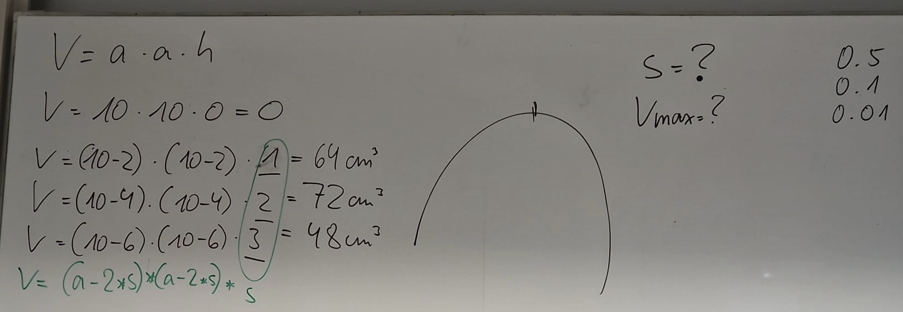

<CardHeading>

  ## 13.10
</CardHeading>


<CardChapter>

  ### while.cpp

  Geben Sie die Zahlen von 1-10 in der Konsole aus.

```cpp title='while.cpp'
#include <iostream>

using namespace std;

int main()
{
  int z = 0;

  while (z <= 10)
  {
    cout << z << "\n";
    z++;
  }

  return 0;
}
```
alternativ:

### for.cpp

```cpp title='for.cpp'
#include <iostream>

using namespace std;

int main()
{

  for (int z = 0; z <= 10; z++)
  {
    cout << z << "\n";
  }

  return 0;
}
```

</CardChapter>
<br/>


<CardHeading>

  ## 16.10
</CardHeading>


<CardChapter>

  ### EVA-Prinzip

  
```cpp title='eva.cpp'
#include <iostream>

using namespace std;

int main()
{
  int a = 0;
  int b = 0;

  // Eingabe
  //
  cout << "Eingabe von a: \n";
  cin >> a;
  cout << "Eingabe von b: \n";
  cin >> b;

  // Verarbeitung

  // modulo funktioniert nur bei integer
  a %= b;

  // int werden abgeschnitten
  // a /= b;

  // Ausgabe
  cout << a;

  /*
  Eingabe 3 und 8     -   299 und 100
  Ergebnis 0 Rest 3   -   2 Test 99
  */

  return 0;
}
```

</CardChapter>
<br/>

<CardChapter>

  ### teilenMitModulo.cpp

  ```cpp title='teilenMitModulo.cpp'
#include <iostream>

using namespace std;

int main()
{
  // Deklarationen und Initialisierungen
  int a = 0, b = 0, c = 0;

  // Eingabe(n)
  cout << "Eingabe a bitte: ";
  cin >> a; // "Console Input"
  cout << "Eingabe b bitte: ";
  cin >> b; // "Console Input"

  // Verarbeitung
  c = a / b;
  a %= b; // a = a / b

  // Ausgabe(n)
  //  Eingaben: 3 und 8  -  299 und 100
  //  Ausgabe:  0 Rest 3 -   2 Rest 99

  cout << c << " Rest " << a; // "Console Output"
  return 0;
}
```

</CardChapter>
<br/>

<CardChapter>

  ### teilenOhneModulo.cpp

  
```cpp title='teilenOhneModulo.cpp'
#include <iostream>

/*
Teilen ohne modulo...
  b != 0
  a > b
    z.B.  Eingaben: 3 und 8  -  299 und 100
    ->    Ausgabe:  0 Rest 3 -   2 Rest 99
*/

using namespace std;

int main()
{
  int a = 0, b = 0, c = 0;

  cout << "Eingabe a bitte: ";
  cin >> a;
  cout << "Eingabe b bitte: ";
  cin >> b;

  while (a >= b)
  {
    a -= b;
    c++;
  }

  cout << c << " Rest " << a;
  return 0;
}

```

</CardChapter>
<br/>

<CardHeading>

  ## 17.10
</CardHeading>

<CardChapter>

  ### zufallZahlen

  Geben Sie 50 zufällig ermittelte Zahlen in der Konsole aus.

```cpp title='zufallZahlen.cpp'
#include <iostream>
#include <stdlib.h>
#include <time.h>
#define OG 6
#define UG 1

using namespace std;

int main()
{
  int i, zufall;
  srand(time(NULL)); // Start Random

  for (i = 1; i <= 50; i++)
  {
    //	zufall=rand()%(Obergrenze-Untergrenze+1)+Untergrenze
    zufall = rand() % (OG - UG + 1) + UG;
    cout << zufall << " ";
    if (i % 10 == 0)
    {
      cout << endl;
    }
  }

  return 0;
}
```

</CardChapter>
<br/>

<CardChapter>

  ### MinMax.cpp

  Bestimmen Sie Minimum und Maximum von Zahlen und geben Sie diese in der Konsole aus.


```cpp title='MinMax.cpp'
#include <iostream>

using namespace std;

int main(int argc, char const *argv[])
{

  int i = 0, mini = 0, maxi = 0, zahl = 0;
  float summe = 0.0, durch = 0.0;

  cout << "Bitte erste Zahl eingeben:" << endl;
  cin >> zahl;

  mini = zahl;
  maxi = zahl;
  summe = zahl;

  for (i = 1; i < 5; i++)
  {
    cout << "Bitte naechste Zahl eingeben:" << endl;
    cin >> zahl;
    summe += zahl;
    if (zahl > maxi)
    {
      maxi = zahl;
    }
    else if (zahl < mini)
    {
      mini = zahl;
    }
  }
  durch = summe / i;

  cout << "Minimum:" << mini << endl;
  cout << "Maximum:" << maxi << endl;
  cout << "Durchschnitt" << durch << endl;

  return 0;
}
```

</CardChapter>
<br/>

<CardHeading>

  ## 18.10
</CardHeading>

<CardChapter>

  ### minMax2.cpp

  Bestimmen Sie Minimum und Maximum von Zahlen und geben Sie diese in der Konsole aus.


```cpp title='minMax2.cpp'
#include <iostream>
#include <stdlib.h>
#include <time.h>
#define OG 20
#define UG 1

using namespace std;

int main()
{

  int i, mini = 0, maxi = 0, zahl = 0;
  float summe = 0.0, durch = 0.0;

  for (i = 1; i <= 5; i++)
  {
    cout << "Zahl bitte: ";
    cin >> zahl;
    summe = summe + zahl;
    if (i == 1)
    {
      maxi = zahl;
      mini = zahl;
    }
    else if (zahl > maxi)
    {
      maxi = zahl;
    }
    else if (zahl < mini)
    {
      mini = zahl;
    }
  }

  durch = summe / i;

  cout << "\nMinimum: " << mini;
  cout << "\nMaximum: " << maxi;
  cout << "\nDurchschnitt: " << durch;

  return 0;
}
```

</CardChapter>
<br/>

<CardChapter>

  ### minMaxZufallZahlen.cpp

  
```cpp title='minMaxZufallZahlen.cpp'
#include <iostream>
#include <stdlib.h>
#include <time.h>
#define OG 200
#define UG 100

using namespace std;

int main()
{

  int i = 0, mini = 0, maxi = 0, zahl = 0;
  float summe = 0.0, durch = 0.0;

  srand(time(NULL)); // Start Random
  zahl = rand() % (OG - UG + 1) + UG;

  mini = zahl;
  maxi = zahl;
  summe = zahl;

  for (i = 1; i < 10; i++)
  {

    zahl = rand() % (OG - UG + 1) + UG;

    summe += zahl;
    if (zahl > maxi)
    {
      maxi = zahl;
    }
    else if (zahl < mini)
    {
      mini = zahl;
    }
  }
  durch = summe / i;

  cout << "Minimum:" << mini << endl;
  cout << "Maximum:" << maxi << endl;
  cout << "Durchschnitt" << durch << endl;

  return 0;
}
```

</CardChapter>
<br/>

<CardHeading>

  ## 19.10
</CardHeading>

<CardChapter>

  ### minMaxZufallZahlen2.cpp

```cpp title='minMaxZufallZahlen2.cpp'
#include <iostream>
#include <stdlib.h>
#include <time.h>

#define OG 500
#define UG 1
#define ANZAHL 100

using namespace std;

int main()
{

  int i, mini = 0, maxi = 0, zahl = 0;
  float summe = 0.0, durch = 0.0;
  srand(time(NULL));

  for (i = 1; i <= ANZAHL; i++)
  {
    zahl = rand() % (OG - UG + 1) + UG;
    printf("%3i ", zahl);

    if (i % 10 == 0)
    {
      printf("\n");
    }
    summe = summe + zahl;
    if (i == 1)
    {
      maxi = zahl;
      mini = zahl;
    }
    else if (zahl > maxi)
    {
      maxi = zahl;
    }
    else if (zahl < mini)
    {
      mini = zahl;
    }
  }

  durch = summe / ANZAHL;

  cout << "\nMinimum: " << mini;
  cout << "\nMaximum: " << maxi;
  cout << "\nDurchschnitt: " << durch;

  return 0;
}
```
</CardChapter>
<br/>

<CardHeading>

  ## 20.10
</CardHeading>

<CardChapter>

  ### array01.cpp

  ```cpp title='array01.cpp'
#include <iostream>
#include <stdlib.h>
#include <time.h>
#include <cmath>
#define ANZ 5

using namespace std;

int main()
{
  int z[ANZ], i;
  srand(time(NULL));

  for (i = 0; i < ANZ; i++)
  {
    cout << "z[" << i << "] bitte: ";
    cin >> z[i];
  }
  cout << "\n---------------------\n";
  /*
      for(i=ANZ-1; i>=0; i--){
          cout << "z["<< i <<"]: " << z[i] << endl;
      }

      cout << "Welches Element wollen Sie sehen? ";
      cin >> i;
  */
  i = rand() % ANZ;
  cout << "\nz[" << i << "]: " << z[i];

  return 0;
}
```

</CardChapter>
<br/>

<CardChapter>

  ### array02.cpp

  ```cpp title='array02.cpp'
#include <iostream>
#include <stdlib.h>
#include <time.h>
#include <cmath>
#define ANZ 50

using namespace std;

int main()
{
  int z[ANZ], i;
  srand(time(NULL));

  for (i = 0; i < ANZ; i++)
  {
    z[i] = rand() % 100 + 1;
  }

  for (i = 0; i < ANZ; i++)
  {
    cout << z[i] << " ";
    if ((i + 1) % 10 == 0)
      cout << endl;
  }
  cout << "\n---------------------\n";
  cout << "Welches Element wollen Sie sehen? ";
  cin >> i;

  //   i=rand()%ANZ;
  cout << "\nz[" << i << "]: " << z[i];

  return 0;
}
```

</CardChapter>
<br/>

<CardChapter>

  ### array02GeradeUngeradeAnzahl.cpp

Ermitteln Sie die Anzahl der geraden und ungeraden Zahlen...

```cpp title='array02GeradeUngeradeAnzahl.cpp'
#include <iostream>
#include <stdlib.h>
#include <time.h>
#include <cmath>
#define ANZ 50

using namespace std;

int main()
{
  int z[ANZ], i;
  int gerade = 0, ungerade = 0;
  srand(time(NULL));

  for (i = 0; i < ANZ; i++)
  {
    z[i] = rand() % 100 + 1;
  }

  for (i = 0; i < ANZ; i++)
  {
    cout << z[i] << " ";
    if ((i + 1) % 10 == 0)
      cout << endl;
    if (z[i] % 2 == 0)
    {
      ungerade++;
    }
    else
    {
      gerade++;
    }
  }
  cout << "\n---------------------\n";

  cout << "Ungerade:  " << ungerade << endl;
  cout << "Gerade:  " << gerade << endl;

  return 0;
}
```

</CardChapter>
<br/>

<CardChapter>

  ### array02MinMax.cpp

  Ermitteln Sie Minumum und Maximum der Zahlen

```cpp title='array02MinMax.cpp'
#include <iostream>
#include <stdlib.h>
#include <time.h>
#include <cmath>
#define ANZ 50

using namespace std;

/*
Ermitteln Sie Minumum und Maximum der Zahlen
*/

int main()
{
  int min = 0;
  int max = 0;
  int z[ANZ], i;
  srand(time(NULL));

  for (i = 0; i < ANZ; i++)
  {
    z[i] = rand() % 100 + 1;
  }

  for (i = 0; i < ANZ; i++)
  {
    cout << z[i] << " ";
    if ((i + 1) % 10 == 0)
      cout << endl;
    if (i == 0)
    {
      min = max = z[i];
    }
    else if (z[i] < min)
    {
      min = z[i];
    }
    else if (z[i] > max)
    {
      max = z[i];
    }
  }
  cout << "\n---------------------\n";

  cout << "min: " << min << endl;
  cout << "max: " << max << endl;

  return 0;
}
```

</CardChapter>
<br/>

<CardHeading>

  ## 06.11
</CardHeading>

<CardChapter>

  ### quadratzahlen.cpp

  Ausgabe der Quadratzahlen:

1 x 1 = 1

2 x 2 = 4

3 x 3 = 9

...

20 x 20 = 400

```cpp title='quadratzahlen.cpp'
#include <iostream>
/*
1 x 1 = 1
2 x 2 = 4
3 x 3 = 9
...
20 x 20 =400
*/
using namespace std;

int main()
{
  int a = 1, b = 0;

  for (a = 1; a <= 20; a++)
  {
    b = a * a;
    // cout << a << " x " << a << " = " << b << endl;
    printf("%3i x %2i = %3x\n", a, a, b);
  }
  return 0;
}
```

</CardChapter>
<br/>

<CardChapter>

  #### zerlegen.cpp

  Zerlegen Sie eine bis zu vierstellige Zahl (Eingabe)
und geben Sie die Teile einzeln aus, z.B.
1234 = 1 Tausender + 2 Hunderter + 3 Zehner + 4 Einer

689 = 6 Hunderter + 8 Zehner + 9 Einer

7 = 7 Einer

```cpp title='zerlegen.cpp'
#include <iostream>
#include <cstdlib>
#include <ctime>
#include <cmath>

using namespace std;

int main()
{
  int zahl = 5678, t = 0, h = 0, z = 0;

  // cout << "Zahl bitte: (max. 9999)";
  // cin >> zahl;

  t = zahl / 1000;
  zahl = zahl % 1000;

  h = zahl / 100;
  zahl = zahl % 100;

  z = zahl / 10;
  zahl = zahl % 10;

  if (t > 0)
    cout << t << " Tausender + ";

  cout << h << " Hunderter + ";
  cout << z << " Zehner + ";
  cout << zahl << " Einer";
  // cout << endl << "Rest : " << zahl;

  return 0;
}
```

</CardChapter>
<br/>

<CardChapter>

  ### zerlegen2.cpp

  Zerlegen Sie eine bis zu vierstellige Zahl (Eingabe)
und geben Sie die Teile einzeln aus, z.B.
1234 = 1 Tausender + 2 Hunderter + 3 Zehner + 4 Einer

689 = 6 Hunderter + 8 Zehner + 9 Einer

7 = 7 Einer

```cpp title='zerlegen2.cpp'
#include <iostream>
#include <cstdlib>
#include <ctime>
#include <cmath>

using namespace std;

int main()
{
  int zahl, t = 0, h = 0, z = 0, i;
  srand(time(NULL));

  for (i = 1; i <= 10; i++)
  {

    zahl = rand() % 9999 + 1;
    printf("Zahl: %4i => ", zahl);

    t = zahl / 1000;
    zahl = zahl % 1000;

    h = zahl / 100;
    zahl = zahl % 100;

    z = zahl / 10;
    zahl = zahl % 10;

    if (t > 0)
      cout << t << " Tausender + ";

    cout << h << " Hunderter + ";
    cout << z << " Zehner + ";
    cout << zahl << " Einer\n";
  }

  return 0;
}

```
</CardChapter>
<br/>

<CardChapter>

  ### zerlegenP.cpp

  Zerlegen Sie eine bis zu vierstellige Zahl (Eingabe)
und geben Sie die Teile einzeln aus, z.B.
1234 = 1 Tausender + 2 Hunderter + 3 Zehner + 4 Einer

689 = 6 Hunderter + 8 Zehner + 9 Einer

7 = 7 Einer

```cpp title='zerlegenP.cpp'
#include <iostream>

using namespace std;

int main()
{

  int eingabe = 5432;

  printf("%i x tausender \n", eingabe / 1000);
  printf("%i x hunderter \n", eingabe % 1000 / 100);
  printf("%i x zehner \n", eingabe % 100 / 10);
  printf("%i x einer \n", eingabe % 10);

  return 0;
}
```

</CardChapter>
<br/>

<CardChapter>

  ### rechenTrainer1.cpp

  Rechentrainer mit Zufallszahlen

Erweiterung1:
Operatoren: `+`, `-`, `*`, `%`

Erweiterung2:
10x Eingabe und Ausgabe

```cpp title='rechenTrainer1.cpp'
#include <iostream>
#include <cstdlib>
#include <ctime>

using namespace std;

int main()
{
  int a, b, c, d;

  srand(time(NULL));

  a = rand() % 9 + 1;
  b = rand() % 9 + 1;
  c = a + b;

  cout << a << " + " << b << " = ";
  cin >> d;

  if (d == c)
    cout << "richtig geraten";
  else
    cout << "leider falsch";

  return 0;
}
```

</CardChapter>
<br/>

<CardChapter>

  ### rechenTrainer2.cpp

  Rechentrainer mit Zufallszahlen

Erweiterung1:
Operatoren: `+`, `-`, `*`, `%`

Erweiterung2:
10x Eingabe und Ausgabe

```cpp title='rechenTrainer2.cpp'
#include <iostream>
#include <cstdlib>
#include <ctime>

using namespace std;

int main()
{
  int a, b, c, eingabe, zuf;
  char op;

  srand(time(NULL));

  a = rand() % 9 + 1;
  b = rand() % 9 + 1;
  zuf = rand() % 4;

  switch (zuf)
  {
  case 0:
    op = '+';
    c = a + b;
    break;
  case 1:
    op = '-';
    c = a - b;
    break;
  case 2:
  {
    op = '*';
    c = a * b;
    break;
  }
  case 3:
  {
    op = '%';
    c = a % b;
    break;
  }
  }

  cout << a << " " << op << " " << b << " = ";
  cin >> eingabe;

  if (eingabe == c)
    cout << "richtig geraten";
  else
    cout << "leider falsch";

  return 0;
}
```

</CardChapter>
<br/>

<CardChapter>

  ### rechenTrainer3.cpp

  Rechentrainer mit Zufallszahlen

Erweiterung1:
Operatoren: `+`, `-`, `*`, `%`

Erweiterung2:
10x Eingabe und Ausgabe

```cpp title='rechenTrainer3.cpp'
#include <iostream>
#include <cstdlib>
#include <ctime>

using namespace std;

int main()
{
  int a, b, c, eingabe, zuf, i, zaehler = 0;
  char op;

  srand(time(NULL));

  for (i = 1; i <= 5; i++)
  {
    a = rand() % 9 + 1;
    b = rand() % 9 + 1;
    zuf = rand() % 4;

    switch (zuf)
    {
    case 0:
      op = '+';
      c = a + b;
      break;
    case 1:
      op = '-';
      c = a - b;
      break;
    case 2:
    {
      op = '*';
      c = a * b;
      break;
    }
    case 3:
    {
      op = '%';
      c = a % b;
      break;
    }
    }

    cout << a << " " << op << " " << b << " = ";
    cin >> eingabe;

    if (eingabe == c)
      zaehler++;
  }
  cout << "Sie haben " << zaehler << " Aufgaben richtig beantwortet.";

  return 0;
}
```

</CardChapter>
<br/>

<CardChapter>

  ### rechenTrainerP.cpp

  Rechentrainer mit Zufallszahlen

Erweiterung1:
Operatoren: `+`, `-`, `*`, `%`

Erweiterung2:
10x Eingabe und Ausgabe

```cpp title='rechenTrainer3.cpp'
#include <iostream>
#define OG 20
#define UG 10

using namespace std;

int main()
{
  int a = 0, b = 0, c = 0, d = 0, operat = 0;
  char op = ' ';

  for (int i = 1; i <= 10; i++)
  {
    srand(time(NULL)); // Start Random
    a = rand() % (OG - UG + 1) + UG;
    b = rand() % (OG - UG + 1) + UG;
    operat = rand() % 4;

    if (operat == 0)
    {
      op = '+';
      c = a + b;
    }
    else if (operat == 1)
    {
      op = '-';
      c = a - b;
    }
    else if (operat == 2)
    {
      op = '*';
      c = a * b;
    }
    else if (operat == 3)
    {
      op = '%';
      c = a % b;
    }

    printf("Was ist das Ergebnis von %i %c %i?\n", a, op, b);
    cin >> d;

    while (d != c)
    {
      printf("Eingabe falsch! \n");
      printf("Was ist das Ergebnis von %i %c %i?\n", a, op, b);
      cin >> d;
    }

    printf("Gut gerechnet!\n");
  }

  return 0;
}
```

</CardChapter>
<br/>

<CardHeading>

  ## 07.11
</CardHeading>

<CardChapter>

  ### arr01.cpp

```cpp title='arr01.cpp'
#include <iostream>
#include <cstdlib>
#include <ctime>
#define ANZAHL 50

using namespace std;

int main()
{
  int a[ANZAHL] = {0}, i, mini, maxi;
  srand(time(NULL));

  for (i = 0; i < ANZAHL; i++)
  {
    a[i] = rand() % 100 + 1;
    cout << a[i] << " ";
  }

  mini = maxi = a[0];
  for (i = 1; i < ANZAHL; i++)
  {
    if (a[i] > maxi)
    {
      maxi = a[i];
    }
    else if (a[i] < mini)
    {
      mini = a[i];
    }
  }
  printf("\nMinimum ist: %i", mini);
  printf("\nMaximum ist: %i", maxi);

  return 0;
}

```

</CardChapter>
<br/>

<CardChapter>

  ### arr02strings.cpp

```cpp title='arr02strings.cpp'
#include <iostream>
#include <cstdlib>
#include <ctime>
#include <cmath>

using namespace std;

int main()
{
  string namen[5];
  int i;

  for (i = 0; i < 5; i++)
  {
    cout << "Name:";
    cin >> namen[i];
  }

  cout << "\n----------------------\n";
  for (i = 0; i < 5; i++)
  {
    cout << namen[i] << " ";
  }
  return 0;
}
```

</CardChapter>
<br/>

<CardHeading>

  ## 08.11
</CardHeading>

<CardChapter>

  ### arrWuerfeln.cpp

  Ein Programm soll 100/1000/10.000/... mal "würfeln".

Ermitteln Sie, wie oft jede Zahl (1-6) jeweils geworfen wurde.

```cpp title='arrWuerfeln.cpp'
#include <iostream>
#include <stdlib.h>
#include <time.h>
#define OG 6
#define UG 1
#define ANZAHL 60

using namespace std;

int main()
{
  int i, zufall, z[7] = {0};

  srand(time(NULL)); // Start Random

  for (i = 1; i <= ANZAHL; i++)
  {
    zufall = rand() % (OG - UG + 1) + UG;
    cout << zufall << " ";
    if (i % 20 == 0)
    {
      cout << "\n";
    }
    switch (zufall)
    {
    case 1:
      z[1]++;
      break;
    case 2:
      z[2]++;
      break;
    case 3:
      z[3]++;
      break;
    case 4:
      z[4]++;
      break;
    case 5:
      z[5]++;
      break;
    case 6:
      z[6]++;
      break;
    }
  }

  for (i = 1; i < 7; i++)
  {
    cout << "\n " << i << ": " << z[i] << " mal";
  }

  return 0;
}
```

alternativ als array:

```cpp title='arrWuerfeln2.cpp'
#include <iostream>
#include <stdlib.h>
#include <time.h>
#define OG 6
#define UG 1
#define ANZAHL 60

using namespace std;

int main()
{
  int i, zufall, z[7] = {0};

  srand(time(NULL)); // Start Random

  for (i = 1; i <= ANZAHL; i++)
  {
    zufall = rand() % (OG - UG + 1) + UG;
    cout << zufall << " ";
    if (i % 20 == 0)
    {
      cout << "\n";
    }
    z[zufall]++;
  }

  for (i = 1; i < 7; i++)
  {
    cout << "\n " << i << ": " << z[i] << " mal";
  }

  return 0;
}
```

</CardChapter>
<br/>

<CardChapter>

  ### volumen.cpp



```cpp title='volumen.cpp'
#include <iostream>

using namespace std;

int main()
{
  double volumen = 0.0, a = 10.0, h = 0.0, aMax = 0.0, hMax = 0.0, volMax = 0.0;

  while (h <= a / 2)
  {
    volumen = (a - 2 * h) * (a - 2 * h) * h;

    if (volumen > volMax)
    {
      volMax = volumen;
      aMax = a - 2 * h;
      hMax = h;
    }
    h *= 10;
    h += 1;
    h /= 10;
  }

  cout << "Groesste Volumen ist " << volMax << endl;
  cout << "Seitenlaenge :" << aMax << endl;
  cout << "Hoehe :" << hMax << endl;

  return 0;
}
```

</CardChapter>
<br/>

<CardChapter>

  ### arrayGeradeUebertragen

```cpp title='arrGeradeUebertragen.cpp'
#include <iostream>
#include <cstdlib>
#include <ctime>
#include <cmath>

using namespace std;

int main()
{
  int arr[10], arrGerade[10] = {0}, i, k = 0;
  srand(time(NULL));

  for (i = 0; i < 10; i++)
  {
    arr[i] = rand() % (50 - 10 + 1) + 10;
    cout << arr[i] << " ";
  }
  cout << endl;
  for (i = 0; i < 10; i++)
  {
    if (arr[i] % 2 == 0)
    {
      arrGerade[k] = arr[i];
      // cout << arrGerade[k] << " ";
      k++;
    }
  }

  for (i = 0; i < k; i++)
  {
    cout << arrGerade[i] << " ";
  }
  return 0;
}
```

alternativ:

```cpp title='arrGeradeUebertragenP.cpp'
#include <iostream>
#include <ctime>
#define OG 50
#define UG 10
#define ANZAHL 10

using namespace std;

int main(int argc, char const *argv[])
{
  int erstes[ANZAHL] = {0}, zweites[ANZAHL] = {0}, i = 0;

  srand(time(NULL));

  for (i = 0; i < ANZAHL; i++)
  {
    erstes[i] = rand() % (OG - UG + 1) + UG;
    zweites[i] = erstes[i] * 2;

    cout << "Erstes[" << i << "]: " << erstes[i] << "   "
         << "Zweites[" << i << "]: " << zweites[i] << endl;
  }

  return 0;
}
```

</CardChapter>
<br/>

<CardHeading>

  ## 09.11
</CardHeading>

<CardChapter>

  ### minimumSort

```cpp title='minimumSort.cpp'
#include <iostream>

using namespace std;

int main(int argc, char const *argv[])
{
  int arr[5] = {7, 12, 2, 15, 9}, i, hilf, k;

  cout << "Vorher: ";
  for (i = 0; i < 5; i++)
  {
    printf("%4i ", arr[i]);
  }

  for (i = 0; i < 4; i++)
  {
    for (k = 0; k < 5; k++)
    {
      hilf = arr[i];
      arr[i] = arr[k];
      arr[k] = hilf;
    }
  }

  cout << "\nNachher:";
  for (i = 0; i < 5; i++)
  {
    printf("%4i ", arr[i]);
  }

  return 0;
}
```

alternativ mit Konstante für Arraygröße:

```cpp title='minimumSort2.cpp'
#include <iostream>
#define ANZ 5

using namespace std;

int main(int argc, char const *argv[])
{
  int arr[ANZ] = {7, 12, 2, 15, 9}, i, hilf, k;

  cout << "Vorher: ";
  for (i = 0; i < ANZ; i++)
  {
    printf("%4i ", arr[i]);
  }

  for (i = 0; i < ANZ - 1; i++)
  {
    for (k = 0; k < 5; k++)
    {
      hilf = arr[i];
      arr[i] = arr[k];
      arr[k] = hilf;
    }
  }

  cout << "\nNachher:";
  for (i = 0; i < ANZ; i++)
  {
    printf("%4i ", arr[i]);
  }

  return 0;
}
```

</CardChapter>
<br/>

<CardChapter>

  ### minimumSortZufall.cpp

```cpp title='minimumSortZufall.cpp'
#include <iostream>
#include <ctime>
#define ANZ 5
#define OG 100
#define UG 1

using namespace std;

int main(int argc, char const *argv[])
{
  int arr[ANZ] = {}, i, hilf, k;

  srand(time(NULL));

  for (i = 0; i < ANZ; i++)
  {
    arr[i] = rand() % (OG - UG - 1) + UG;
  }

  cout << "Vorher: ";
  for (i = 0; i < ANZ; i++)
  {
    printf("%4i ", arr[i]);
  }

  for (i = 0; i < ANZ - 1; i++)
  {
    for (k = 0; k < 5; k++)
    {
      hilf = arr[i];
      arr[i] = arr[k];
      arr[k] = hilf;
    }
  }

  cout << "\nNachher:";
  for (i = 0; i < ANZ; i++)
  {
    printf("%4i ", arr[i]);
  }

  return 0;
}
```

alternativ mit Angabe Schleifendurchläufe und Tauschanzahl:

```cpp title='minimumSortZufall2.cpp'
#include <iostream>
#include <cstdlib>
#include <ctime>
#define ANZ 20

using namespace std;

int main()
{
  int arr[ANZ], hilf, tausch = 0, schleifen = 0;
  int i, k;

  srand(time(NULL));
  cout << "Vorher:\n";
  for (i = 0; i < ANZ; i++)
  {
    arr[i] = i; // rand()%100+1;
    cout << arr[i] << " ";
  }

  for (i = 0; i < ANZ - 1; i++)
  {
    for (k = i + 1; k < ANZ; k++)
    {
      schleifen++;
      if (arr[k] < arr[i])
      {
        tausch++;
        hilf = arr[i];
        arr[i] = arr[k];
        arr[k] = hilf;
      }
    }
  }

  cout << "\nNachher:\n";
  for (i = 0; i < ANZ; i++)
  {
    cout << arr[i] << " ";
  }

  cout << "\nEs wurde " << tausch << " mal getauscht.";
  cout << "\nSchleifendurchl\204ufe: " << schleifen;

  return 0;
}
```

</CardChapter>
<br/>

<CardChapter>

  ### bubbleSort.cpp

```cpp title='bubbleSort.cpp'
#include <iostream>

using namespace std;

int main(int argc, char const *argv[])
{
  int arr[5] = {25, 9, 14, 25, 7}, anz = 5, i = 0, hilf = 0;
  bool tausch = true;

  printf("Vorher: ");
  for (i = 0; i < 5; i++)
  {
    printf("%3i ", arr[i]);
  }

  do
  {
    tausch = false;
    anz = anz - 1;
    for (i = 0; i < anz; i++)
    {
      if (arr[i] > arr[i + 1])
      {
        hilf = arr[i];
        arr[i] = arr[i + 1];
        arr[i + 1] = hilf;
        tausch = true;
      }
    }

  } while (tausch == true);

  printf("\nNachher:");
  for (i = 0; i < 5; i++)
  {
    printf("%3i ", arr[i]);
  }

  return 0;
}
```

alternativ mit Angabe Schleifendurchläufe und Tauschanzahl:

```cpp title='bubbleSort2.cpp'
#include <iostream>
#include <cstdlib>
#include <ctime>
#define ANZ 10

using namespace std;

int main()
{
  int arr[ANZ], hilf, tausch = 0, schleifen = 0;
  int i, anz = ANZ;
  bool getauscht;

  srand(time(NULL));
  cout << "Vorher:\n";
  for (i = 0; i < ANZ; i++)
  {
    arr[i] = rand() % 10 + 1;
    cout << arr[i] << " ";
  }

  do
  {
    getauscht = false;
    anz--;
    for (i = 0; i < anz; i++)
    {
      schleifen++;
      if (arr[i + 1] < arr[i])
      {
        tausch++;
        hilf = arr[i];
        arr[i] = arr[i + 1];
        arr[i + 1] = hilf;
        getauscht = true;
      }
    }
  } while (getauscht == true);

  cout << "\nNachher:\n";
  for (i = 0; i < ANZ; i++)
  {
    cout << arr[i] << " ";
  }

  cout << "\nEs wurde " << tausch << " mal getauscht.";
  cout << "\nSchleifendurchl\204ufe: " << schleifen;

  return 0;
}
```

Text-Array:

```cpp title='bubbleSortString.cpp'
#include <iostream>
#include <cstdlib>
#include <ctime>

#define ANZ 5

using namespace std;

int main()
{
  string arr[ANZ] = {"Hans", "Anton", "Stefanie", "Stefan", "Stef"}, hilf;
  int i, anz = ANZ, tausch = 0, schleifen = 0;
  bool getauscht;

  srand(time(NULL));
  cout << "Vorher:\n";
  for (i = 0; i < ANZ; i++)
  {
    cout << arr[i] << " ";
  }

  do
  {
    getauscht = false;
    anz--;
    for (i = 0; i < anz; i++)
    {
      schleifen++;
      if (arr[i + 1] < arr[i])
      {
        tausch++;
        hilf = arr[i];
        arr[i] = arr[i + 1];
        arr[i + 1] = hilf;
        getauscht = true;
      }
    }
  } while (getauscht == true);

  cout << "\nNachher:\n";
  for (i = 0; i < ANZ; i++)
  {
    cout << arr[i] << " ";
  }

  cout << "\nEs wurde " << tausch << " mal getauscht.";
  cout << "\nSchleifendurchl\204ufe: " << schleifen;

  return 0;
}
```

</CardChapter>
<br/>

<CardChapter>

  ### arraySearch.cpp

  ```cpp title='arraySearch.cpp'
#include <iostream>

/*
Array nach Benutzereingabe durchsuchen
*/

using namespace std;

int main(int argc, char const *argv[])
{
  string arr[5] = {"Hans", "Stefan", "Stefanie", "Peter", "Paul"}, ein = " ";
  int i = 0;

  printf("Bitte zu durchsuchenden Namen eingeben:");
  cin >> ein;

  for (i = 0; i < 5; i++)
  {
    if (ein == arr[i])
    {
      printf("%s gefunden: arr[%i]", ein.c_str(), i);
    }
  }
  return 0;
}
```

</CardChapter>
<br/>

<CardChapter>

  ### arrayGewinner.cpp

```cpp title='arrayGewinner.cpp'
#include <iostream>
#include <ctime>

/*
zufällig einen Gewinner aus dem Array ermitteln
*/

using namespace std;

int main(int argc, char const *argv[])
{
  string arr[5] = {"Hans", "Stefan", "Stefanie", "Peter", "Paul"};

  srand(time(NULL));

  printf("%s hat gewonnen", arr[rand() % 5].c_str());

  return 0;
}
```

</CardChapter>
<br/>

<CardHeading>

  ## 10.11
</CardHeading>

<CardChapter>

  ### Übungsklausur 6

```cpp title='uebKlausur6.cpp'
#include <iostream>
using namespace std;

int main()
{
  double a = 10, s = 0, v = 0, vmax = 0, smax = 0, l = 0.01;
  while (v >= vmax)
  {
    v = (a - 2 * s) * (a - 2 * s) * s;
    cout << "Schnittl\204nge " << s << " akt. Volumen " << v << endl;
    if (vmax < v)
    {
      vmax = v;
      smax = s;
    }
    s += l;
  }
  cout << "Maximales Volumen von " << vmax << " bei " << smax;

  return 0;
}
```

</CardChapter>
<br/>

<CardChapter>

  ### Übungsklausur 7

```cpp title='uebKlausur7.cpp'
#include <iostream>
#include <cstdlib>
#include <ctime>
using namespace std;

int main()
{
  int bsp[10] = {25, 3, 31, 8, 55, 43, 21, 17, 49, 85};
  int ung[5] = {0}, i = 0, k = 0, hilf;

  // while(k<5 && i<10){
  for (i = 0; i < 10 && k < 5; i++)
  {
    if (bsp[i] % 2 == 1)
    {
      ung[k] = bsp[i];
      k++;
    }
    //	i++;
  }

  for (i = 0; i < 5; i++)
  {
    cout << ung[i] << " ";
  }
  return 0;
}
```
</CardChapter>
<br/>


