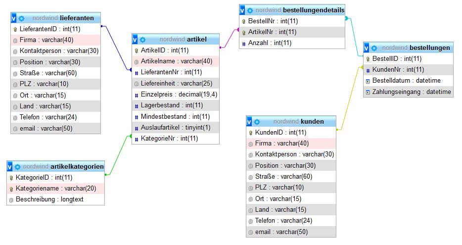

<CardHeading>

  # Aufgaben `nordwind`
</CardHeading>

---

<CardChapter>

  ## Datenbankvorlage

- [nordwind1.sql](https://drive.google.com/file/d/1t7rWYl47wO8qVu7JOCWtmJhFgTcPFC33/view?usp=drive_link)

</CardChapter>
 

